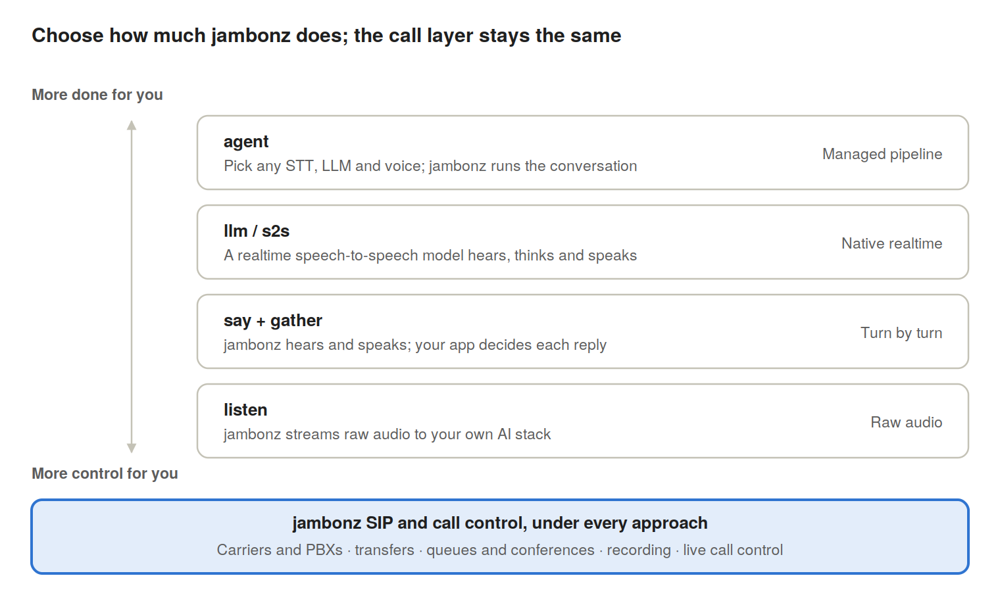

Most voice AI platforms make one big decision for you on day one: how your agent hears, thinks and speaks. With [jambonz](https://jambonz.org/) you make that decision yourself, and you can change your mind later without moving your phone numbers, carriers or call flows.

The voice AI market is moving faster than any of us can plan for. A [speech-to-speech](https://docs.jambonz.org/tutorials/voice-ai-examples/google-gemini-live) model that is state of the art this quarter may be overtaken next quarter. A new transcription vendor ships smarter turn detection. Your compliance team asks for the audio to stay in-region. If your platform only offers one way to wire a call to an AI, every one of those changes becomes a migration.

jambonz takes a different view by giving you four distinct ways to connect a live phone call to an AI agent, each at a different level of abstraction. You pick the level that fits what you are building today, and you move up or down as your needs change, all on the same platform.

## How the Four jambonz Approaches Divide the Work of a Voice AI Call

Every AI phone conversation has the same five jobs: carry the call, hear the caller, decide when they have finished, work out a reply, and speak it. The four jambonz approaches differ only in who does which job.

Whichever approach you pick, jambonz carries the call, so your numbers, SIP trunks, routing and recording stay put. What changes is how much of the conversation you hand to jambonz, to a model vendor, or to your own code.

## Build a Complete Voice AI Agent With Any STT, LLM and TTS Using the Agent Verb

The agent verb is the fastest way to put a production-quality voice agent on a phone line. You tell jambonz which speech recognition vendor, which LLM and which voice to use, write a prompt, and jambonz runs the whole conversation.

The hard parts of voice AI are handled for you:

- **Turn-taking.** Deciding when a caller has actually finished speaking is the difference between an agent that feels natural and one that talks over people. jambonz supports the native turn detection in vendors such as Deepgram Flux, AssemblyAI and Speechmatics, plus Krisp's acoustic end-of-turn model.
- **Barge-in.** Callers can interrupt, and jambonz can tell a real interruption from an "uh-huh".
- **Latency.** Early generation starts the LLM thinking before the caller's turn is confirmed, so replies arrive sooner.
- **Tools and handoff.** Connect MCP servers or your own functions, and hand the caller to a human with a built-in transfer.
- **Observability.** Every turn reports its transcript, reply and per-component latency.

The big advantage over single-vendor platforms is that **every part is swappable**. [Deepgram](https://docs.jambonz.org/tutorials/voice-ai-examples/deepgram-voice-agent) for hearing, [Anthropic](https://docs.jambonz.org/guides/features/bring-your-own-llm/anthropic) for thinking and [Cartesia](https://docs.jambonz.org/guides/features/tts-vendor-settings/cartesia) for speaking is a perfectly valid agent, and next month it can be a different mix. You can also change the prompt, context or tools in the middle of a call.

**Best for:** teams who want a great-sounding agent quickly and want to keep freedom over vendors. *The agent verb is available in jambonz 10.1 and later.*

## Connect Calls to OpenAI, Gemini and Other Speech-to-Speech Models With the LLM Verb

Speech-to-speech models skip the text step altogether. One model listens to the caller's audio, reasons about it and replies in its own voice, which can make conversations feel remarkably fluid and expressive.

With the [llm verb](https://docs.jambonz.org/verbs/verbs/llm) (also called s2s), jambonz connects the phone call directly to that model. It supports the leading realtime services, including [OpenAI](https://jambonz.org/blog/openai-gpt-live-support-in-jambonz), Google, Deepgram, [ElevenLabs](https://docs.jambonz.org/tutorials/voice-ai-examples/elevenlabs-conversational-ai) and [Ultravox](https://docs.jambonz.org/tutorials/hosted-applications/ultravox). jambonz looks after the telephony and the audio bridge, and still gives you tool calling, MCP servers, human handoff and a clean hangup.

The trade-off is that you accept one vendor's choices for hearing, turn-taking and voice. That is often exactly what you want, until it isn't. Because the verb shape is common across vendors, trying a newer realtime model is a configuration change, not a rebuild.

**Best for:** the most natural-sounding conversations, when one vendor's model and voices suit your use case.

## Use Say and Gather to Script Regulated Calls and Replace Legacy IVR

[say](https://docs.jambonz.org/verbs/verbs/say) and [gather](https://docs.jambonz.org/verbs/verbs/gather) are the classic jambonz building blocks. gather listens to the caller and hands your application the transcript; say speaks whatever your application sends back. In between, your code decides what happens.

That middle step is where the flexibility lives. Your application can call any LLM, a rules engine, a database or all three. It can check a caller's account before the model sees the question, validate the answer before it is spoken, or switch to a scripted flow for payments and consent. Speech recognition and voices are still yours to choose from any supported vendor.

You give up some of the polish the agent verb provides out of the box, such as advanced turn detection and speculative replies. In return you get complete, auditable control over every exchange, which regulated industries and structured IVR replacements often need.

**Best for:** guided, rules-heavy conversations, and teams modernising an existing IVR one step at a time.

## Stream Raw Call Audio to Your Own AI Over WebSocket With the Listen Verb

[listen](https://docs.jambonz.org/verbs/verbs/listen) is the lowest level of all. jambonz streams the caller's audio in real time to a WebSocket you provide, and can play audio you stream back. Everything else, from recognition to reasoning to voice, is up to you.

This is the route for teams who already have their own voice AI engine, a custom or self-hosted model, or a voice agent framework they have invested in. It is also the answer when audio must go to infrastructure you control for data residency or privacy reasons. jambonz still handles the hard telephony work: carriers, SIP, numbers, transfers and recording.

**Best for:** teams bringing their own AI, research and custom models, and strict data-control requirements.

## Which jambonz Voice AI Approach Should You Choose?

|  | agent | llm / s2s | say + gather | listen |
| --- | --- | --- | --- | --- |
| Time to first working agent | Fastest | Fastest | Moderate | Longest |
| Vendor choice | Mix any STT, LLM and TTS | Any supported realtime model | Mix any STT and TTS, any LLM in your app | Anything you can run |
| Turn-taking and barge-in | Handled, with advanced options | Handled by the model | Basic, per turn | Yours to build |
| Control over each reply | Prompt, tools, live updates | Prompt and tools | Complete | Complete |
| Where your effort goes | Prompt and tools | Prompt and tools | Conversation logic | The whole AI pipeline |
| Great for | Most new voice agents | Most natural voice | Regulated and scripted flows | Bring-your-own AI |

## SIP Trunking, Transfers and Call Control Work the Same With Every Approach

The AI is only half of a phone call. Whichever of the four approaches you choose, your agent sits on the same carrier-grade SIP and call control that jambonz is known for. You never trade telephony features for AI features.

- **Any carrier, any PBX.** Connect SIP trunks from the carriers you already use, or bring calls in from your existing PBX or contact centre.
- **Transfers that work.** Hand callers to a human with a blind or warm transfer, a SIP REFER, or a new outbound leg, with context passed along in SIP headers.
- **Queues and conferences.** Park callers in a queue, bring a supervisor into a conference, or let a person listen in and take over.
- **Live call control.** Redirect, update, mute or hang up any call in progress through the REST API, whatever verb it is running.
- **Recording and the rest.** Record calls, detect answering machines, collect DTMF digits, and clean up noisy lines with noise isolation.

This is why the choice of approach matters less on jambonz than elsewhere. Moving from the agent verb to listen, or from speech-to-speech to say and gather, changes how the conversation works. It never changes how the call is carried, routed or controlled.

## Switch Voice AI Approaches Without Migrating Numbers, Carriers or Call Flows

On most voice AI platforms, the level you build at is fixed by the product. A hosted agent builder rarely lets you drop down to raw audio. A raw streaming API rarely gives you managed turn-taking. Outgrow either and you are migrating numbers, carriers and call flows to someone else.

In jambonz, all four approaches are verbs in the same application model. They run on the same calls, the same numbers and the same SIP trunks, and they can even be used in the same call. That makes some powerful patterns possible:

- **Start high, drop down where it matters.** Launch with the agent verb, then move the payment step to say and gather so every word is scripted and verified.
- **Test the newest model safely.** Route a share of calls to a speech-to-speech model and compare it with your existing agent, with no change to telephony.
- **Bring your own later.** Build on the agent verb today; if you train your own model next year, move to listen without touching your carriers.
- **Mix within one call.** A scripted greeting and consent with say and gather, then a hand-off to an AI agent, then a transfer to a human.

The result is that choosing an approach is a design decision you can revisit, not a platform commitment you are stuck with.

## Where to Start When Adding Voice AI to Your Phone Line

There is no single right way to connect a phone call to AI, and the right way for you will probably change. jambonz is built for that reality: pick the level that fits today, and keep your options open for tomorrow.

If you are starting fresh, the agent verb is the quickest route to a great voice agent. If you already have AI of your own, listen gets it on the phone network. And whichever you choose, the rest are there when you need them.

[Start building with jambonz](https://jambonz.org/).

