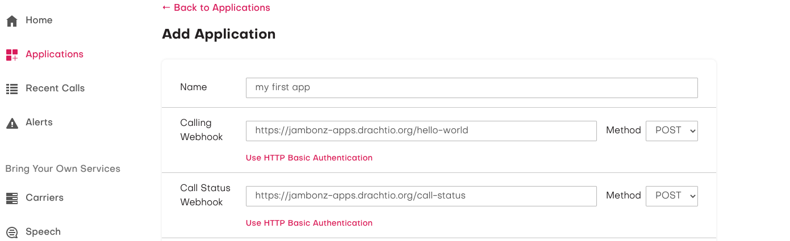
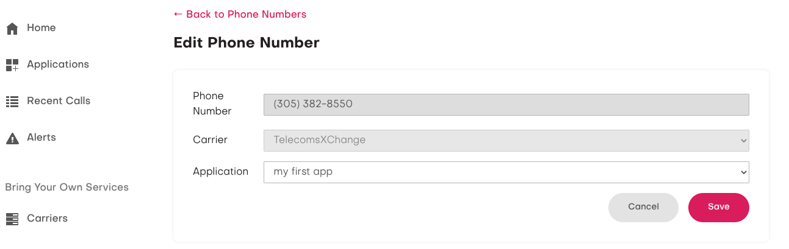

> *Originally published September 2021. This post describes jambonz as it was at the time and some details have since changed.*

[jambonz](https://jambonz.org) is the open-source CPaaS for service providers and developers alike that is no more difficult to install than a webserver. It is a BYOE (bring your own everything) platform, which means that you bring your own carrier trunks and speech APIs (Google and AWS cloud speech both supported).

> Haven't got a carrier, but want to try out jambonz? No problem, visit [TelecomsXchange](https://www.telecomsxchange.com/jambonz) to create a free account and gain access to their worldwide network of hundreds of voice and SMS carriers!

Your options for deploying a jambonz service include:

- downloading and installing for free on your own infrastructure (jambonz is published under the [MIT open source license](https://opensource.org/licenses/MIT)),
- deploying in your AWS account using a [cloudformation script](https://aws.amazon.com/marketplace/pp/prodview-55wp45fowbovo), or
- creating a free account on our [hosted platform](https://jambonz.cloud/register).

> If you are just getting started and want to try out jambonz for the first time, we recommend [creating an account on the hosted platform](https://jambonz.cloud/register), since it is simple, free, and gets you up and running instantly.

Node.js is the preferred application environment for creating and running jambonz applications. And whipping up a jambonz app couldn't be easier using the [npx](https://docs.npmjs.com/cli/v10/commands/npx) and the `create-jambonz-app` utility. Let's run it with the `-h` option to see what it can do for us:

```bash
 $ npx create-jambonz-app -h
Usage: create-jambonz-app [options] project-name

Options:
  -v, --version              display the current version
  -s, --scenario <scenario>  generates sample webhooks for specified scenarios, default is dial and tts (default: "tts, dial")
  -h, --help                 display help for command


Scenarios available:
- tts: answer call and play greeting using tts,
- dial: use the dial verb to outdial through your carrier,
- record: record the audio stream generated by the listen verb,
- auth: authenticate sip devices, or
- all: generate all of the above scenarios

Example:
  $ npx create-jambonz-app my-app
```

You can see that it will scaffold out an [express](https://expressjs.com/)-based jambonz [webhook](https://docs.jambonz.org/verbs/verbs/overview) application that implements one or more scenarios.

Let's dive right in and create a simple app that answers a call and plays a greeting using text-to-speech:

```
npx create-jambonz-app -s tts my-app

Creating a new jambonz app in /Users/dhorton/tmp/my-app

Installing packages...
```

Done! Now let's see what we have:

```
$ cd my-app/
$ ls -lrt
total 432
-rw-r--r--    1 dhorton  staff     567 Sep 23 07:40 README.md
-rw-r--r--    1 dhorton  staff    1616 Sep 23 07:40 app.js
drwxr-xr-x    2 dhorton  staff      64 Sep 23 07:40 data
-rw-r--r--    1 dhorton  staff     491 Sep 23 07:40 ecosystem.config.js
drwxr-xr-x    3 dhorton  staff      96 Sep 23 07:40 lib
drwxr-xr-x  239 dhorton  staff    7648 Sep 23 07:40 node_modules
-rw-r--r--    1 dhorton  staff  203525 Sep 23 07:40 package-lock.json
-rw-r--r--    1 dhorton  staff     489 Sep 23 07:40 package.json
```

A [pm2](https://pm2.keymetrics.io/docs/usage/quick-start/) config file is generated to hold some environment variables that you must define -- things such as your jambonz account sid, the URL of your jambonz API server, etc:

```bash
$ cat ecosystem.config.js
module.exports = {
  apps : [{
    name: 'my-app',
    script: 'app.js',
    instance_var: 'INSTANCE_ID',
    exec_mode: 'fork',
    instances: 1,
    autorestart: true,
    watch: false,
    max_memory_restart: '1G',
    env: {
      NODE_ENV: 'production',
      LOGLEVEL: 'info',
      HTTP_PORT: 3000,
      JAMBONZ_ACCOUNT_SID: '',
      JAMBONZ_API_KEY: '',
      JAMBONZ_REST_API_BASE_URL: '',
      WEBHOOK_SECRET: '',
      HTTP_PASSWORD: '',
      HTTP_USERNAME: '',
    }
  }]
};
```

> Note: use of pm2 is course optional, you can alternatively specify your environment variables in a .env file or on the command line if you prefer.

The final two environment variables above (`HTTP_PASSWORD` and `HTTP_USERNAME`) are optional - you only need to suply them if you are using http basic auth to secure your webhook endpoint. The others are required, and you can find your account_sid, api_key, and webhook secret in the jambonz portal. If you are using the [jambonz.cloud](https://jambonz.cloud) hosted platform the `JAMBONZ_REST_API_BASE_URL` variable should be `https://api.jambonz.cloud/v1`, otherwise set to the appropriate URL for your own server.

Update the `ecosystem.config.js` file with these values where indicated.

Let's have a look at the code now. The `app.js` file is boilerplate stuff that you probably won't have to change, but let's have a look at it to understand what it does.

```js
$ cat app.js
const assert = require('assert');
assert.ok(process.env.JAMBONZ_ACCOUNT_SID, 'You must define the JAMBONZ_ACCOUNT_SID env variable');
assert.ok(process.env.JAMBONZ_API_KEY, 'You must define the JAMBONZ_API_KEY env variable');
assert.ok(process.env.JAMBONZ_REST_API_BASE_URL, 'You must define the JAMBONZ_REST_API_BASE_URL env variable');

const express = require('express');
const app = express();
const {WebhookResponse} = require('@jambonz/node-client');
const basicAuth = require('express-basic-auth');
const opts = Object.assign({
  timestamp: () => `, "time": "${new Date().toISOString()}"`,
  level: process.env.LOGLEVEL || 'info'
});
const logger = require('pino')(opts);
const port = process.env.HTTP_PORT || 3000;
const routes = require('./lib/routes');
app.locals = {
  ...app.locals,
  logger,
  client: require('@jambonz/node-client')(process.env.JAMBONZ_ACCOUNT_SID, process.env.JAMBONZ_API_KEY, {
    baseUrl: process.env.JAMBONZ_REST_API_BASE_URL
  })
};

if (process.env.HTTP_USERNAME && process.env.HTTP_PASSWORD) {
  const users = {};
  users[process.env.HTTP_USERNAME] = process.env.HTTP_PASSWORD;
  app.use(basicAuth({users}));
}
app.use(express.urlencoded({ extended: true }));
app.use(express.json());
if (process.env.WEBHOOK_SECRET) {
  app.use(WebhookResponse.verifyJambonzSignature(process.env.WEBHOOK_SECRET));
}
app.use('/', routes);
app.use((err, req, res, next) => {
  logger.error(err, 'burped error');
  res.status(err.status || 500).json({msg: err.message});
});

const server = app.listen(port, () => {
  logger.info(`Example jambonz app listening at http://localhost:${port}`);
});
```

Pretty straightforward stuff, right? It's creating an express app, using middleware to validate the signature of incoming webhook requests to be sure they came from your account, enforcing http basic auth if you've configured it, and then invoking your the http endpoints you are exposing.

Oh, and its also including the `@jambonz/node-client` [npm package](https://www.npmjs.com/package/@jambonz/node-client). This little beauty will make it easy to respond to webhooks and to use the [jambonz REST api](https://api.jambonz.org).

Let's look at the code generated for the http endpoints next. In this case, we asked it to generate a simple app to use tts to play a greeting. We'll actually need two endpoints: one to respond to the webhook request for an application, and one to handle call status events. Both of those are generated under `lib/routes/endpoints` as you can see:

```bash
$ ls -lrt lib/routes/endpoints/
total 24
-rw-r--r--  1 dhorton  staff  218 Sep 23 07:40 call-status.js
-rw-r--r--  1 dhorton  staff  183 Sep 23 07:40 index.js
-rw-r--r--  1 dhorton  staff  803 Sep 23 07:40 tts-hello-world.js

MBP-daveh:my-app dhorton$ cat lib/routes/endpoints/index.js
const router = require('express').Router();

router.use('/call-status', require('./call-status'));
router.use('/hello-world', require('./tts-hello-world'));

module.exports = router;
```

Finally, let's have a look at the code generated to respond to the application webhook!

```js
$ cat lib/routes/endpoints/tts-hello-world.js
const router = require('express').Router();
const WebhookResponse = require('@jambonz/node-client').WebhookResponse;
const text = `<speak>
<prosody volume="loud">Hi there,</prosody> and welcome to jambones!
jambones is the <sub alias="seapass">CPaaS</sub> designed with the needs
of communication service providers in mind.
This is an example of simple text-to-speech, but there is so much more you can do.
Try us out!
</speak>`;

router.post('/', (req, res) => {
  const {logger} = req.app.locals;
  logger.debug({payload: req.body}, 'POST /hello-world');
  try {
    const app = new WebhookResponse();
    app
      .pause({length: 1.5})
      .say({text});
    res.status(200).json(app);
  } catch (err) {
    logger.error({err}, 'Error');
    res.sendStatus(503);
  }
});

module.exports = router;
```

The key here is the WebhookResponse instance we create and then call chained methods on, each corresponding to a [jambonz webhook verb](https://docs.jambonz.org/verbs/verbs/overview):

```js
const WebhookResponse = require('@jambonz/node-client').WebhookResponse;

.. then ..

const app = new WebhookResponse();
app
  .pause({length: 1.5})
  .say({text});
```

When we've added all our verbs, we simply return it a json payload in our http response:

```js
res.status(200).json(app);
```

Let's run this puppy!

When testing on my laptop, I like to use [ngrok](https://ngrok.com) to provide an externally-reachable URL for the app running behind my firewall:

```bash
$ ngrok http -region=us -hostname=jambonz-apps.drachtio.org 3000
```

> Note: I am using a custom domain here, which requires a paid plan on ngrok.

Next, I just start up my app:

```bash
$ pm2 start ecosystem.config.js
[PM2][WARN] Applications my-app not running, starting...
[PM2] App [my-app] launched (1 instances)
┌─────┬───────────┬─────────────┬─────────┬─────────┬──────────┬────────┬──────┬───────────┬──────────┬──────────┬──────────┬──────────┐
│ id  │ name      │ namespace   │ version │ mode    │ pid      │ uptime │ ↺    │ status    │ cpu      │ mem      │ user     │ watching │
├─────┼───────────┼─────────────┼─────────┼─────────┼──────────┼────────┼──────┼───────────┼──────────┼──────────┼──────────┼──────────┤
│ 0   │ my-app    │ default     │ 0.0.1   │ fork    │ 25162    │ 0s     │ 0    │ online    │ 0%       │ 9.7mb    │ dhorton  │ disabled │
└─────┴───────────┴─────────────┴─────────┴─────────┴──────────┴────────┴──────┴───────────┴──────────┴──────────┴──────────┴──────────┘
```

pm2 log shows me that the app has is listening on the configured port for webhooks

```bash
$ pm2 log

0|my-app   | {"level":30, "time": "2021-09-23T12:53:11.336Z","pid":25162,
"hostname":"MBP-daveh.local",
"msg":"Example jambonz app listening at http://localhost:3000"}
```

Now, bounce over to your jambonz portal and create a new application with this webhook URL and path..



And assign a phone number to route to this app..



Bam! Done!

Incoming calls on this phone number now route to this webhook, which returns a simple app that plays a text-to-speech greeting using my preferred speech vendor and voice.

This is has been a basic (and hopefully painless!) introduction to building apps using jambonz and the Node.js SDK. If you prefer to learn by watching, [here is a video](https://youtu.be/42jcqyvCstU) covering much of the same material but going into a bit more detail, including showing you how to use Twilio as your carrier.

To create your own account for testing, just head over to [jambonz.cloud](https://jambonz.cloud/register), or watch [this video](https://youtu.be/BVOwpxIKOso) showing how to get started.

There's much more you can do -- as a next step, consider using the `--scenario` option to scaffold an app that does a [dial](https://docs.jambonz.org/verbs/verbs/dial) or a record (using the [listen](https://docs.jambonz.org/verbs/verbs/listen) verb) operation.

In this article, we explored creating webhook applications but did not use the [REST api](https://api.jambonz.org). We will cover that in a later article, but for a sneak peak at an example application that uses both webhooks and the REST api, have a look at the attended transfer application [here](https://github.com/jambonz/jambonz-node-example-app/blob/main/lib/routes/endpoints/dial/attended-transfer.js) (and video [here](https://youtu.be/IwrPmJdQYXE)), where we respond to dtmf events during a call to use the REST api to perform Live Call Control.

Any questions, feel free to email us at <a href="mailto:support@jambonz.org">support@jambonz.org</a> or [join our community forum](https://community.jambonz.org) to ping us in real-time!
