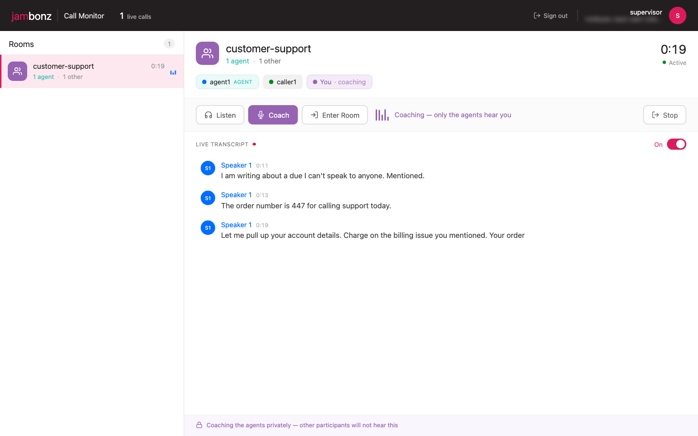
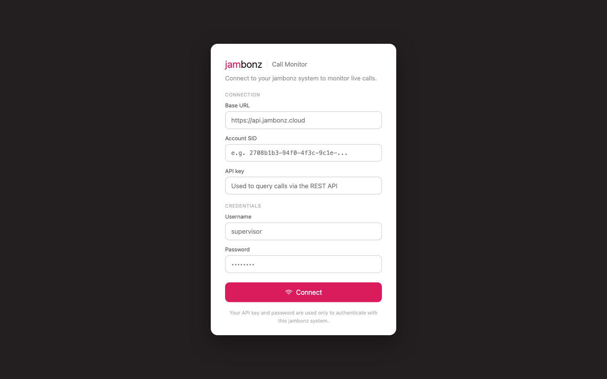
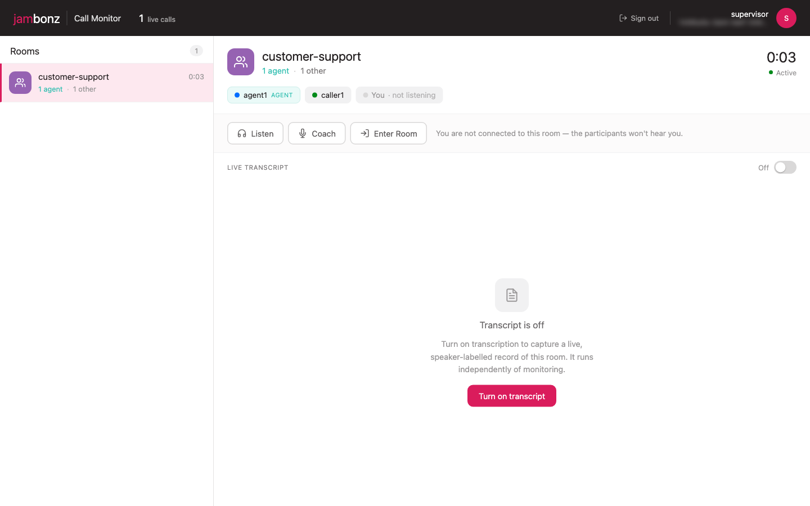
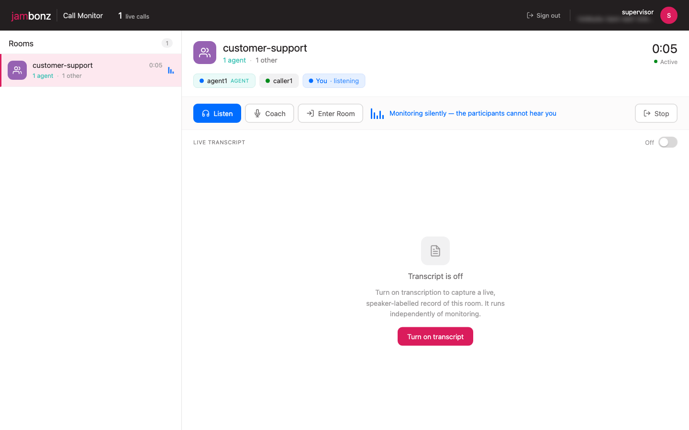
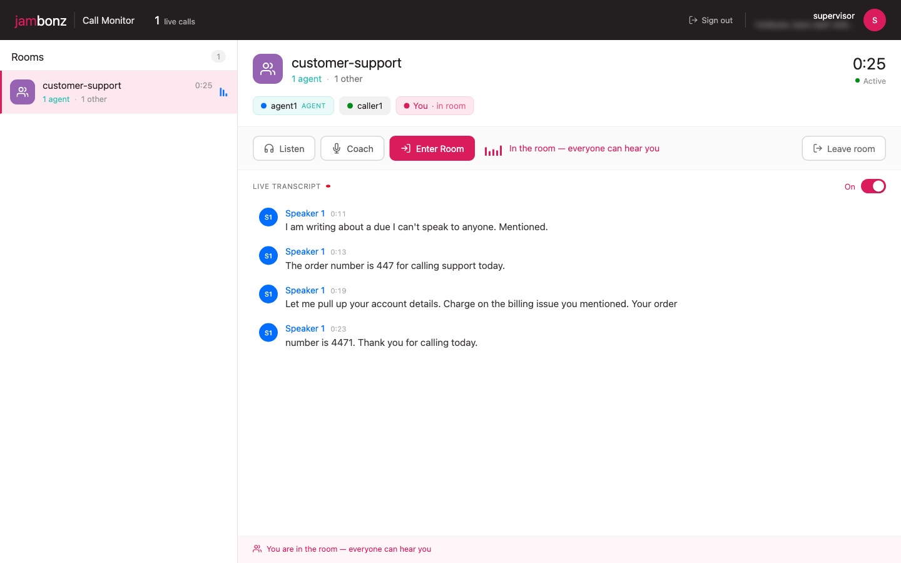
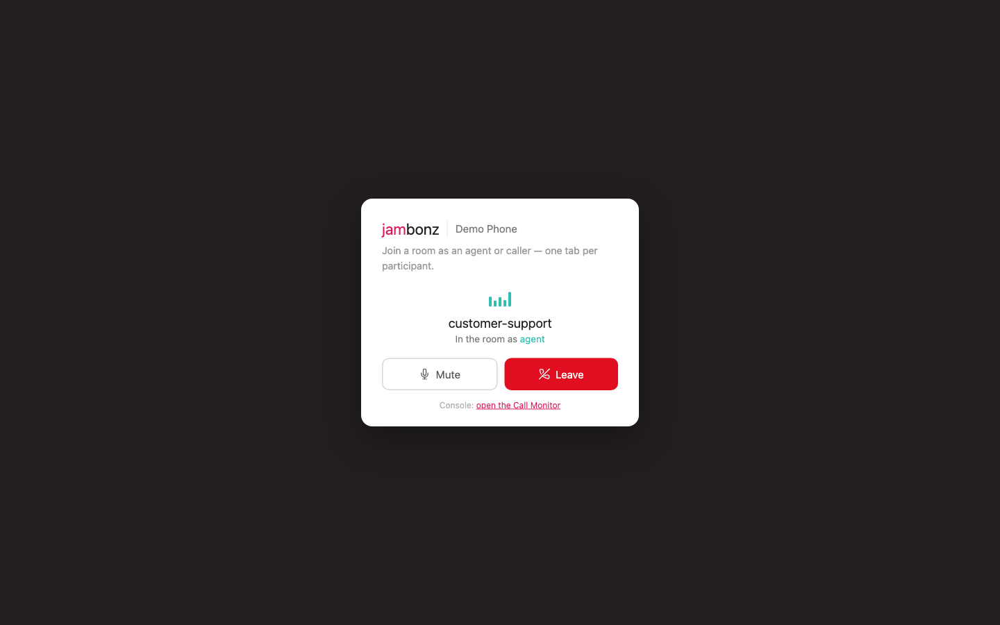

Every contact center eventually needs the same three superpowers: a supervisor
who can **listen** to a live call without anyone knowing, **coach** an agent
through a rough moment without the customer hearing, and — when things really
go sideways — **barge in** and take over. Add a live transcript of the room and
you've described the supervision feature set of every serious call-center
platform.

jambonz has had the underlying machinery for this for a while (conference
member tags, coach mode, mid-call participant actions), and we've recently
added the missing piece — a way to tap a conference's audio without being a
participant. To show how it all fits together, we built a complete,
open-source supervision console:
**[jambonz/room-monitor](https://github.com/jambonz/room-monitor)**.



It's a real application — React front end, Node backend, live-tested with
humans on real phones — but it's deliberately small and readable, because its
main job is to be **a reference you can take apart and rebuild into your own
product**. This post walks through what it does, the jambonz primitives
underneath it, how to run the demo yourself, and where the seams are when you
adapt it.

## What the app does

A supervisor signs in and sees every live room (conference) on the account,
updating in real time: room names, running durations, and a participant
breakdown that distinguishes **agents** from everyone else.



Selecting a room shows its participants as chips — caller ID when available,
the bare number otherwise, with agents visibly tagged — and three engagement
buttons:



- **Listen** — the supervisor hears everything; nobody hears the supervisor.
  The supervisor never appears as a participant, and the counts don't change.



- **Coach** — the supervisor's audio is delivered **only to the agents** in
  the room. The customer hears nothing. The button only appears when the room
  actually contains an agent, and if the last agent hangs up mid-coaching, the
  console automatically falls back to listening.

- **Enter Room** — full barge-in; everyone hears the supervisor.



Switching between these modes is **instant** — no re-dial, no interruption to
the room. Under the hood the supervisor holds exactly one call leg, and each
mode change is a mid-call command on it.

Then there's the **live transcript**: per-room, on-demand, speaker-labelled.
Two properties matter here. First, it's **independent of listening** — you can
transcribe a room you're not connected to at all. Second, it respects coach
privacy: coached audio never appears in it (more on why that's guaranteed, and
how we proved it, below).

## The jambonz primitives underneath

Everything in the app rides on five platform capabilities. If you remember
nothing else from this post, remember this table — it's the stable contract
your own version builds against.

| Capability | Mechanism |
|---|---|
| Who is an "agent" | `memberTag` on each conference member |
| Silent monitor | join the conference with `joinMuted: true` |
| Coach / whisper | supervisor audio delivered only to members with a given tag |
| Barge-in | `uncoach` + unmute |
| Room audio out | a **conference listen fork**: jambonz streams the room mix to your WebSocket |

### Tags drive everything

When your application puts an agent into a conference, tag them:

```js
session.conference({
  name: 'customer-support',
  memberTag: 'agent',
}).send();
```

That one property powers the console's agent counts, the Coach button gating,
and the coach audio routing. And tags are **fully dynamic** — you can promote
or demote a live participant without a re-join:

```js
// the application controlling the leg:
session.injectCommand('conf:participant-action', { action: 'tag', tag: 'agent' });
session.injectCommand('conf:participant-action', { action: 'untag' });

// or from anywhere, via the REST client:
await client.calls.update(callSid, {
  conferenceParticipantAction: { action: 'tag', tag: 'agent' },
});
```

An active coach re-relates automatically when tags change: think "warm
transfer just completed" or "human takes over from the AI agent" — the
coaching starts reaching them the moment the tag lands.

### One leg, three modes

The supervisor joins as a normal (but muted, tagged, and deliberately
non-room-owning) member:

```js
session
  .answer()
  .conference({
    name: roomName,
    joinMuted: true,               // hears everything, heard by no one
    memberTag: 'supervisor',       // lets the room list filter this leg out
    startConferenceOnEnter: false, // never create/destroy the room being watched
    endConferenceOnExit: false,
  })
  .send();
```

Mode changes are then just participant actions on that live leg:

```js
// coach: audio delivered only to members tagged 'agent'
session.injectCommand('conf:participant-action', { action: 'coach', tag: 'agent' });
session.injectCommand('conf:mute-status', { conf_mute_status: 'unmute' });

// barge-in: heard by everyone
session.injectCommand('conf:participant-action', { action: 'uncoach' });

// back to silent monitoring
session.injectCommand('conf:mute-status', { conf_mute_status: 'mute' });
```

A note on transport: the same actions exist over REST
(`PUT /Accounts/{sid}/Calls/{call_sid}`), but the reference app injects them
over the leg's own WebSocket session. That reaches the exact feature-server
process that owns the leg *by construction*, so the app works on any
deployment topology — including a single box running one feature-server per
core.

### Tapping the room's audio

The newest primitive is the **conference listen fork** — the thing that makes
the transcript possible without the supervisor being connected:

```bash
curl -X POST "$BASE_URL/v1/Accounts/$ACCOUNT_SID/Conferences/customer-support/listen" \
  -H "Authorization: Bearer $API_KEY" -H "Content-Type: application/json" \
  -d '{"url": "wss://your-host/fork", "sampleRate": 16000,
       "metadata": {"room": "customer-support", "sampleRate": 16000}}'
```

jambonz dials out to your WebSocket and streams the room's mixed audio as L16
PCM. That's the entire jambonz involvement: **it transports audio and knows
nothing about transcription**. What sits on the other end of that socket —
Deepgram in the reference app, but equally your own STT, a sentiment engine,
compliance phrase detection, or a recorder — is entirely your business.

The fork has exactly the lifecycle you'd hope for. It's a media-server-owned
bot member: excluded from participant counts, never keeps a room alive, torn
down automatically when the conference ends. Starting it requires no
participant leg, and repeated starts are idempotent. And — this is the part
with teeth — **coached audio is never delivered to it**, because the fork is
an untagged listener like any other. Private coaching cannot leak into a
transcription or recording tap.

(These endpoints ship with MediaJam-based conferencing — they're on jambonz
`main` today and in the next release. The full API reference is on
[docs.jambonz.org](https://docs.jambonz.org/reference/rest-call-control/conferences/start-conference-listen).)

### Discovering rooms

One more endpoint rounds out the set — the conferences listing grew an
`expand` parameter:

```
GET /Accounts/{sid}/Conferences?expand=participants
→ [{ id, name, durationSec,
     participants: [{ call_sid, label, memberTag, isAgent }] }]
```

That's what feeds the console's room list, and it's how your own tooling can
answer "which live calls have no agent yet?" in one request.

## The architecture, in two pipelines

The app splits cleanly into two independent flows that share nothing but a
room's name:

```
Supervisor media + control                    Transcription
──────────────────────────                    ─────────────
Browser (WebRTC SDK)                          Backend ──REST──▶ jambonz
  │ SIP over WebSocket                                            │
  ▼                                                               ▼
jambonz SBC ──▶ supervisor leg in conference          MediaJam conf-bot joins room
  ▲                                                               │
  │ conf:participant-action (coach/uncoach/mute)                  │ L16 PCM room mix
  └── injected by the backend over the leg's ws session           ▼
                                                      Backend WS sink ──▶ Deepgram
                                                                  │
                                                                  ▼
                                                      speaker-labelled lines → browser
```

The browser talks to the backend over a small typed WebSocket contract (four
message types each way), places its media leg with the
[jambonz WebRTC SDK](https://github.com/jambonz/webrtc-sdk) — routed straight
to the application via an `X-Application-Sid` header, no dial plan needed —
and never sees a `call_sid` or an API key doing anything sensitive.

## How we know coach mode actually works

Here's my favorite part of this project. How do you *prove* that the customer
can't hear the coaching — in CI, with no humans?

The repo ships a closed-loop end-to-end test (`tools/e2e/`) that launches
three headless Chromium instances whose **microphones are scripted WAV
files** (Chromium's `--use-file-for-fake-audio-capture`). An "agent" browser
and a "caller" browser join a room and talk; a "supervisor" browser drives the
console. Then the test uses **the transcript as an audio oracle**: the room's
transcription fork hears whatever the room mix contains, so:

- the caller's scripted words appearing in the transcript proves the entire
  audio path (browser → SBC → media server mix → fork → STT) end to end;
- the supervisor's scripted words being **absent** while coaching — and
  **present** after barge-in — proves the coach-privacy contract with no ears
  involved.

That assertion earned its keep before the app ever shipped: it caught a real
bug where a transcription fork that joined a room *mid-coaching* would hear
the coached audio (late-joining bots weren't announced, so the coach
relationships were never re-applied to them). Fixed in the media server, with
a regression test — and the e2e has verified the contract on every deploy
since. If you adapt this app, adapt the test too; it will keep verifying *who
can hear whom* as your code evolves.

## Running the demo

You'll need a jambonz deployment with MediaJam conferencing and the
conference-listen endpoints (jambonz `main` today), a
[Deepgram](https://deepgram.com) API key for the transcript, and Node 20+.
Full details live in the repo's
[DEMO.md](https://github.com/jambonz/room-monitor/blob/main/DEMO.md); here's
the shape of it.

**1. Provision the account** (portal or the included script):

- An application named **`room-monitor`**, calling webhook
  `ws://<backend-host>:3002/supervisor` — serves the console's monitoring leg
  and the demo phone page.
- An application named **`room-monitor-caller`**, calling webhook
  `ws://<backend-host>:4003/caller` — route a **phone number (DID)** at this
  one. Which room inbound callers land in is the application's **`ROOM_NAME`
  env var**, declared via OPTIONS discovery so you can edit it right on the
  portal's application screen. No redeploy to change rooms.
- Three webrtc clients: `supervisor`, `agent1`, `caller1`.

Or just run `node tools/e2e/provision.mjs` with your account SID and API key
and let it create all of the above idempotently.

**2. Configure and start the backend:**

```bash
# apps/server/.env
PORT=3001                        # data WebSocket for the browser
JAMBONZ_WS_APP_PORT=3002         # the jambonz application (supervisor + fork sink)
CALLER_APP_PORT=4003             # the DID caller application
WEBRTC_SBC_URL=wss://<sbc-host>:8443
FORK_SINK_URL=ws://<backend-host>:3002/fork   # must be reachable from the media server
DEEPGRAM_API_KEY=<key>

npm install && npm run dev:server && npm run dev:web
```

The backend fails fast if anything required is missing, and exposes `/health`
on every port.

**3. Create some traffic.** The repo gives you three ways:

- **The demo phone page** (`/#phone`) — the fastest path. One browser tab per
  participant: pick a room, pick **Agent** or **Caller**, join with your real
  microphone. Share a link like `/#phone?room=customer-support` so everyone
  lands in the same room (ask us how we learned that lesson).



- **A real phone** — dial the DID you routed to `room-monitor-caller`. You'll
  hear "Welcome, joining customer support," and appear in the console.
- **The traffic kit** (`tools/traffic/`) — sipp scenarios that fill the room
  list with background rooms, each looping synthesized speech, so the rail
  looks like a busy floor and the transcript has something to chew on.

**4. Walk the script.** Two phone tabs (one agent, one caller) plus the
console gives you the whole demo: Listen (they can't hear you) → Coach (the
agent hears you, the caller doesn't — the one to verify with your own ears) →
Enter Room (everyone hears you) → transcript on → agent leaves → Coach button
disappears. The repo includes a ready-to-send
[three-person test script](https://github.com/jambonz/room-monitor/blob/main/docs/LIVE-TEST.md)
if you want to rope in friends.

## Adapting it into your product

This is the part the app was actually built for. The repo's
[ADAPTING.md](https://github.com/jambonz/room-monitor/blob/main/docs/ADAPTING.md)
is the full guide; the short version:

**Keep the contract, replace everything else.** The five primitives in the
table above are the stable surface. The React UI, the Node backend, the
Deepgram integration — all of it is replaceable scaffolding around those five
calls.

**The one true integration point is tagging.** The monitor never decides who
an agent is; it reads `memberTag`. Wherever your existing call flow puts an
agent into a conference, add the tag — one property — and this console (or
your version of it) lights up. Richer taxonomies work too: `speakOnlyTo`
accepts any tag, so "coach only the trainee" or "whisper to the interpreter"
are the same mechanism with a different tag.

**Swap the audio consumer.** The transcription module is ~120 lines of "PCM
in → Deepgram → labelled fragments out." The fork feed is plain L16 PCM over
a WebSocket, so that seam is where you'd plug in a different STT vendor,
AI supervision (sentiment, compliance phrases, auto-summaries, agent-assist),
or archival.

**Know the demo shortcuts.** The repo is honest about what's demo-grade:
there's no auth on the browser WebSocket, credentials are typed per-session
instead of held server-side, the phone page is a test fixture, room state is
polled rather than pushed, and nothing is persisted. ADAPTING.md lists each
one with the exact file where the production fix goes — the goal is that you
never mistake scaffolding for load-bearing walls.

## If you build with an AI assistant

Everything in this post is also wired into the
[jambonz MCP server](https://github.com/jambonz/mcp-server). Point Claude
Code (or Cursor, or any MCP-capable assistant) at
`https://mcp-server.jambonz.app/mcp` and it can pull
`guide:conference-monitoring` — the supervision patterns as an LLM-ready
reference — and the `conference-supervision` SDK example, a two-file
distillation of this app served with full source. Ask your assistant to
"build a supervision tool on jambonz" and it has the contract, the code, and
the gotchas without you explaining any of it.

## Wrapping up

Supervision features have a reputation for being deep platform magic —
something you only get from the big CCaaS vendors. The point of room-monitor
is that on jambonz they're an afternoon of plumbing around five primitives:
tag your agents, join one muted leg, flip participant actions on it, fork the
room's audio when you want a transcript, and list conferences with
`expand=participants`.

The code is at
[github.com/jambonz/room-monitor](https://github.com/jambonz/room-monitor) —
MIT-licensed, live-tested, with the architecture doc, the adaptation guide,
and the closed-loop test suite included. Take it apart. Build something.
