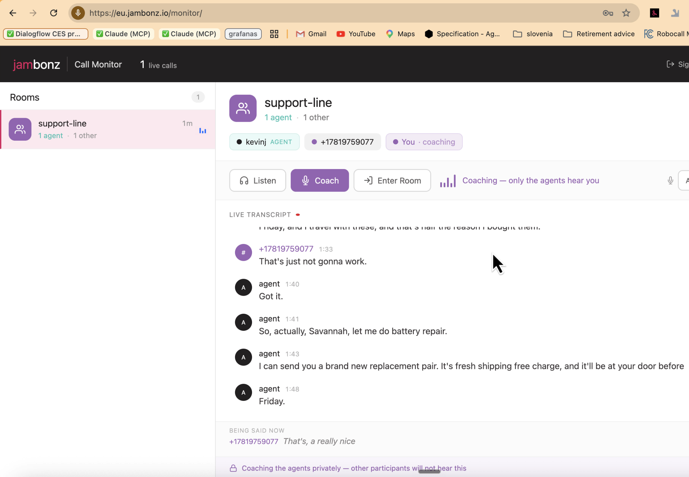
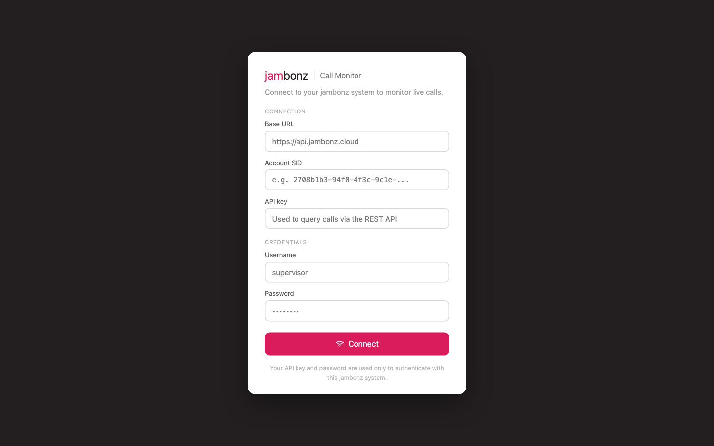
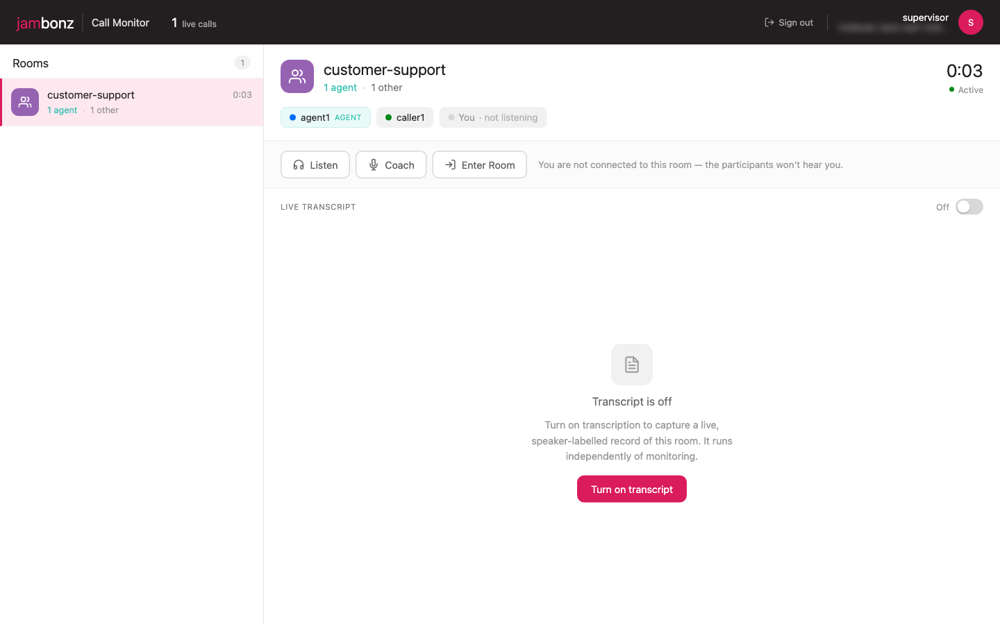
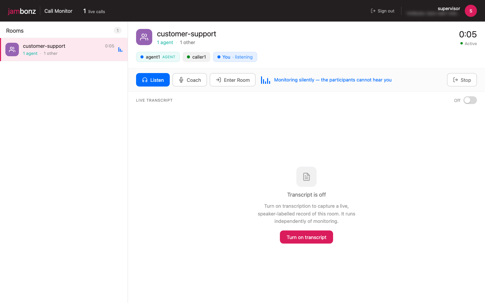
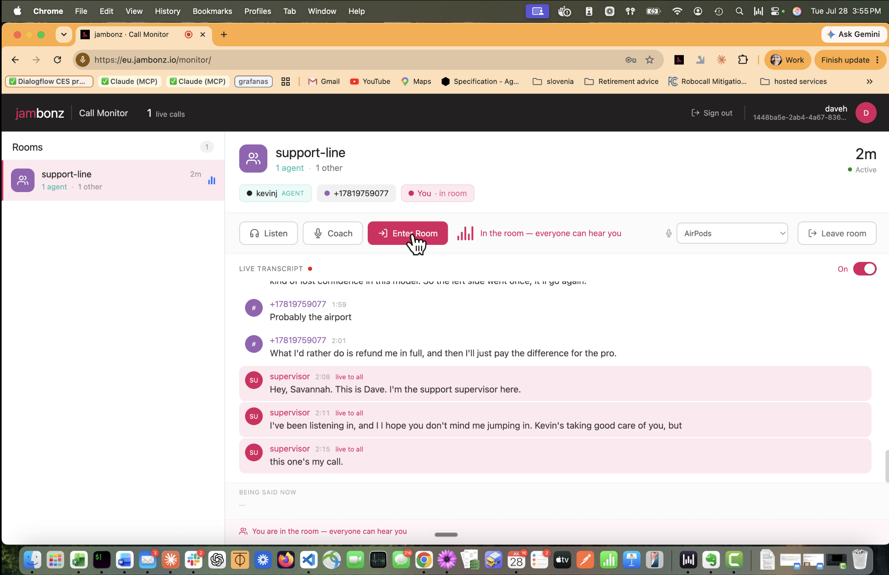

Every contact center eventually needs the same three superpowers: a supervisor
who can **listen** to a live call without anyone knowing, **coach** an agent
through a rough moment without the customer hearing, and — when things really
go sideways — **barge in** and take over. Add a live transcript of the room and
you've described the supervision feature set of every serious call-center
platform.

jambonz has had the underlying machinery for this for a while (conference
member tags, coach mode, mid-call participant actions), and in version 11 we've recently
added the missing piece — a way to tap a conference's audio without being a
participant. To show how it all fits together, we built a complete,
open-source supervision console:

<iframe width="560" height="315" src="https://www.youtube.com/embed/V-wPtCeQnm4?si=Y247I01Noiz181MG" title="YouTube video player" frameborder="0" allow="accelerometer; autoplay; clipboard-write; encrypted-media; gyroscope; picture-in-picture; web-share" referrerpolicy="strict-origin-when-cross-origin" allowfullscreen></iframe>

All code for this example application can be found on [github](https://github.com/jambonz/room-monitor)

It's a real application — React front end, Node backend, live-tested with
humans on real phones — but it's deliberately small and readable, because its
main job is to be **a reference you can take apart and rebuild into your own
product**. This post walks through what it does, the jambonz primitives
underneath it, how to run the demo yourself, and some suggestions on how you 
might adapt it for your own needs.



## What the app does

A supervisor signs in and sees every live room (conference) assiciated with a jambonz account,
updating in real time: room names, running durations, and a participant
breakdown that distinguishes **agents** from everyone else.



Selecting a room shows its participants as chips — caller ID when available,
the bare number otherwise, with agents visibly tagged — and three engagement
buttons:



- **Listen** — the supervisor hears everything; nobody hears the supervisor.
  The supervisor never appears as a participant, and the counts don't change.



- **Coach** — the supervisor's audio is delivered **only to the agents** in
  the room. The customer hears nothing. The button only appears when the room
  actually contains an agent, and if the last agent hangs up mid-coaching, the
  console automatically falls back to listening.

- **Enter Room** — full barge-in; everyone hears the supervisor.



Switching between these modes is **instant** — no re-dial, no interruption to
the room. Under the hood the supervisor holds exactly one call leg, and each
mode change is a mid-call command on it.

Then there's the **live transcript**: per-room, on-demand, and labelled with
who is actually speaking — **"agent"** for anyone carrying the agent tag, the
**caller's phone number** for everyone else, **"supervisor"** for the
supervisor's own barge-in. 

Words appear in a **"being said now"** pane while they are still
being spoken, then settle into the record above when they are finalized.

Note: We used [Deepgram](https://deepgram.com/) Nova-3 for the speech recognition because 
in our testing it provided the best latency of any STT vendor.


Listening and transcribing are independent features; you can transcribe the conversation in a room in real time, 
whether or not you have joined it or are even listening to it. 

## How it works

The operation is based on a simple concept of tags.
Each participant can optionally be assigned one or more tags, and a tag is nothing more 
than a simple string value you can assign to the participant. 
In our application, we assign the tag value 'agent' to participants that are agents. 
Participants that are customers do not receive a tag. 

The second piece of this is the optional property `speakOnlyTo` that can be assigned to a participant.
If assigned, the value is used to direct that participant's audio only to the subset of participants in the room that have been assigned a tag of the same value. Thus, when a supervisor joins in coach mode, we simply set his or her speak-only-to property to 'agent'.

It's that simple. What's even better is that these tags, adn the speakOnlyTo property, Can be dynamically changed or unassigned 
at any point in time via the jambonz SDK, and media flows will automatically and immediately adjust accordingly. 

### Show me

When an agent is joining a conference room, we simply include their tag on the conference verb:

```js
session.conference({
  name: 'customer-support',
  memberTag: 'agent',
}).send();
```

Or if we wanted to assign a tag to a participant already in the conference, or remove a tag, 
we can use the injectCommand API to do so:

```js
// the application controlling the leg:
session.injectCommand('conf:participant-action', { action: 'tag', tag: 'agent' });
session.injectCommand('conf:participant-action', { action: 'untag' });

// or from anywhere, via the REST client:
await client.calls.update(callSid, {
  conferenceParticipantAction: { action: 'tag', tag: 'agent' },
});
```

### One leg, three modes

The supervisor joins as a normal (but muted, tagged, and deliberately
non-room-owning) member:

```js
session
  .answer()
  .conference({
    name: roomName,
    joinMuted: true,               // hears everything, heard by no one
    memberTag: 'supervisor',       // lets the room list filter this leg out
    startConferenceOnEnter: false, // never create/destroy the room being watched
    endConferenceOnExit: false,
  })
  .send();
```

Mode changes are then just participant actions on that live leg:

```js
// coach: audio delivered only to members tagged 'agent'
session.injectCommand('conf:participant-action', { action: 'coach', tag: 'agent' });
session.injectCommand('conf:mute-status', { conf_mute_status: 'unmute' });

// barge-in: heard by everyone
session.injectCommand('conf:participant-action', { action: 'uncoach' });

// back to silent monitoring
session.injectCommand('conf:mute-status', { conf_mute_status: 'mute' });
```

Note: the same actions exist over REST (`PUT /Accounts/{sid}/Calls/{call_sid}`)

### Tapping the room's audio

The newest primitive is the **conference listen fork** — the thing that makes
the transcript possible without the supervisor being connected:

```bash
curl -X POST "$BASE_URL/v1/Accounts/$ACCOUNT_SID/Conferences/customer-support/listen" \
  -H "Authorization: Bearer $API_KEY" -H "Content-Type: application/json" \
  -d '{"url": "wss://your-host/fork", "sampleRate": 16000,
       "metadata": {"room": "customer-support", "sampleRate": 16000}}'
```

jambonz dials out to your WebSocket and streams the room's mixed audio as L16
PCM. In the example app, what sits on the other end of that socket is 
code that streams the audio to Deepgram for real-time transcription, but equally 
you could replace with your own STT, a sentiment engine,
compliance phrase detection, or a recorder etc.

### One stream per speaker

The simple stream of mixed audio from the room is the right tap for recording a call, but 
it is the wrong tap for knowing who said what.  Here you have two options:
- diarize the single mixed audio stream and have your STT try to identify speakers, or
- instruct jambonz instead to have you a separate stream per participant.

In our testing, the diarization was not 100% reliable so we implemented the second approach: 
receiving a separate audio stream per participant and applying real-time transcription 
to each participant, then combining them in the transcript window.

```bash
curl -X POST "$BASE_URL/v1/Accounts/$ACCOUNT_SID/Conferences/support-line/listen" \
  -H "Authorization: Bearer $API_KEY" -H "Content-Type: application/json" \
  -d '{"url": "wss://your-host/fork", "scope": "members", "sampleRate": 16000}'
```

With `scope: "members"` the media server opens **one WebSocket per participant**
and streams only that participant's own audio down it. Each stream announces
itself in its first text frame:

```json
{ "room": "support-line", "memberId": 4, "callSid": "…",
  "accountSid": "…", "tag": "agent", "sampleRate": 16000 }
```

Participants who join after the conference starts are forked automatically; each fork is 
closed gracefully with its participant leaves the room.

Note that **coached audio is never delivered over a websocket to the app**, so private coaching cannot leak into a
transcription or recording tap.

(These endpoints ship with jambonz version 11 conferencing — they're on jambonz.cloud today. The full API reference is on
[docs.jambonz.org](https://docs.jambonz.org/reference/rest-call-control/conferences/start-conference-listen).)

### Discovering rooms

```
GET /Accounts/{sid}/Conferences?expand=participants
→ [{ id, name, durationSec,
     participants: [{ call_sid, label, number, direction,
                      memberTag, isAgent }] }]
```

The application uses the REST API above to build the console's room list, and it's how your own tooling can
answer "which live calls have no agent yet?" in one request. `number` is the
**remote party** — who called in, or who you dialed — which is what the
transcript uses to label a participant who isn't an agent.

## The architecture, in two pipelines

The app splits cleanly into two independent flows that share nothing but a
room's name:

```
Supervisor media + control                    Transcription
──────────────────────────                    ─────────────
Browser (WebRTC SDK)                          Backend ──REST──▶ jambonz
  │ SIP over WebSocket                                            │
  ▼                                                               ▼
jambonz SBC ──▶ supervisor leg in conference       media server forks each member
  ▲                                                               │
  │ conf:participant-action (coach/uncoach/mute)                  │ one L16 stream
  └── injected by the backend over the leg's ws session           │ per participant
                                                                  ▼
                                              Backend WS sink ──▶ one STT session each
                                                                  │ (diarization off)
                                                                  ▼
                                                  lines labelled from stream identity,
                                                  ordered by when they were spoken
```

The browser talks to the backend over a small typed WebSocket contract (four
message types each way), places its media leg with the
[jambonz WebRTC SDK](https://github.com/jambonz/webrtc-sdk) — routed straight
to the application via an `X-Application-Sid` header, no dial plan needed —
and never sees a `call_sid` or an API key doing anything sensitive.

## Making a live transcript feel live

Two problems that came up as we tested with real conversations:

**Finals arrive late.** A speech-to-text engine emits a finished line after it
decides the utterance has ended, which measured at a median **2.35 s** (p90
4.0 s) from when the person started speaking. So the console publishes *interim*
results too — and because each stream has exactly one known speaker, they need
no "unattributed" limbo: they appear immediately, correctly labelled, in a
**"being said now"** pane pinned below the transcript, then vanish as the
finished line settles into the record above. Text becomes visible a median
**1.27 s earlier** that way, and the settled transcript never reflows while you
are reading it.

<!-- SCREENSHOT (NEW — placeholder is a plain magenta image): close-up of the
     bottom of the console — the "Being said now" pane with grey in-progress
     text, and a few settled lines above it. -->


**Per-speaker streams finish out of order.** Each participant has an independent
STT session, so a long utterance that *started* first can be finalised after a
short one that started later. Appending in arrival order puts the conversation
out of sequence — a reply above the thing it replies to. Every line therefore
carries the wall-clock time its speech *began* (derived from the engine's
word-level offsets), and the console inserts by that, not by arrival.

## Test suite included

The repo ships a closed-loop end-to-end test (`tools/e2e/`) that launches
three headless Chromium instances whose **microphones are scripted WAV
files** (Chromium's `--use-file-for-fake-audio-capture`). An "agent" browser
and a "caller" browser join a room and talk; a "supervisor" browser drives the
console. Then the test uses **the transcript as an audio oracle**: the room's
transcription fork hears whatever the room mix contains, so:

- the caller's scripted words appearing in the transcript proves the entire
  audio path (browser → SBC → media server mix → fork → STT) end to end;
- the supervisor's scripted words being **absent** while coaching — and
  **present** after barge-in — proves the coach-privacy contract with no ears
  involved.

## Running the demo

You need jambonz.cloud or a self-hosted jambonz release 11.0.3 or above, a
[Deepgram](https://deepgram.com) API key for the transcript, and Node 20+.
Everything else — provisioning the two applications and the webrtc clients (or
just running `tools/e2e/provision.mjs`), the handful of env vars, and a
step-by-step runbook — is in the repo's
[DEMO.md](https://github.com/jambonz/room-monitor/blob/main/DEMO.md).

To populate a room, the simplest thing is to point **two phone numbers** at the
caller application — one arriving as an agent, one as a customer. That app
declares two env vars, `ROOM_NAME` and `ROLE` (`agent` or `caller`), which the
portal discovers via OPTIONS and shows on the application screen. Since env vars
belong to the *application*, you create two applications aimed at the same
websocket endpoint, give them the same `ROOM_NAME`, set `ROLE=agent` on one and
`ROLE=caller` on the other, and route a DID at each. `ROLE=agent` is the whole
difference: it adds `memberTag: 'agent'` to the conference verb, which is what
makes Coach light up. Dial both numbers and you have a live room with a tagged
agent and a customer in it — no code changes to move them to another room.

Then, with the console watching that room, the one step worth doing with your
own ears is Coach: speak, and the agent's phone hears you while the customer's
does not. If you want to rope in other people,
[docs/LIVE-TEST.md](https://github.com/jambonz/room-monitor/blob/main/docs/LIVE-TEST.md)
is a ready-to-send hand-out for a three-person test.

## Adapting it into your product

This is a sample application that's intended to be iterated on. The repo's
[ADAPTING.md](https://github.com/jambonz/room-monitor/blob/main/docs/ADAPTING.md)
is the full guide; the short version:

**Keep the contract, replace everything else.** The five primitives in the
table above are the stable surface. The React UI, the Node backend, the
Deepgram integration — all of it is replaceable scaffolding around those five
calls.

**The one true integration point is tagging.** The monitor never decides who
an agent is; it reads `memberTag`. Wherever your existing call flow puts an
agent into a conference, add the tag — one property — and this console (or
your version of it) lights up. Richer taxonomies work too: `speakOnlyTo`
accepts any tag, so "coach only the trainee" or "whisper to the interpreter"
are the same mechanism with a different tag.

**Swap the audio consumer.** The transcription module is ~150 lines of "PCM
in → Deepgram → labelled fragments out." The feed is plain L16 PCM over a
WebSocket, so that is where you'd plug in a different STT vendor, AI
supervision (sentiment, compliance phrases, auto-summaries, agent-assist), or
archival. Choose your scope by what you're building: `members` when you need to
know who said it (transcripts, agent scoring, real-time assist), `mix` when you
want the room audio as one artifact (recording, a single summariser).

**Know the demo shortcuts.** The repo is honest about what's demo-grade:
there's no auth on the browser WebSocket, credentials are typed per-session
instead of held server-side, the phone page is a test fixture, room state is
polled rather than pushed, and nothing is persisted. ADAPTING.md lists each
one with the exact file where the production fix goes.

## If you build with an AI assistant

Everything in this post is also wired into the
[jambonz MCP server](https://github.com/jambonz/mcp-server). Point Claude
Code (or Cursor, or any MCP-capable assistant) at
`https://mcp-server.jambonz.app/mcp` and it can pull
`guide:conference-monitoring` — the supervision patterns as an LLM-ready
reference — and the `conference-supervision` SDK example, a two-file
distillation of this app served with full source. Ask your assistant to
"build a supervision tool on jambonz" and it has the contract, the code, and
the gotchas without you explaining any of it.

## Wrapping up

Supervision features have a reputation for being deep platform magic —
something you only get from the big CCaaS vendors. The point of room-monitor
is that on jambonz they're an afternoon of plumbing around five primitives:
tag your agents, join one muted leg, flip participant actions on it, fork the
room's audio when you want a transcript, and list conferences with
`expand=participants`.

The code is at
[github.com/jambonz/room-monitor](https://github.com/jambonz/room-monitor) —
MIT-licensed, live-tested, with the architecture doc, the adaptation guide,
and the closed-loop test suite included. Take it apart. Build something.
