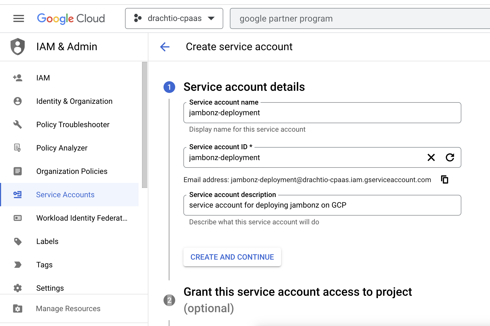
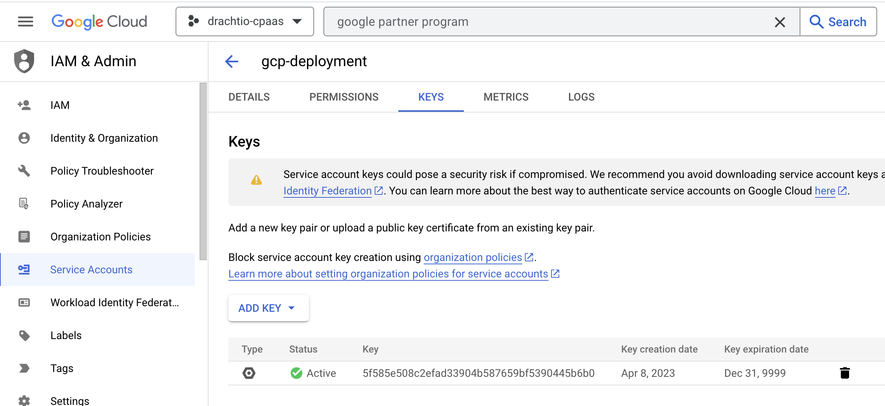
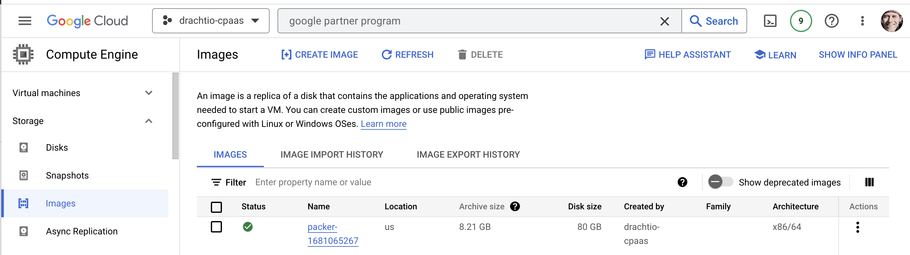
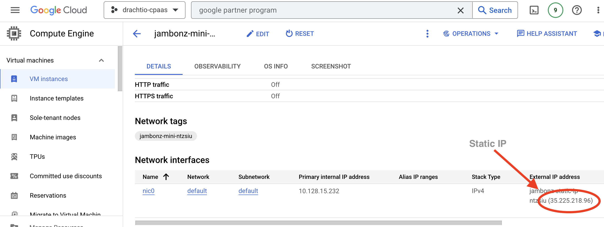
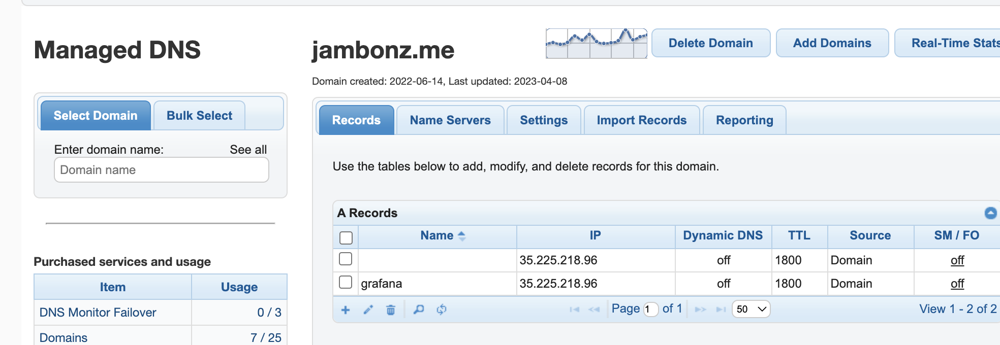
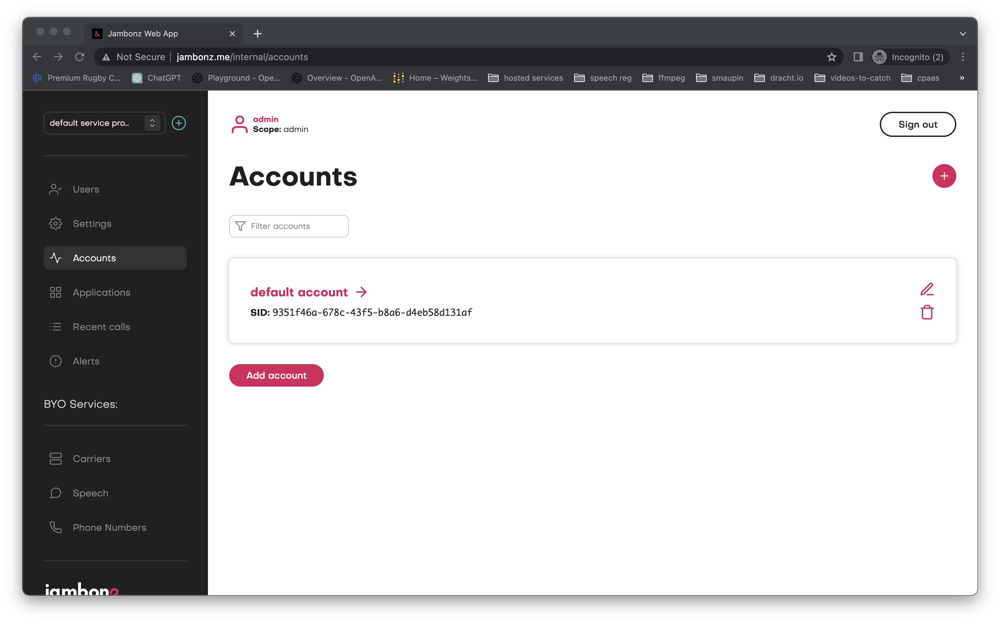

> *Originally published April 2023. This post describes jambonz as it was at the time. The `jambonz-infrastructure` repo referenced below has since been superseded by the repos under [jambonz-selfhosting](https://github.com/jambonz-selfhosting), and current instructions live in the [self-hosting docs for GCP](https://docs.jambonz.org/self-hosting/hosting-providers/gcp).*

## Overview

This article describes how to build a jambonz image on GCP using [packer](https://www.packer.io/) and then deploy a VM using [terraform](https://www.terraform.io/). To follow along the example here, you will need the following:

* a [google cloud account](https://console.cloud.google.com)

* [packer](https://www.packer.io/) and [terraform](https://www.terraform.io/) and git installed on your laptop

Let's get started!

## Create a GCP project and service account

In order to run packer and terraform locally on your laptop and create resources on Google Cloud Platform we'll need to download some credentials to our laptop. So login into the [GCP console](https://console.cloud.google.com), create a project (or select an existing one) and then from the main menu select IAM & Admin / Service Accounts. Click "Create Service Account", fill in the details and click "Create and Continue".



Add the following roles to the service account and then click "Continue":

* Compute Admin

* Compute Instance Admin (v1)

* Compute Network Admin

* Service Account Admin

* Service Account User

Now find the service account you just created in the list, select it and then click Add Key / Create Key and select JSON. Download the json key file to your laptop and save it to folder.



## Check out jambonz-infrastructure from github

In a terminal window on your laptop check out jambonz-infrastructure and navigate to the packer folder for building the jambonz-mini.

```bash
git clone https://github.com/jambonz/jambonz-infrastructure.git
cd jambonz-infrastructure/packer/jambonz-mini/
```

Next, set the environment variable `GOOGLE_APPLICATION_CREDENTIALS` to point to the JSON service key file that you downloaded

```bash
export GOOGLE_APPLICATION_CREDENTIALS=~/Downloads/drachtio-cpaas-4712713e4b95.json
```

## Building a image

Now you are ready to build a GCP image. First, review the settings in the file `gcp-template.json` and change:

* `project_id` to your gcp project id,

* `image_zone` to the zone that you want to build the image in.
  You can also change the `disk_size` if you want to have a larger disk than the default 80G (it is recommended to have at least 80G to handle time series data like call detail records and logs).

Once you have made any changes necessary, start the packer build. This will take 30-45 minutes to complete as it builds all of the supporting software projects as well as jambonz.

```bash
 packer build -color=false gcp-template.json
```

Once it is completes it will generate an image:

```bash
    googlecompute: Processing triggers for man-db (2.9.4-2) ...
==> googlecompute: Deleting instance...
    googlecompute: Instance has been deleted!
==> googlecompute: Creating image...
==> googlecompute: Deleting disk...
    googlecompute: Disk has been deleted!
Build 'googlecompute' finished after 40 minutes 57 seconds.
```

You will be able to see the image in the GCP console:



## Deploying a VM instance

Now change into the terraform folder

```bash
cd ../../terraform/gcp/jambonz-mini/
```

You can now prepare to run terraform by running the following commands:

```bash
terraform init
terraform plan
```

This will prompt you to provide some variables, most importantly the image id that you just created. If you prefer, you can also provide these settings by creating a file named `deployment.tfvars` in the same folder, for example in my case:

```bash
image = "packer-1681065267"
region = "us-central1"
zone = "us-central1-a"
project = "drachtio-cpaas"
dns_name = "jambonz.me"
instance_type = "e2-medium"
```

the `dns_name` should be a DNS name in a domain controlled by you. It will be the http URL at which you access the jambonz.portal. The `instance_type` is the GCP instance type that the jambonz VM instance will be running on. We recommend an instance type with a minimum of 2vCPUs and 8 GB Ram (more of each if this server is going to handle production traffic).

and then run the command as:

```bash
terraform plan -var-file="deployment.tfvars"
```

If all looks good, then run it:

```bash
terraform apply
```

or, if you've created a variables file:

```bash
terraform apply -var-file="deployment.tfvars"
```

This should run successfully with output like the following:

```bash
random_string.uuid: Creating...
random_string.uuid: Creation complete after 0s [id=ntzsiu]
google_compute_address.jambonz_static_ip: Creating...
google_compute_firewall.jambonz_mini_firewall_rule: Creating...
google_compute_address.jambonz_static_ip: Still creating... [10s elapsed]
google_compute_firewall.jambonz_mini_firewall_rule: Still creating... [10s elapsed]
google_compute_address.jambonz_static_ip: Creation complete after 11s [id=projects/drachtio-cpaas/regions/us-central1/addresses/jambonz-static-ip-ntzsiu]
google_compute_instance.jambonz_mini: Creating...
google_compute_firewall.jambonz_mini_firewall_rule: Creation complete after 11s [id=projects/drachtio-cpaas/global/firewalls/jambonz-firewall-rule-ntzsiu]
google_compute_instance.jambonz_mini: Still creating... [10s elapsed]
google_compute_instance.jambonz_mini: Still creating... [20s elapsed]
google_compute_instance.jambonz_mini: Still creating... [30s elapsed]
google_compute_instance.jambonz_mini: Still creating... [40s elapsed]
google_compute_instance.jambonz_mini: Creation complete after 42s [id=projects/drachtio-cpaas/zones/us-central1-a/instances/jambonz-mini-ntzsiu]

Apply complete! Resources: 4 added, 0 changed, 0 destroyed.
```

Now you should be able to log into the GCP console and see the running instance. Make note of the external (static) IP because in the final step you will add DNS A records pointing to this IP.



## Create DNS records for the server

Now create DNS records in your DNS provider for the name that you provided when creating the instance. For example, in my case I chose to use the name jambonz.me to refer to the VM instance, and I will create the following two DNS A records, each pointing to the static IP of the server:

* jambonz.me

* grafana.jambonz.me

In my case, I am using [DNS Made Easy](https://dnsmadeeasy.com) as my DNS provider so my DNS records look like this:



## Log into the portal and configure the system

At this point you can log into the jambonz portal at the DNS name that you chose with user / password "admin/admin". You will be forced to change the password on your first login.



You'll want to configure your Carriers (sip trunks) and speech credentials, but at this point you have a fully functional jambonz system running on GCP. Enjoy!
