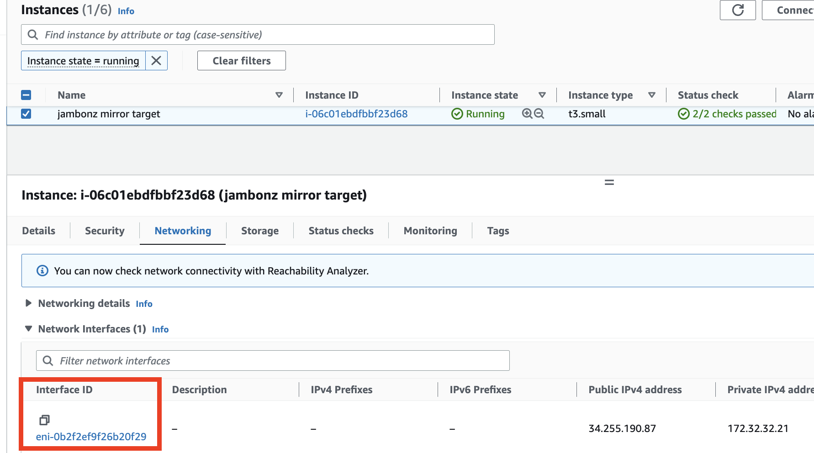
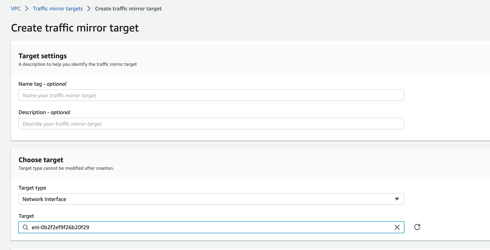
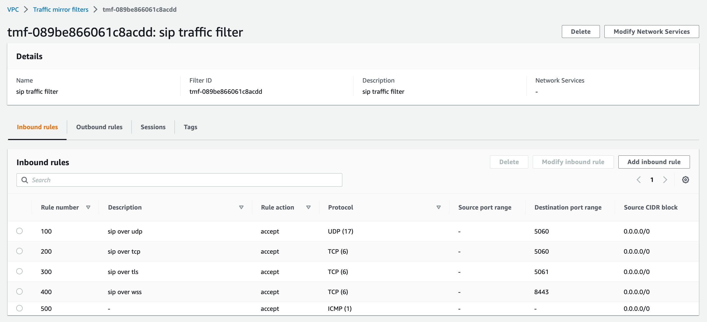
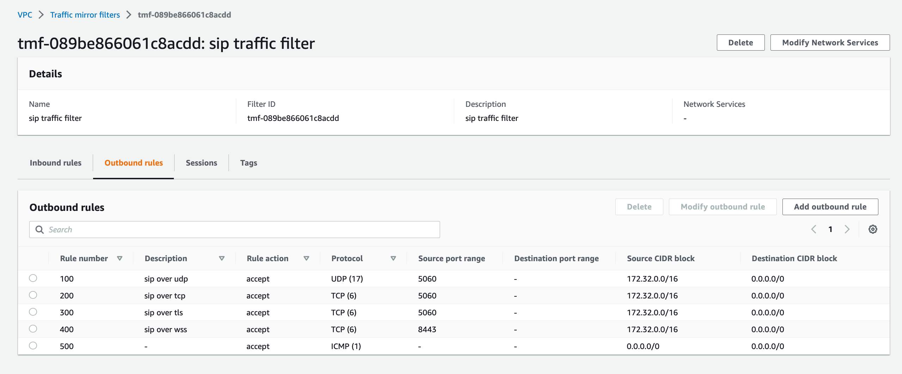
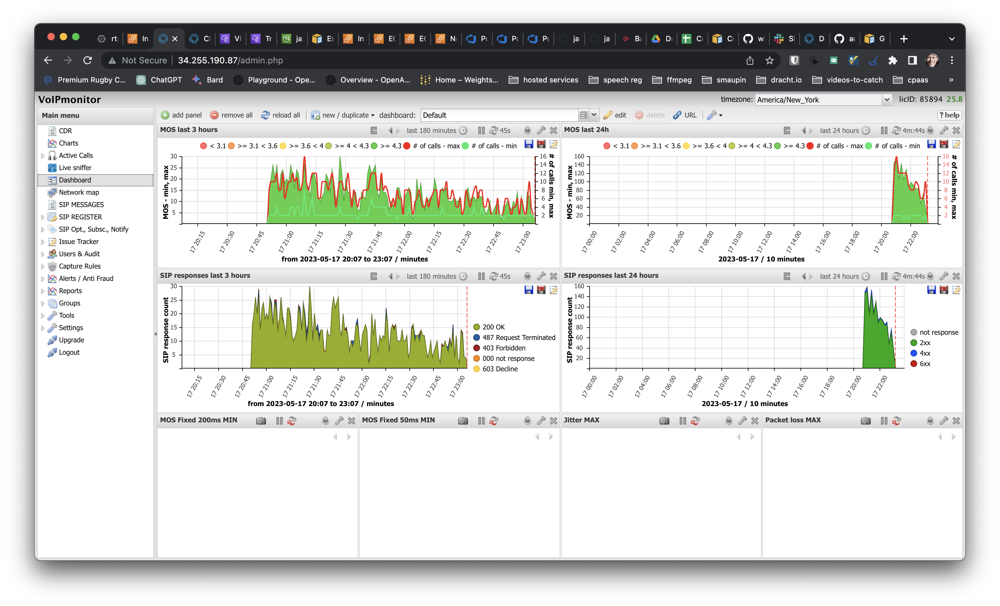

> *Originally published May 2023. This post describes jambonz as it was at the time and some details have since changed.*

jambonz comes with a great set of observability tools out of the box:

* a grafana dashboard displaying key performance metrics,

* opentelemetry application traces, which are visible in the jambonz portal, and

* the ability to download sip traces in the form of pcap files from the portal for recent calls.

The gold standard in VoIP system monitoring, however, has always been [Voipmonitor](https://www.voipmonitor.org/). Voipmonitor provides a wealth of charts and detailed analytic tools for SIP and RTP that are powerful and yet accessible to tier-one support engineers. If you want to level up your jambonz support organization, implementing Voipmonitor is a great choice.

In this article we will show you how to deploy Voipmonitor on AWS using the Traffic Mirroring feature to mirror traffic from your jambonz SIP and RTP servers to a voipmonitor server.

> Note: This works both for EC2 as well as Kubernetes installs.

Also, as a bonus, we will show you how to write the mirrored traffic to pcap files and upload them to S3 storage, separately from Voipmonitor. Having rolling raw pcap files like this can be useful for troubleshooting low level transport connection issues such as TLS connectivity with carriers.

Let's get started!

## What you need

### Nitro-based EC2 instances

We'll be mirroring the traffic to the voipmonitor server using [AWS Traffic Mirroring](https://docs.aws.amazon.com/vpc/latest/mirroring/traffic-mirroring-getting-started.html), and that feature is only available to [nitro-based instances](https://docs.aws.amazon.com/AWSEC2/latest/UserGuide/instance-types.html#ec2-nitro-instances), so make sure that your jambonz servers are running on a nitro-based instance as well as the new server that you'll be spinning up to run voipmonitor.

### Voipmonitor

And of course you'll need to install Voipmonitor as well (we'll show you how). Voipmonitor is a commercial product, but don't be dissuaded from trying it -- they provide a 30-day free trial and the [pricing is very reasonable](https://www.voipmonitor.org/whmcs/cart.php?gid=1) when you are ready for upgrade to a paid license.

## Installing Voipmonitor

The first step is to spin up a new instance in the AWS VPC where your jambonz system is running (Traffic Mirroring works within a VPC so Voipmonitor must be in the same VPC, unless you choose to do more complicated VPC peering). Again, this must be a nitro-based instance; in my deployment I chose to use a t3.small. You'll want a lot of disk space, at least 50G (for my deployment I used a 100 G disk).

So go ahead and spin up a nitro-based instance on Debian 11, configured as above, in your jambonz VPC. Create a new security group for the instance that allows the following traffic in:

* ssh (22/tcp) from anywhere,

* http (80/tcp) and https (443/tcp) from anywhere, and

* VXLAN (4789/udp) from the VPC

Once the instance is up and running, follow [these instructions](https://www.voipmonitor.org/doc/Debian_11) to install the voipmonitor GUI and sniffer. The sniffer will be reading the mirrored traffic from the network interface that will be coming in on 4789/udp. The default voipmonitor config (in /etc/voipmonitor.conf) listens for VXLAN traffic on this port so no changes are needed to the config file.

After installing the GUI, connect your browser to the public IP of the voipmonitor server using http (not https). You will be guided through the final stages of the install and redirected to the voipmonitor corporate site to generate a free license for the demo period of 30 days.

As a final step, If you want to enable HTTPS for the voipmonitor GUI [follow these instructions](https://www.voipmonitor.org/doc/Securing_the_VoIPmonitor_Web_GUI_HTTPS_and_Basic_Auth). As an example, to use [letsencrypt](https://letsencrypt.org) to generate your certificate you would first create a DNS A record for the server in your DNS provider, and then simply do this:

```bash
apt-get update
apt install snapd
snap install core
snap install --classic certbot
ln -s /snap/bin/certbot /usr/bin/certbot
certbot --apache
systemctl restart apache2
```

Once voipmonitor is up and running, we now need to mirror the traffic from the jambonz SIP and RTP servers to voipmonitor.

## Configuring AWS Traffic Mirroring

There are three steps to configuring traffic mirroring:

1. Create a mirror target

2. Create two mirror filters: one for SIP and one for RTP

3. Create mirror sessions for each jambonz SIP and RTP server. A mirror session will direct traffic from one elastic network interface (ENI) to the mirror target, using the mirror filter to determine which traffic to mirror.

### Create a mirror target

First, retrieve and copy the Interface ID for the network interface that is attached to voipmonitor instance that you created. You can find it in the network panel of the instance details as shown below:



Then go to Traffic mirroring / MIrror targets / Create mirror target. Leave Target type set to "Network Interface" and paste the Interface ID that you copied above. Add a Name tag and click Create. This configures the voipmonitor instance to receive the mirrored traffic.



### Create mirror filters

Go to Traffic mirroring / Mirror filters / Create mirror filter. First, let's create a filter for sip traffic.

Create inbound rules that accept the following:

* port 5060/udp from anywhere (this is for sip over udp),

* 5060/tcp, 5061/tcp, 8443/tcp from anywhere (sip over tcp, tls, and websockets), and

* icmp (can be useful to troubleshoot destination unreachable issues).

Create outbound rules that accept the following:

* 5060/udp sent from the VPC to anywhere

* 5060/tcp, 5061/tcp, 8443/tcp from the VPC sent anywhere, and

* icmp

Save the mirror filter. As an example, my sip inbound rules look like this:



and my sip outbound rules look like this:



Now create a second filter for rtp. Inbound rules this time will be:

* dst port 40000-60000/udp

* icmp

and outbound rules will be:

* src port: 40000-60000/udp

* icmp

### Create mirror sessions

Finally, create a mirror session for every jambonz SIP server and RTP server. If using Kubernetes, you will create a mirror session for every node in the SIP and RTP node pools. The source node in each case will be the jambonz server and the destination will be the mirror target that you created earlier.

As a first step, for each source node gather the interface IDs for the ENI for each EC2 instance. Then create a mirror session for each node; for sip nodes use the sip mirror filter and for rtp nodes using the rtp mirror filter. In all cases connect to the single mirror target that you've created.

Once you've done this, mirrored traffic should be flowing to voipmonitor and you should see calls in the voipmonitor GUI.



## Bonus section: upload pcap files to AWS S3

In addition to voipmonitor you may also want to upload pcaps of network traffic to AWS S3.

> Note: this section does not require the voipmonitor install, though it does require the traffic mirroring to be set up as above.

### Create an S3 bucket

Create a bucket in S3 to hold the pcap files.

### Install the aws cli on the mirror target server

```bash
sudo apt-get update
sudo apt-get upgrade
sudo apt-get install unzip
curl "https://d1vvhvl2y92vvt.cloudfront.net/awscli-exe-linux-x86_64.zip" -o "awscliv2.zip"
unzip awscliv2.zip
sudo ./aws/install
```

Configure the aws cli

```bash
aws configure
```

### Create a systemd file for tcpdump

We'll be using tcpump to continually write the incoming mirrored traffic to pcap files on the server. To do that, create a file named /etc/systemd/system/tcpdump.service:

```bash
[Unit]
Description=Tcpdump

[Service]
ExecStart=/usr/bin/tcpdump -ni ens5 'port 4789' -W 5 -C 300 -w /tmp/rolling.pcap
Restart=on-failure
User=root
LimitNOFILE=4096

[Install]
WantedBy=multi-user.target
```

This writes all the encapsulated traffic to 5 rotating pcap files, closing each file when it reaches 300 MB. Start the service:

```bash
sudo systemctl daemon-reload
sudo systemctl start tcpdump.service
```

### Monitor pcap files and upload them to AWS S3

Next we need a job to monitor these files and upload them to your bucket. First, install support for inotify, which we will use to detect when a rolling pcap file has been closed.

```bash
sudo apt-get install inotify-tools
```

Create a file named /usr/local/bin/pcap-monitor.sh. Copy the contents below into the file:

```bash
#!/bin/bash

folder="/tmp/"
bucket="<your-bucket-name>"

inotifywait -m $folder -e close_write |
    while read path action file; do
        if [[ "$file" =~ .*pcap[0-9]$ ]]; then
            echo "The file '$file' appeared in directory '$path' via '$action'"
            # Format the current date and time
            current_date=$(date +%Y-%m-%d)
            current_time=$(date +%H-%M-%S)
            # Copy and compress the file
            cp ${path}${file} ${path}${file}.tmp && gzip -q ${path}${file}.tmp
            # S3 path
            s3_path="s3://$bucket/${current_date}/${current_time}.pcap.gz"
            echo "Uploading to $s3_path"
            # Upload to S3 and remove the compressed file
            aws s3 cp ${path}${file}.tmp.gz $s3_path --quiet && rm ${path}${file}.tmp.gz
            echo "Upload to $s3_path completed"
        fi
    done
```

This script watches the /tmp directory and every time a new pcap file is closed it will zip it and then upload the zip file to your S3 bucket, deleting the zip file afterwards. Make the file executable:

```bash
sudo chmod a+x /usr/local/bin/pcap-monitor.sh
```

Next, we'll create a systemd daemon to run this.

Create a file named /etc/systemd/system/pcap-monitor.service and copy the contents below in:

```bash
[Unit]
Description=Monitor Script
After=network.target

[Service]
ExecStart=/bin/bash /usr/local/bin/pcap-monitor.sh
WorkingDirectory=/tmp
StandardOutput=journal
StandardError=journal
SyslogIdentifier=pcap-monitor

[Install]
WantedBy=multi-user.target
```

Now start it:

```bash
sudo systemctl daemon-reload
sudo systemctl restart pcap-monitor
```

All set! At this point pcap files should be periodically uploaded to your bucket, into folders by date. You may want to configure the AWS bucket to automatically delete pcap files after a certain number of days. But now you will have access to all network traffic from your production SBC SIP and RTP servers in order to troubleshoot any tricky SIP interop issues in production.

### Time for one more option?

If you like, with a few more steps you can strip the VXLAN headers from the pcaps, so that they will appear in wireshark exactly as they would as they arrived over the wire. There is no problem with leaving the pcaps encapsulated in the VXLAN headers, but it might be slightly less confusing when you analyze them in a tool like wireshark without them. If you want to do this, first you need to build a simple utility to strip the headers -- luckily, I have one for you on my github!

```bash
sudo apt-get install libpcap-dev build-essential git
git clone https://github.com/drachtio/decap_vxlan.git
cd decap_vxlan
make && sudo make install
```

Now edit the /usr/local/bin/pcap-monitor.sh file to be like this

```bash
#!/bin/bash

folder="/tmp/"
bucket="<your-bucket-name>"

inotifywait -m $folder -e close_write |
    while read path action file; do
        if [[ "$file" =~ .*pcap[0-9]$ ]]; then
            echo "The file '$file' appeared in directory '$path' via '$action'"
            # Format the current date and time
            current_date=$(date +%Y-%m-%d)
            current_time=$(date +%H-%M-%S)
            # Copy and compress the file
            cat ${path}${file} | decap_vxlan | gzip -q > ${path}${file}.tmp.gz
            # S3 path
            s3_path="s3://$bucket/${current_date}/${current_time}.pcap.gz"
            echo "Uploading to $s3_path"
            # Upload to S3 and remove the compressed file
            aws s3 cp ${path}${file}.tmp.gz $s3_path --quiet && rm ${path}${file}.tmp.gz
            echo "Upload to $s3_path completed"
        fi
    done
```

That's it! Now you've rolling pcaps of your recent sip and rtp traffic available in a secured S3 bucket for your jambonz deployment. Enjoy!
