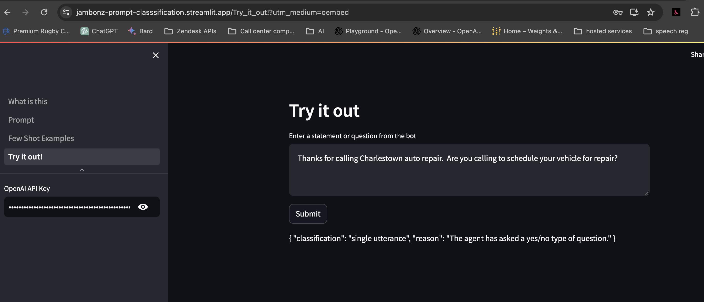

Yes, we can talk to AI. Connecting a speech driven interface to AI is easy. But crafting a conversational experience that approaches the ease and pleasure of a conversation with another human is not.

One of the challenges is that speech recognition systems are not that good at detecting the turn of a conversation. As humans, we're super good at this - we continually process all sorts of cues during a conversation to determine when our partner has finished speaking and we can jump in. For instance:

* s/he asked us a question so we know it's time for us to respond (and think about how easy it is for us to classify a question as rhetorical, in which case we understand it is *not* for us to respond to),

* s/he starts by saying "it's a long story.." and we settle in to wait longer for our turn to speak, or

* s/he pauses during her speech, but we know it is a sort of "thinking" or a "bridge" pause and we don't break in ("Yeeeah..(pause)...well, it's not that simple, my friend..")

However, in a conversation with AI, speech recognition services will return a transcript any time the speaker pauses, regardless of whether this is a complete response. Quite often, conversations get derailed because AI tried to process a partial statement from the speaker and returned a non-sensical response. If on the other hand we simply wait an extra long time to be sure the user has finished speaking, we get a stilted conversation with lots of uncomfortable silence that is even worse.

## Using AI to help predict the turns of the conversation

What if we used AI to predict the type of response a caller may make to a given statement or question from a voicebot? And what if we then used that prediction to tune the speech recognizer specifically for this turn of the conversation?

This is essentially a text classification operation, which is something that LLMs are really good at. Let's build a simple example using OpenAI's gpt-3.5-turbo model to test with.

### Streamlit app

Below is a streamlit app that we can use to test out our idea. In this app we are using a few-shot prompt to configure the model to assess a statement from a voicebot and predict the type of response a caller might make. You'll need an OpenAI key to test with, and you can actually modify the prompt and examples to see how it impacts your results.

We ask the model to predict and classify the next response from the caller as one of four types:

* a single utterance

* a single sentence

* multiple sentences

* identification data

The categories are mostly self-explanatory, but the category of identification data needs some explanation. The purpose of this category is to predict when a caller is going to need to do something like give a credit card or customer number, spell their name or email address, etc. In these cases we need to make sure to give some extra time since people will often speak slowly, or pause while they refer to notes they are reading from.

Read the instructions on the first page of the app below, review the prompts and examples and then click on the "Try it out" page and enter a statement or question and see what type of response the model predicts. You can even change the prompt or the few-shot examples to see if you can improve the results!

<iframe
  src="https://jambonz-prompt-classsification.streamlit.app//?embed=true"
  height="800"
  width="100%"
></iframe>

If you are unable to run the application yourself for some reason, here is a screenshot showing a sample query and response:

### Implementing in jambonz

For our experiment we'll make a simple change to our jambonz app to consult OpenAI at each turn of the conversation to get a classification of the next expected response. We'll then turn that into a specific configuration command sent to the speech recognizer.

We're using [Deepgram](https://deepgram.com) and specifically we'll be tuning their endpointing and utteranceEndMs properties [as described here](https://developers.deepgram.com/docs/understanding-end-of-speech-detection#using-utteranceend).

* If the classification is `single utterance`, we'll leave the settings at their default, because the default settings have extremely low latency (i.e. transcripts returned very quickly after extremely short pauses)

* If the classification is `single sentence`, we'll set the properties to `{endpointing: 500}` to set the endpointing to 500 ms,

* If the classification is `multiple sentences`, we'll set the properties to `{endpointing: 500, utteranceEndMs: 2000}` which sets the endpointing as above and additionally requires 2 second of non-speech before returning a final transcript

* If the classification is `identification data`, we'll also set the properties to the same values as above, since we also need to allow the caller plenty of time to finish entering their customer number, spell their name, or what have you.

### Results

The resulting conversation after these changes is much more natural and, as a result, much more effective. Check out the video below to see the difference before and after the AI tuning approach is implemented

<iframe width="560" height="315" src="https://www.youtube.com/embed/DqvmUhE7NaE?si=gmgZuutuED4aCLEm" title="YouTube video player" frameborder="0" allow="accelerometer; autoplay; clipboard-write; encrypted-media; gyroscope; picture-in-picture; web-share" allowfullscreen></iframe>

## Conclusion

The advances in AI over the past year has been breathtaking. However, the quality of speech interactions between humans and AI still lags. Until problems like detecting turns of conversation are solved, the promise of AI in our everyday lives will be stunted. This is a hard problem that will take an array of solutions to solve comprehensively, and in this post we have only experimented with a relatively simple approach of using text-based classification to improve the prediction of dialog turns. We look forward to doing further work on this topic in the future.
