> *Originally published January 2023. This post describes jambonz as it was at the time and some details have since changed — see the [self-hosting docs](https://docs.jambonz.org/self-hosting/overview) for current deployment instructions.*

This article will walk you through the process of deploying [jambonz](https://jambonz.org) using the [AWS Cloudformation offering](https://aws.amazon.com/marketplace/pp/prodview-55wp45fowbovo). Additionally, it shows the post-install steps necessary to modify the jambonz portal to use https instead of plain http.

> The AWS Marketplace offering for a jambonz server is a flat fee of $18/month. This includes the ability to deploy an unlimited number of instances. Cost of the AWS instances themselves and associated infrastructure is separate.

## Installation

### First steps

#### Before starting

Choose the AWS region you want to deploy into. If have not previously generated an AWS keypair in that region, go and do so now. You will need it in the steps below.

#### Main page

In your web browser, navigate to https://aws.amazon.com/marketplace/pp/prodview-55wp45fowbovo. This provides the basic details of the offering, including version numbers and pricing. Click on the button labeled "Continue to Subscribe".

#### Terms and Conditions page

Review the terms and conditions and click "Continue to Configuration".

#### Configure this software page

Leave the Fulfillment option and Software version to their default settings. Select your desired AWS region from the dropdown. Click "Continue to Launch".

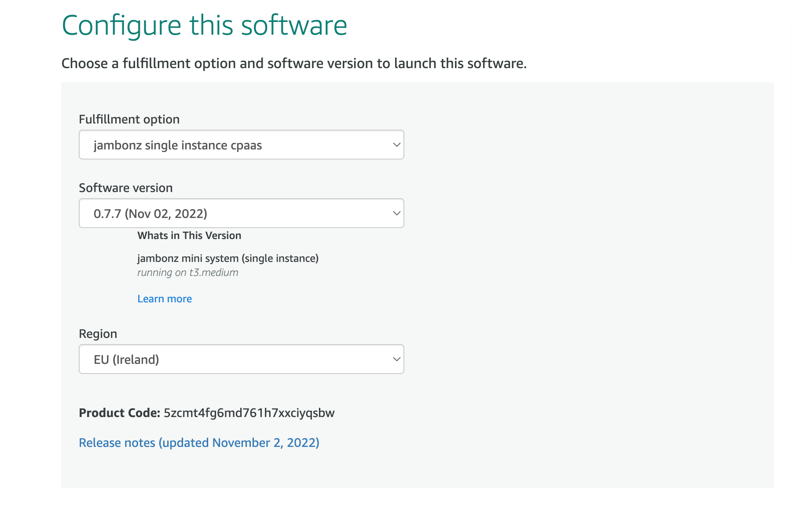

#### Launch this software page

In the "Choose Action" dropdown select "Launch Cloudformation" and click "Launch

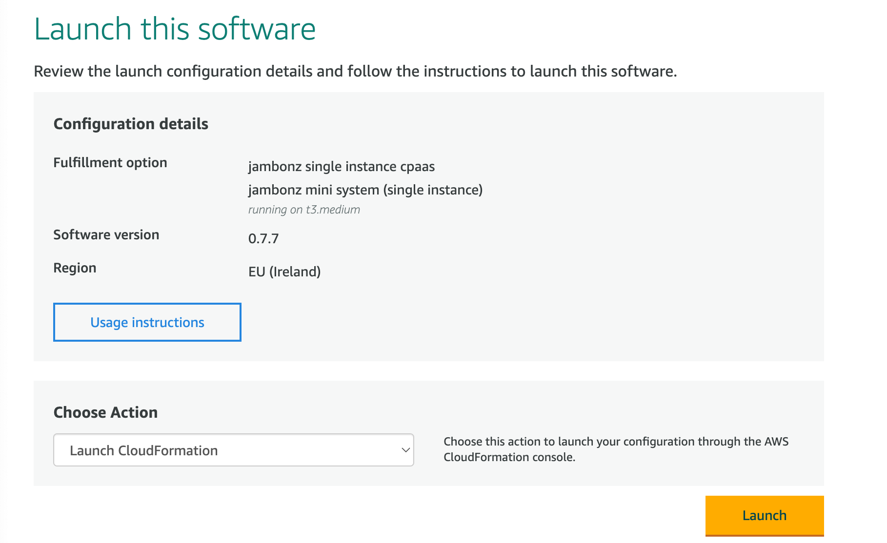

#### Create Stack

Now we've moved to the AWS Cloudformation stacks page, where we are creating a new stack using the template provided. On the next several pages we will configure the AWS environment that jambonz will be running in. All of the AWS infrastructure that will be created will be in a new VPC created by this stack, so it will not interfere with anything else you already have running in this region.

On this page, leave everything at the default selections, and simply click "Next".

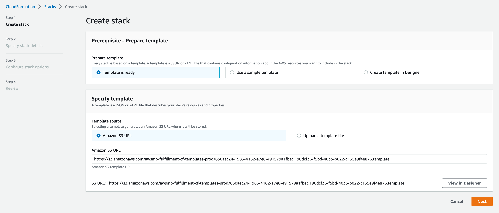

#### Specify stack details

Enter a name for the stack and then fill out the Parameters section:

* `AllowedHttpCidr`: This is a network mask that can restrict what networks can access the jambonz portal. Typically, you may want to leave this open to the internet if you don't know where your admin users will be logging in from; if so, enter "0.0.0.0/0".

* `AllowedRtpCidr`: Ditto to the above, for the source of caller media streams (RTP). Again, in most cases you will want this to be "0.0.0.0/0".

* `AllowedSipCidr`: Ditto for restricting the sources of SIP signaling. As above, for most deployments this will be "0.0.0.0/0" but if you wanted to restrict it for instance to one of your internal SBCs you could enter the network mask for that.

* `AllowedSshCidr`: And finally, the same for where you want to allow ssh access into the server and, again, "0.0.0.0/0" means access from anywhere.

* `InstanceType`: Here you choose the instance type you want to run on. For production VoIP systems, AWS recommends the c5n instance class and a good choice for jambonz would be the c5n.xlarge, if they have that instance type in your region. This would handle about 15-20 arriving calls per second and 300-400 concurrent calls in progress. If you need something smaller, e.g. for testing, feel free to deploy a t2 or t3.medium. If you need something for large production loads, speak to us about building a jambonz horizontally-scalable cluster -- we have a cloudformation script for that as well, but it is not currently available on the AWS marketplace so you need to contact us (support@jambonz.org) and we will set you up.

* `KeyName`: Select one of the AWS keypairs that you have previously generated in this region.

* `URLPortal`: If you intend for the jambonz portal to be accessible from a browser using a DNS name (versus its IP address), then enter that name here. In my example, I will be adding 'jambonz.net' as the DNS. *(Note: you don't need to provision the DNS record for that name just yet, you will do so after the stack completes and you know the elastic IP of the EC2 instance created.)*

* `VpcCidr`: The stack is going to create an AWS VPC that will contain everything that gets created -- things like subnets, internet gateways, the EC2 instance itself, etc. Here put a CIDR for the VPC itself. As an example, I typically use "10.0.0.0/16".

Finally, click "Next".

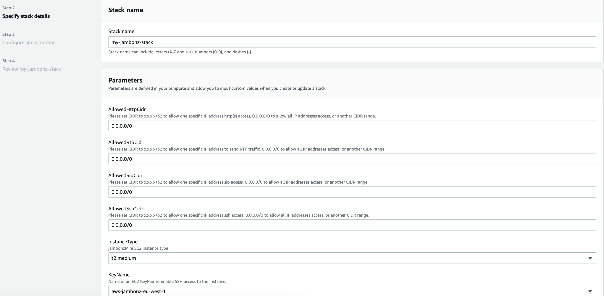

#### Configure stack options

Under the "Tags" section, its a good idea to add a "Name" tag with a meaningful name to identify and group all of the stuff we are going to create. This is optional, however.

Leave the rest of the fields at their default and click "Next" at the bottom righthand side of the page.

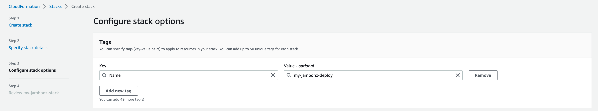

#### Review stack

Leave everything as presented and click "Submit" on the bottom of the page.

> Note: if prompted to confirm the creation of an IAM role, select the checkbox to ok that. As of release 0.7.8 and later, the stack automatically configures jambonz to send logs to Cloudwatch, which is very useful for troubleshooting. In order to do so, the stack must create an IAM role for this.

#### Done!

Now we wait a bit while AWS deploys our EC2 instance and the associated stuff in our new VPC. This should take roughly 2-3 minutes.

When complete, click on the Outputs panel. This will tell you the elastic IP of the server, along with the initial password to use to log into the portal.

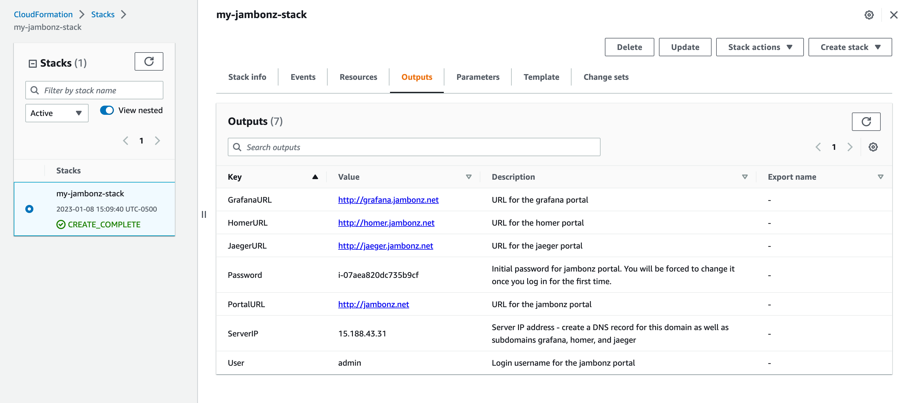

#### DNS configuration

If you entered a DNS name in the stack parameters above, then now is the time to create DNS records for the jambonz portals. (Skip this step if you left that parameter blank).

Copy the ServerIP from the Outputs panel and create DNS A records for all of the following, each pointing to that IP:

* `<dns>`

* `api.<dns>`

* `grafana.<dns>`

* `homer.<dns>`

* `jaeger.<dns>`

For instance, I use [DNS Made Easy](https://dnsmadeeasy.com) as my DNS provider, so I go into their portal to set up these DNS records.

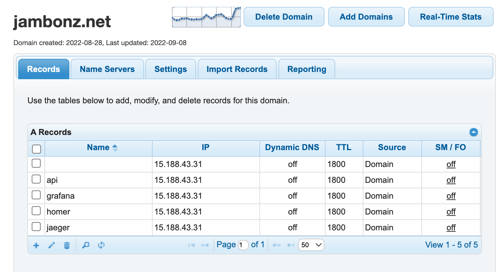

#### Accessing the portal

Now you should be able to log into the portal. In your browser URL window you will either enter the DNS name that you specified (http://jambonz.net, in my case) or just the Server IP if you did not specify a DNS name.

> Note: once the cloudformation stack is complete, the EC2 instance still requires a bit more time to initialize and come up the first time. If you try to log into the portal and get a 502 Bad Gateway just give it a minute or two and try again.

On the jambonz login screen use the username 'admin' and the first-time password that you see on the Output panel of the cloudformation window. You will be forced to set a new password. Once you set the new password you will be logged into the home page of the portal.

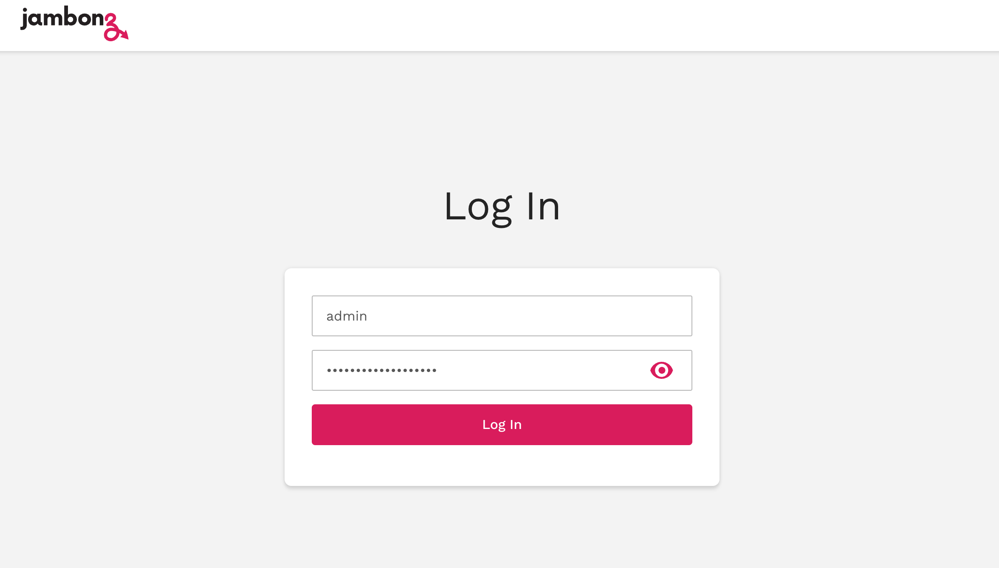

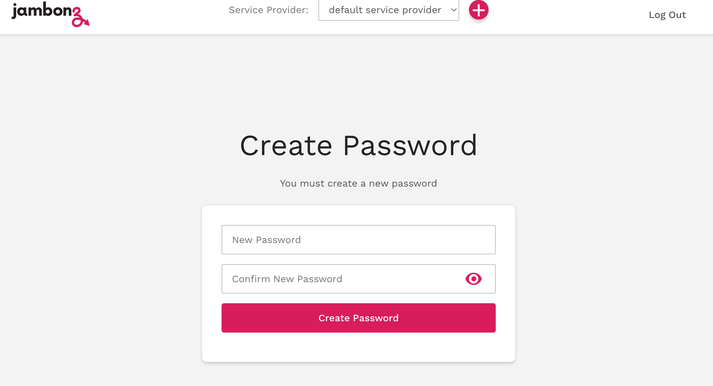

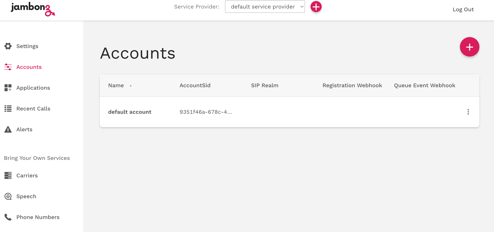

#### Additional portals

If you used a DNS name, the monitoring portal will be `grafana.<dns>` and you will log in with admin/admin. You will be forced to change the password on the initial login.

Navigate to Dashboards/Browse/jambonz/Jambonz Metrics to see the jambonz monitoring page. Right now, with no traffic there won't be much activity, but this will be a useful page to monitor your live system. It will tell you things like: how many calls are on the system, what is the latency / response time for things like text-to-speech generation and application webhook responses etc.

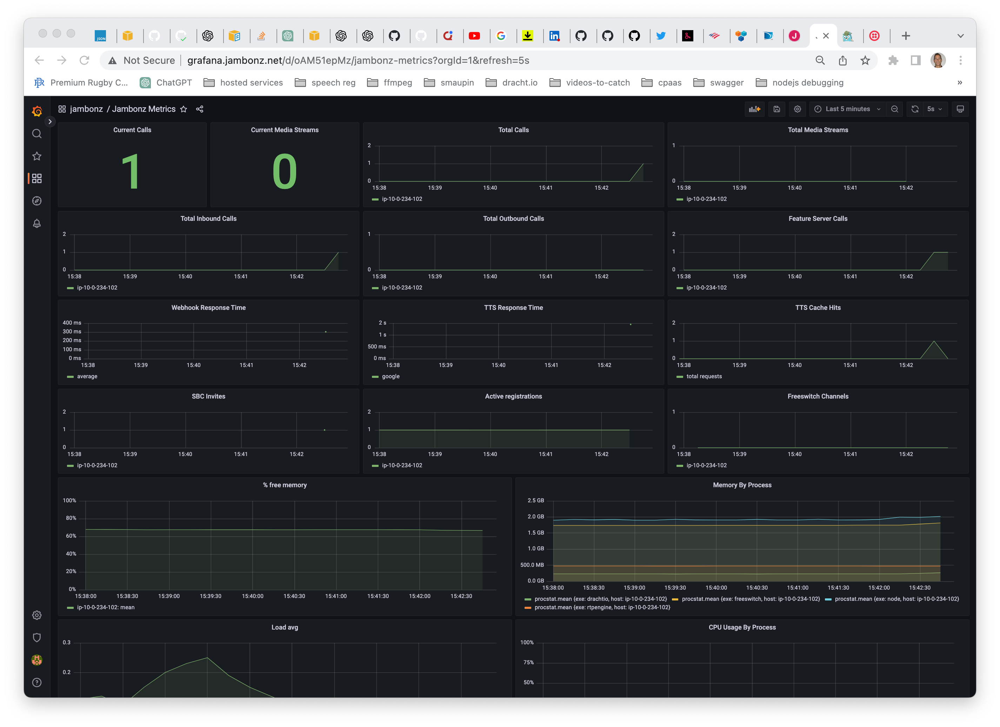

SIP traces are sent to homer, which can be accessed at `homer.<dns>`. The initial login is admin/sipcapture.

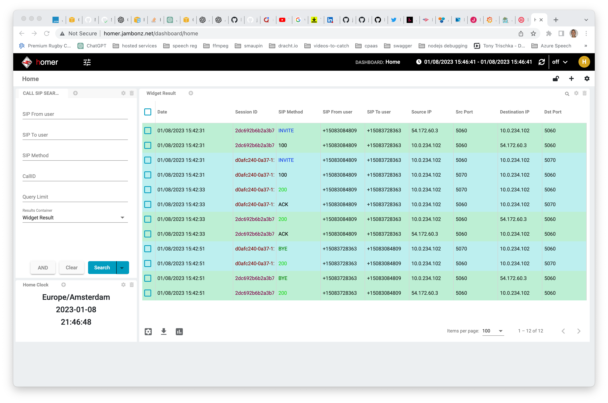

Application traces are sent to jaeger, which can be accessed at `jaeger.<dns>`. There is currently no authentication associated with this page. Application traces can be very useful to see exactly what happened on a specific call. In the trace below, for example, we can see the following:

* retrieving account details from mysql took 15 milliseconds

* the http webhook to retrieve the jambonz app took 308 milliseconds

* synthesizing speech from text took 1.4 seconds (note: tts audio is cached by jambonz, so further requests for this text/voice/language/provider will be near-instantaneous)

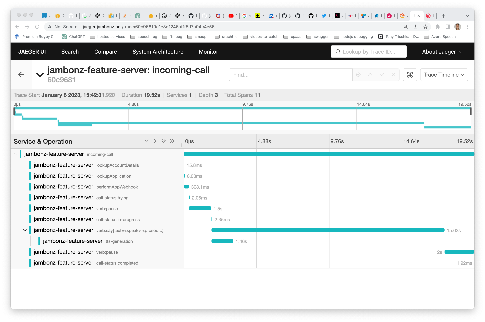

### Modifying portals to use HTTPS

We've been using plain HTTP to access the portals so far. That's perfectly fine, but we can also change to use HTTPS if we like. To do so, we will need to install a TLS certificate on the server, and modify the NGINX and jambonz configs slightly. Let's walk through that.

#### Check nginx config

In jambonz releases prior to 0.8, it may be necessary to fix something in the nginx config file before performing these steps. ssh into the server and as root user open `/etc/nginx/sites-available/default` in an editor. If the top lines look like this:

```bash
  server {
      server_name _;
      location /api/ {
```

change them to replace the underscore with your dns name (jambonz.net in my case)

```bash
server {
    server_name jambonz.net;
    location /api/ {
```

#### Installing a TLS certificate

You can use any certificate provider you want, but in this case I am going to use [letsencrypt](https://letsencrypt.org/) because they are free and easy to use.

Following the instructions on their page, I go [here](https://certbot.eff.org/instructions?ws=nginx&os=debianbuster) to get my instructions. Following these instructions is pretty straightforward:

```bash
sudo -u root -s
apt-get update
apt install snapd
snap install core
snap install --classic certbot
ln -s /snap/bin/certbot /usr/bin/certbot
certbot --nginx
```

This will install a certificate and rewrite your nginx configuration file (the same one we looked at above) to support https. For instance, mine now looks like [this](https://gist.github.com/davehorton/bd35eafe1e0ad6467e417630f020a533).

#### Modifying jambonz config

We're not done quite yet. Now, ssh into the jambonz server as the admin user and go to the `~/apps/jambonz-webapp` folder.

Modify the .env file in this folder. **If you are running a 0.7.x version** change this:

```bash
REACT_APP_API_BASE_URL=http://jambonz.net/api/v1
```

to this

```bash
REACT_APP_API_BASE_URL=https://jambonz.net/api/v1
```

(Of course, your dns name will be different, but the point is simply to change this to an https url).

**If you are running a 0.8 version or above** change this:

```bash
VITE_API_BASE_URL=http://jambonz.net/api/v1
```

to this

```bash
VITE_API_BASE_URL=https://jambonz.net/api/v1
```

Then rebuild and restart:

```bash
npm run build
npm restart jambonz-webapp
```

All set! If you log out of the portal, refresh your browser and log back in you should now see your connection is over a secure https connection.

## Conclusion

I hope this article has been useful in showing you how to quickly install and configure a jambonz system on AWS using the Marketplace offering. Please feel free to contact us by email at support@jambonz.org or by joining our [community forum](https://community.jambonz.org).
