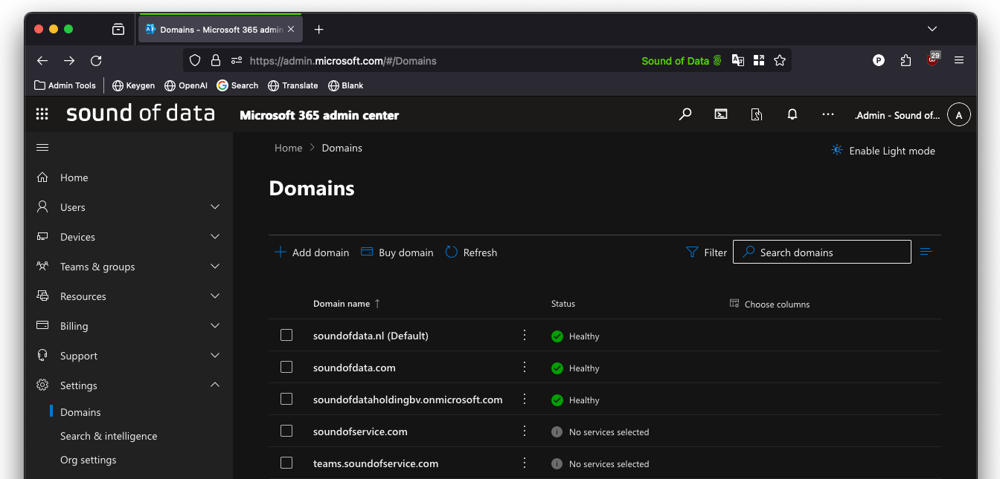
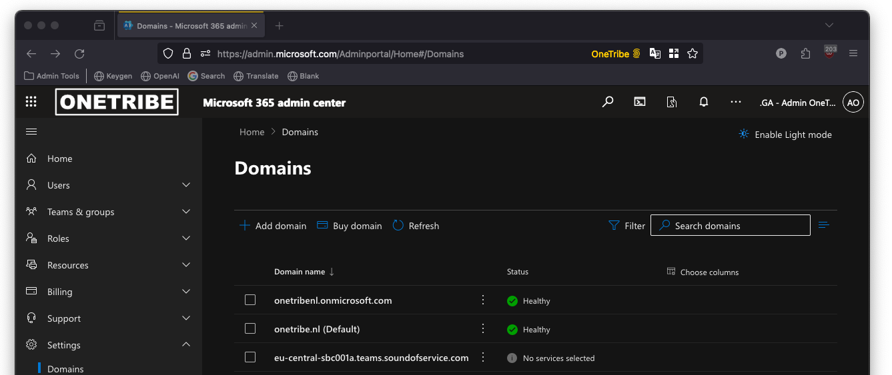

> This blog was comes to you thanks to [Peter Mijnster](https://www.linkedin.com/in/petermijnster/) at [SoundOfData](https://www.soundofdata.com/) and [Antony Jukes](https://www.linkedin.com/in/antony-jukes-7b139782/) at [Callable.io](https://www.callable.io/), who were gracious enough to capture and relay their experience in setting up jambonz as a [Direct Routing SBC for Microsoft Teams](https://learn.microsoft.com/en-us/microsoftteams/pstn-connectivity#teams-phone-with-direct-routing). Thanks Peter and Antony!

Microsoft Teams Direct Routing is a feature of Microsoft Teams that allows organizations to connect their existing telephony infrastructure to Microsoft Teams, enabling users to make and receive calls through the Microsoft Teams interface. Essentially, it allows you (and your users) to use Microsoft Teams as a unified communication platform for both internal and external communications, including traditional phone calls.

When setting up Microsoft Teams Direct Routing, you need a Session Border Controller (SBC) to manage the connection between your on-premises telephony infrastructure and the Microsoft Phone System. The SBC acts as an intermediary, handling the translation of signaling and media between the two systems, ensuring seamless communication.

[jambonz](https://www.jambonz.org/) is an open-source voice platform that is widely deployed by CX/AI, Voice/AI, and CPaaS vendors. It includes SBC functionality and integrates your existing voice infrastructure, such as SIP trunks, with Microsoft Teams; enabling features like inbound and outbound calling, voicemail, and emergency calling within the Microsoft Teams environment.

In simpler terms, Microsoft Teams Direct Routing with jambonz allows you to leverage your existing phone infrastructure while still enjoying the collaborative and communication features of Microsoft Teams. It's a way to bring together the best of both worlds: the familiarity and reliability of traditional telephony with the modern capabilities of a unified communication platform like Microsoft Teams.

## The jambonz Setup

To ensure a seamless demonstration, we've established a jambonz environment using a single EC2 instance (a "jambonz mini" system) hosted on Amazon Web Services (AWS) in the eu-central-1 region within a single dedicated VPC.

> Note: We've used our custom AWS CloudFormation templates which have been designed to meet our specific requirements and code guidelines. While these templates differ from the standard jambonz repository, the end-product remains identical.

> Note: In most of the verbiage below, we have replaced our actual domain name with 'contoso' in order to avoid attracting traffic from web crawlers. You'll still see the actual domain name in some of the images, but hopefully you get the idea.

We've setup our jambonz server with the following domain name, eu-central-jbz-teams.contoso.app. This domain is only used for accessing the Jambonz web portal and has no further use for getting Microsoft Teams Direct Routing up and running. The reason we've included the eu-central in the URI is because we like to know in which region our servers are running and this will help when we introduce Microsoft Teams Direct Routing with jambonz in multiple regions as a global proposition.

## Certificates and DNS

As mentioned above, we will be using a different domain for the Microsoft Teams Direct Routing functionality. This is both true for jambonz as well as Microsoft Teams (Microsoft 365). We will be using the following domain name for this demo, `teams.contoso.com` with a matching wildcard certificate so that we can create subdomains for individual customers ("tenants" in Teams lingo).

The first thing we need to do is to add the FQDN of our jambonz server to our DNS-server as an A-record. In our case that will be eu-central-sbc001a.contoso.com.

**Example of a possible (future) multi-region high-availability approach and FQDN's for the first tenant that is operating in Europa and North-America:**

- eu-central-sbc001a.teams.contoso.com (1st jambonz SIP-SBC for calls in Europe)
- eu-central-sbc001b.teams.contoso.com (2nd jambonz SIP-SBC for calls in Europe)
- us-west-sbc001a.teams.contoso.com (1st jambonz SIP-SBC for calls in North-America)
- us-west-sbc001b.teams.contoso.com (2nd jambonz-SIP-SBC for calls in North-America)

**Example of a possible (future) multi-region high-availability approach and FQDN's for the second tenant that is operating in Europa, North-America and China**:

- eu-central-sbc002a.teams.contoso.com (1st jambonz SIP-SBC for calls in Europe)
- eu-central-sbc002b.teams.contoso.com (2nd jambonz SIP-SBC for calls in Europe)
- us-west-sbc002a.teams.contoso.com (1st jambonz SIP-SBC for calls in North-America)
- us-west-sbc002b.teams.contoso.com (2nd jambonz-SIP-SBC for calls in North-America)
- ap-east-sbc002a.teams.contoso.com (1st jambonz SIP-SBC for calls in China)
- ap-east-sbc002b.teams.contoso.com (2nd jambonz SIP-SBC for calls in China)

> It's important to remember that the FQDN's need to be unique. A FQDN can only be used once in all of the Microsoft 365 tenants. That's why it's important to define a FQDN-strategy beforehand and stick to it because changing it afterwards will impact the tenants (customers). So, using this approach might work for you, you could use customer names, or whatever works for you.

> It's also worth mentioning that tenants (customers) are adding these FQDN's to their Microsoft 365 tenant which you do not have access to, nor have any control over. We strongly advise against reusing these FQDN's as you cannot remove them from their Microsoft 365 tenant's domain list only from your own DNS-servers. And sooner or later this will cause issues.

## Configure drachtio server

Before we can communicate properly with the Microsoft Teams Direct Routing SIP proxy we need to configure the [drachtio server](https://drachtio.org) component of jambonz to accept SIP traffic over TLS from MS Teams.

You will need to complete two tasks:

1. configure drachtio server to listen on port 5061 for sip over tls
2. configure drachtio to know where on the server the TLS certificates are installed.

Since we are running jambonz on AWS using EC2 instances, we'll edit the drachtio.service systemd file to add an additional contact for sip over tls. While you're at it, if you want to support webrtc clients sending sip over websockets, you can add that additional contact as well. An example drachtio service file configured to listen for both sip over tls and wss looks like this:

```plaintext
[Unit]
Description=drachtio
After=syslog.target network.target local-fs.target

[Service]
; service
Type=forking
ExecStartPre=/bin/sh -c 'systemctl set-environment LOCAL_IP=`curl -s http://169.254.169.254/latest/meta-data/local-ipv4`'
ExecStartPre=/bin/sh -c 'systemctl set-environment PUBLIC_IP=`curl -s http://169.254.169.254/latest/meta-data/public-ipv4`'
ExecStart=/usr/local/bin/drachtio --daemon \
--contact sip:${LOCAL_IP};transport=udp --external-ip ${PUBLIC_IP} \
--contact sips:${LOCAL_IP};transport=tls --external-ip ${PUBLIC_IP} \
--contact sips:${LOCAL_IP}:8443;transport=wss --external-ip ${PUBLIC_IP} \
--contact sip:${LOCAL_IP};transport=tcp --external-ip ${PUBLIC_IP} \
 --address 0.0.0.0 --port 9022 --homer 172.20.10.193:9060 --homer-id 10 --homer 172.20.10.193:9060 --homer-id 10
..
```

For the second task, telling drachtio where to find the TLS certificates, edit the /etc/drachtio.conf.xml file and enter the `key-file`, `cert-file`, and `chain-file` properties under the `tls` tag, as described [here](https://drachtio.org/docs/drachtio-server#tls).

*Checking drachtio with openssl*

Before proceeding further it's a good idea to test that basic TLS connectivity is working.

```bash
openssl s_client -connect <URL or IP>:<port>
openssl s_client -connect eu-central-sbc001a.teams.contoso.com:5061
```

## Configure jambonz

We are using the default out-of-the-box settings for Jambonz. This means our "Settings" configuration page looks like this:

- **Domain Name**: eu-central-jbz-teams.contoso.app
- **Sip Domain Name**: sip.eu-central-jbz-teams.contoso.app
- **Monitoring Domain Name**: grafana.eu-central-jbz-teams.contoso.app

On the *Service Provider* tab of the *Settings* configuration page we've ticked the box to enable Microsoft Teams Direct Routing and entered the following SBC domain name:

- teams.contoso.com

After ticking the box and saving, we now see the *MS Teams Tenants* menu item on the lefthand-side of the jambonz portal, under the *BYO Services* section.

On the *MS Teams Tenants* configuration page we've added a Microsoft Teams Tenant with the following settings:

- **Domain Name**: eu-central-sbc001a.teams.contoso.com
- **Account**: default
- **Application**: hello world

> These setting will work for our demo because we only have one tenant. However, if we wanted to scale to multiple tenants we would need to start defining accounts and applications - one jambonz account for every tenant (customer). Each jambonz customer can have its own MS Teams tenant entry.

## The Carrier Microsoft Tenant Setup

Now we can finally head off to the Microsoft 365 Admin Center of the "carrier tenant". In almost all cases this is you, the owner of the jambonz environment where you will configure Microsoft Teams Direct Routing. As owner of the Microsoft 365 Tenant we need to add the "base domain" to our list of domain names.

> We do not need to setup any services like Microsoft Exchange or Microsoft Teams. In this screenshot you will see we also have contoso.com added to the list of domains, this is not required.

> Note: The "base domain" is not the same thing as your Microsoft 365 tenants' default domain.



### The Licensed Service Account

Unfortunately, simply adding the domain to our carrier tenant won't actually do anything useful. The domain needs to be "activated". This basically comes down to creating a service account and assigning a license to that service account. Because we like things to be free, we've opted to use a **Microsoft Teams Phone Resource Account** license which we bought through the Microsoft 365 Admin Center.

The easiest way to correctly create the service account is directly from the Microsoft Teams Admin Center. It is important to note that the service account must be created in the "base domain". In our case the UPN of the service account looks like this:

- sa-sbc@teams.contoso.com

After successful creation of the service account we've assigned the license to the service account using the Microsoft 365 Admin Center.

> Keep in mind that acquiring and assigning licenses, and seeing their effects and outcomes in all of the Microsoft admin centers, may take considerable time. In rare cases this can take up to 24 hours.

### The Customer Microsoft Tenant Setup

At this point we can "instruct" the client to setup their Microsoft 365 tenant. To do this they must add the FQDN of our jambonz Server, eu-central-sbc001a.teams.contoso.com, to their domain list. When doing so, we the carrier, must add the required TXT-record to allow adding this domain to the customers Microsoft 365 tenant to our DNS-server.




> Once again we do not need to setup any services like Microsoft Exchange or Microsoft Teams to make Microsoft Teams Direct Routing work. We can safely remove the TXT-record from our DNS-server after the FQDN of the jambonz Server has been added to the customers' domain list.

### The Licensed Service Account (Again)

The domain needs to be "activated" in the Microsoft 365 customer tenant as well. This is exactly the same as for Microsoft 365 carrier tenant. It's up to the client how they want to do that, but we recommend doing what we did with the Microsoft 365 carrier tenant. In our case the UPN of the service account looks like this:

- sa-sbc@eu-central-sbc001a.teams.contoso.com

After successful creation of the service account we've assigned the license to the service account using the Microsoft 365 Admin Center.

> Keep in mind that acquiring and assigning licenses, and seeing their effects and outcomes in all of the admin centers, may take considerable time. In rare cases this can take up to 24 hours.

### Configure Microsoft Teams

Before we can make calls using the Microsoft Teams client we need to license a regular user account with an eligible Microsoft Teams license. We've opted to go with a **Microsoft Teams Phone Standard** license. For this demo we're using a trial license. We've assigned the license to the regular user account we're going to use for this demo from the Microsoft 365 admin center.

To speed things up we've run a few PowerShell commands to enable Microsoft Teams Enterprise Voice for the user account and assigned a phone number that we, the carrier, own to the user account.

> Before we continue we must first create a PSTN Usage Record. You can do this from the Microsoft Teams admin center Direct Routing section. For this demo we've named it "Jambonz".

```powershell
[Net.ServicePointManager]::SecurityProtocol = [Net.SecurityProtocolType]::Tls12

#Install and Import Module
Install-Module MicrosoftTeams
Import-Module MicrosoftTeams

#Connect to Microsoft Teams
Connect-MicrosoftTeams

#Set Microsoft Teams Enterprise Voice with Voice Routes
New-CsOnlineVoiceRoute -Name "Jambonz Voice Route" -OnlinePstnGatewayList @{add="eu-central-sbc001a.teams.contoso.com"} -Priority 1 -OnlinePstnUsages "Jambonz"
New-CSOnlineVoiceRoutingPolicy "Jambonz Routing Policy" -OnlinePstnUsages "Jambonz"
Set-CsPhoneNumberAssignment -Identity "peter.mijnster@onetribe.nl" -EnterpriseVoiceEnabled $true
Set-CsPhoneNumberAssignment -Identity "peter.mijnster@onetribe.nl" -PhoneNumber "+31101234567" -PhoneNumberType DirectRouting
Grant-CsVoiceRoutingPolicy -Identity "peter.mijnster@onetribe.nl" -PolicyName "Jambonz Routing Policy"
```

What this does is install the appropriate Microsoft PowerShell modules, importing them, and connecting to Microsoft Teams. The next section creates a Microsoft Teams Voice Route with the aforementioned FQDN and a very relaxed number pattern. It also adds the "Jambonz" PSTN Usage Record to the Microsoft Teams Voice Route which is called "Jambonz Voice Route".

In the next section we enable Microsoft Teams Enterprise Voice for the user Peter Mijnster (Hi there) together with a phone number.

## We're Done!

So, we're pretty much done. Only thing left is testing that voice calls actually get handled by jambonz. We can use "pm2 logs" and "/var/log/drachtio/drachtio.log" on the Jambonz server to verify connectivity and also troubleshoot if things don't work as expected.

## What's Left?

To make a call to an actual phone number and not the hello world application we need to develop some custom applications. We've got two example JSON-scripts (Node-RED) on what might work for you.

- [inbound](https://gist.github.com/davehorton/94b64b8bafcfdf8779d256b292e644bf)
- [outbound](https://gist.github.com/davehorton/b0c48873cd2fb13a55d8d6bfcbf38d1d)

If you would like more information on jambonz please email us at support@jambonz.org or [join our Slack channel](https://joinslack.jambonz.org).

And finally, please visit our valued customers if you are looking for solutions:

- [soundofdata](https://www.soundofdata.com/) - Your partner in customer service connectivity. We transform the accessibility of your customer service. Anywhere in the world, through any channel. Automated where possible, personalized where necessary.
- [Callable.io](https://www.callable.io/) - Disruptive wholesale CPaaS: Callable's mission is to give resellers the tools to supercharge their communications portfolio enabling increased sales and customer retention.
