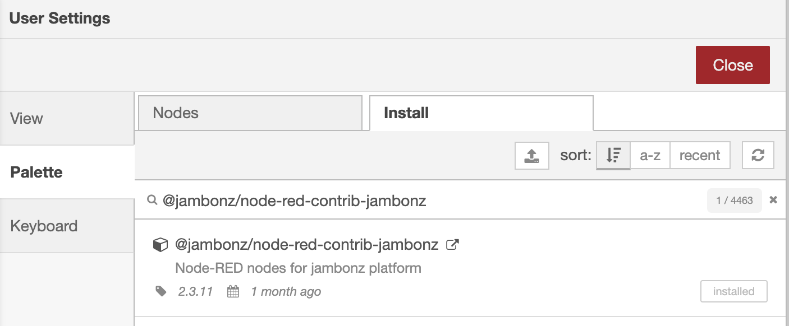
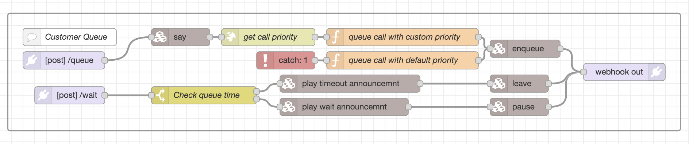

> *Originally published July 2023. This post describes jambonz as it was at the time and some details have since changed.*

## Overview

Being able to prioritize incoming calls based on its “importance” is an essential feature in many business scenarios. For example, the most common scenario in the financial sector is to skip the whole queue in case a client is calling to block the credit card in case of loss.

There were no way to do it in the Jambonz platform until now. Starting from version 0.8.4 the ability to prioritize incoming calls is possible by adding the priority attribute to the queued call. The calls with the highest priority will be connected faster even though there might be other calls awaiting in the queue. Also, this release adds an option to get any queued calls from the queue! What you need is just to know the callSid of the queued call. Isn’t this awesome?

## Node-RED example

Let’s cover a simple example using Node-RED. Node-RED nodes for the Jambonz platform are available under [@jambonz/node-red-contrib-jambonz](https://flows.nodered.org/node/@jambonz/node-red-contrib-jambonz) package. Just follow [this guide](https://nodered.org/docs/user-guide/runtime/adding-nodes) to install them.

The basics of creating a jambonz application is described in [this blog post](/blog/building-your-first-jambonz-app-using-nodejs). In this example we are focused on how to build the Node-RED flow.

In this flow we are greeting the customer on joining the queue and getting the priority from the external application based on the called number. If the number is allocated for a VIP person, the call is placed into the queue with the highest priority. In case the external server is not reachable the catch node continues the logic and places the call with the default priority.

During the querying we are announcing that the call is still in the queue and we are waiting for an available agent to handle the call. When the call waits for a free agent longer than allowed time, the call is disconnected with a ‘goodbye’ announcement.

## Conclusion

The ability to assign priorities to calls in a queue is a useful feature for many use cases. It is now supported in jambonz, but is completely optional. As before, calls can be queued with no priority if desired.

Thanks to @AVoylenko for driving this feature!
