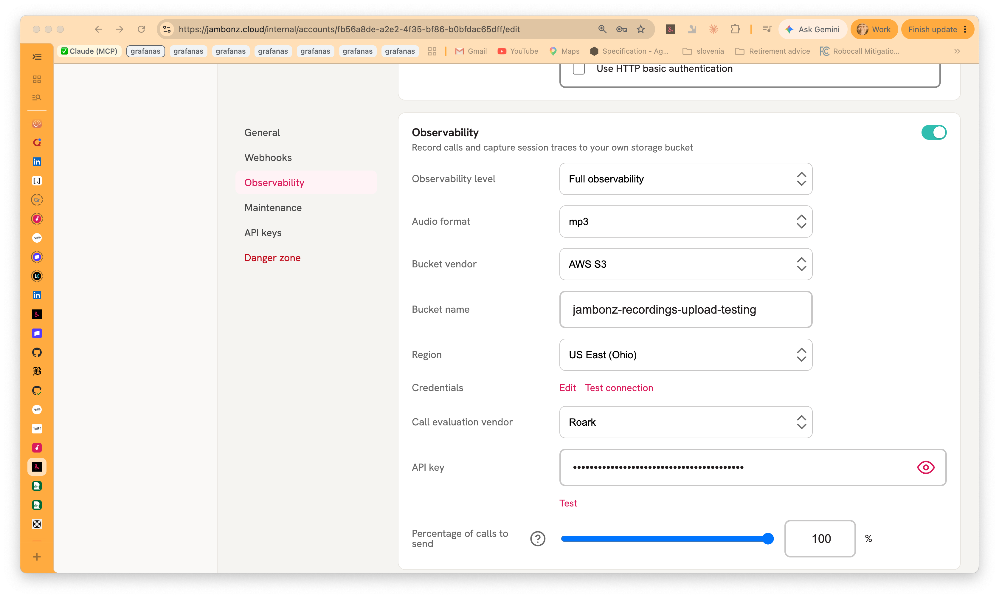
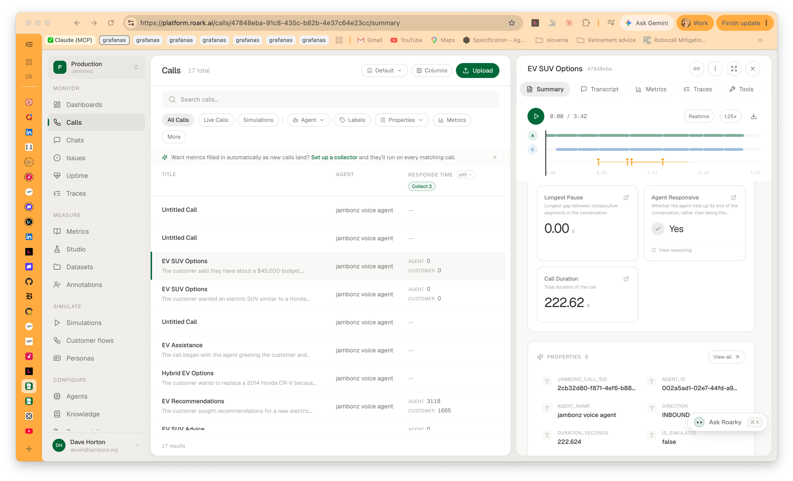
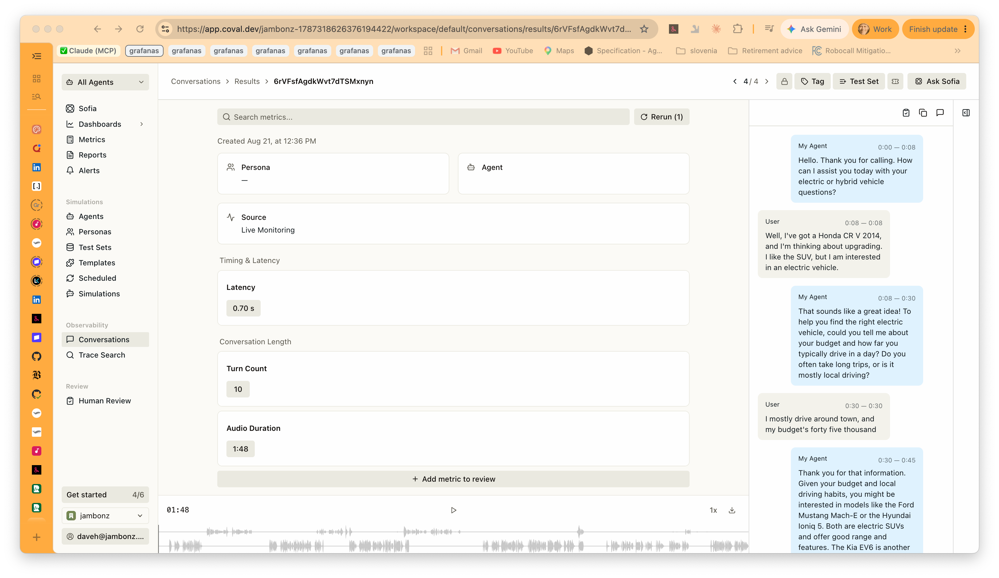

If you build voice agents, you already know that shipping one is the easy part.
Knowing whether it is doing a good job, call after call, is the hard part. That is
the problem [Coval](https://coval.ai) and [Roark](https://roark.ai) solve: you send
them your real calls, and they score them — transcripts, sentiment, custom
LLM-judge metrics, whatever you have defined.

As of **jambonz 11.1.4**, sending those calls is a checkbox-level task. jambonz
already records your calls and captures the turn-by-turn detail of each session
through session observability. Now you can point that same data at one of these two
platforms: choose the vendor,
paste in your API key, and set the percentage of calls you want forwarded. No
application code changes, no bridge process to run, no webhooks to receive.

<iframe width="560" height="315" src="https://www.youtube.com/embed/RaxBf4nxGsg" title="Sending jambonz calls to Coval or Roark for evaluation" frameborder="0" allow="accelerometer; autoplay; clipboard-write; encrypted-media; gyroscope; picture-in-picture; web-share" referrerpolicy="strict-origin-when-cross-origin" allowfullscreen></iframe>

## How to Turn It On

Everything lives in one place in the portal: **Account Settings**, in the
Observability section.

1. Pick your vendor from the **Call evaluation vendor** dropdown — Roark or Coval.
2. Paste the API key you got from that vendor and click **Test**. jambonz makes a
   read-only call to their API and tells you right away whether the key is good, so
   you are not left waiting for the first call to find out. The key is stored
   encrypted, the same way your speech and storage credentials are.
3. Set **Percentage of calls to send**. 100 sends every recorded call; drop it to 10
   if you want a sample. The decision is deterministic per call, so a given call is
   either always sent or never sent — no partial conversations arriving at the vendor.

That's it. From then on, when a call ends and its recording has been safely stored,
jambonz hands the vendor a link to the audio along with the details of the call — who
called whom, the direction, how it ended, and the jambonz call and account ids. If
your observability level is **Full**, the turn-by-turn transcript goes with it. At
**Recording only**, the audio goes on its own and the vendor transcribes it
themselves.

Coval additionally receives a fuller set of metadata: the STT, TTS and LLM vendor and
model that were in play, the turn-detection setting, the termination reason, the
per-stage latencies, barge-in and error counts, and any primitive values from the
`tag` you set when creating the call. That's what lets you write conditional metric
rules on the Coval side — score only the calls that used a particular model, say, or
only the ones that ended badly.

Two things worth knowing about the delivery itself. It happens on the recording
server, after the upload finishes, so a slow or unreachable vendor endpoint can
never delay a live call. And if a delivery does fail — bad key, vendor outage — you
get an entry in the portal's **Alerts** view with the HTTP status and response,
rather than silence, and calls on jambonz are not affected.

## What You See on the Vendor Side

Here is what a call looks like once it has landed in Roark — audio ready to play, a
per-speaker timeline, and Roark's own metrics filled in:

Correlating a call between the two systems is deliberate rather than lucky. The
`jambonz_call_sid` property you can see on the right of that screenshot is exactly
the `call_sid` from your jambonz logs, webhooks and recent-calls view, so you can
always get from a call in one system to the same call in the other. jambonz also
sends it as the vendor's own external identifier — `externalId` for Roark,
`external_conversation_id` for Coval — so it works as a search key either way.

One other convenience comes from the same metadata: each call arrives tagged with
your jambonz `application_sid` as the agent's id, so Roark groups calls by the
jambonz application that handled them.

Coval presents things its own way. Here is a different call, from the same test agent,
with the transcript turn by turn on the right and Coval's own timing and length
metrics computed alongside:

This is the **Full** observability level doing its work. The transcript came from
jambonz rather than from Coval transcribing the audio, which is why each turn carries
the start and end times it actually had on the call, and why the caller's turns are
labelled `User` and the agent's `My Agent` — jambonz maps its own per-turn records
into those roles on the way out. Calls that jambonz sends land under Coval's *Live
Monitoring* source, which is what keeps them separate from the simulated calls you
run there.

## The One Prerequisite

This is the piece that trips people up, so read this part twice.

Evaluation runs on your recordings, which means **session observability has to be
enabled** at either the *Recording only* or *Full observability* level. If
observability is disabled, there is nothing to send and the portal will not let you
configure a vendor.

And your recordings have to live somewhere jambonz can generate a pre-signed URL
from, because that is how the vendor fetches the audio. In practice that means:

- **AWS S3 or any S3-compatible storage** — supported
- **Google Cloud Storage** — supported
- **Azure Blob Storage** — *not* supported today; those calls are skipped

If you are on Azure storage and you want to use this, let us know — it is a matter
of demand, not difficulty.

One last note on retention: once a call is delivered, the vendor keeps its own copy
under their retention policy. Deleting the recording from your bucket does not
delete it from Coval or Roark.

## Evaluating Only Some of Your Applications

There is no separate control for this, and you don't need one. The eval credential is
set at the account level, and the recording server only ever sees calls that were
recorded. Each application's own observability setting overrides the account's — so
set observability to *disabled* on any application you don't want evaluated, and
those calls produce no recording and no eval. The tradeoff to be aware of is that
this excludes them from recording too; "record it but don't evaluate it" isn't
something you can express today.

## Resources

- [Call recording in jambonz](https://docs.jambonz.org/guides/features/call-recording)
- [What's new in jambonz v11](https://jambonz.org/blog/jambonz-v11-release)
- [Coval documentation](https://docs.coval.ai)
- [Roark](https://roark.ai)

Available now in jambonz 11.1.4. As always, come tell us how it goes in the
[jambonz community](https://community.jambonz.org/).
