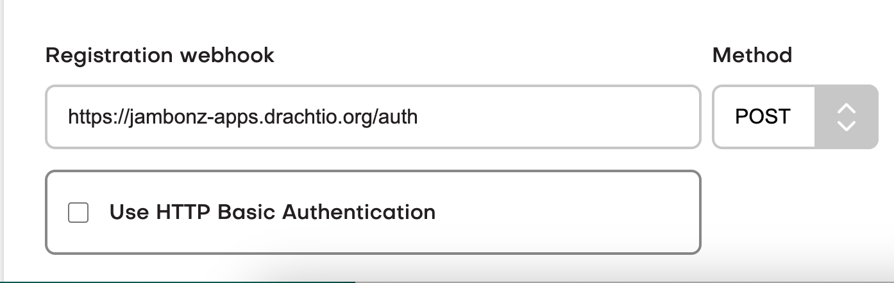
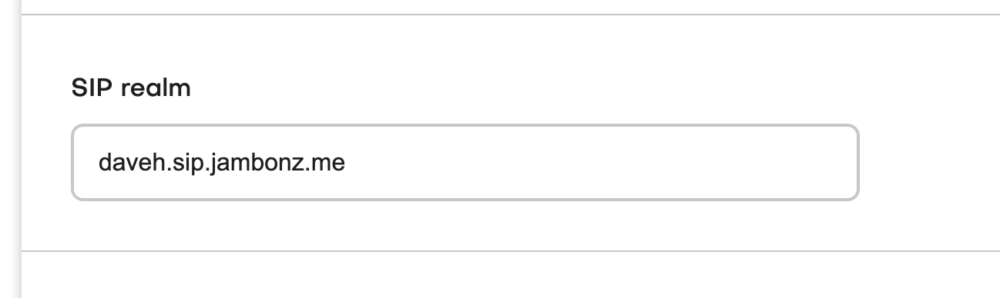
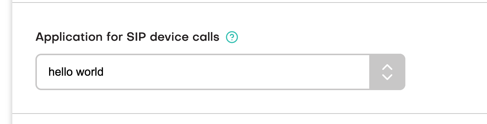

> *Originally published January 2023. This post describes jambonz as it was at the time and some details have since changed.*

If you've done a standard install of jambonz using either the [cloudformation template](https://aws.amazon.com/marketplace/pp/prodview-55wp45fowbovo) or the [Kubernetes helm chart](https://github.com/jambonz/helm-charts) your jambonz system will be configured to receive SIP traffic from VoIP carriers and sip phones using UDP transport.

But what if you want to receive traffic from webrtc clients as well? No problem, this tutorial will show you the changes needed to make that happen.

> Note: the example that follows shows how to configure this on a jambonz system running on VMs, such as AWS EC2.

## Overview

Webrtc clients will be sending SIP over secure WebSockets (wss). Client-side libraries like [jsSip](https://jssip.net/) (my favorite) and [SIP.js](https://sipjs.com) are most often used to build the client webrtc application that runs in your browser. To support these types of clients, jambonz needs to support sip over wss for the SIP signaling, and [SRTP](https://www.rfc-editor.org/rfc/rfc3711) for the encrypted media.

Note that insecure websockets (SIP over plain ws) is not allowed by the browser, so we are going to need to install a TLS certificate on the jambonz server. In the example below we'll configure our jambonz server to listen on port 8443/tcp for sip over wss traffic, and we'll create a TLS wildcard certificate for `*.sip.jambonz.me` since that is a domain that we own. (If you are working along, you should similarly choose a domain of your own that you control the DNS for).

## Generating a TLS certificate for SIP traffic

We're going to use [letsencrypt](https://letsencrypt.org/) to generate our certificate because it's free (and easy!).

After installing the certbot program on the jambonz debian server by [following their instructions](https://certbot.eff.org/instructions?ws=other&os=debianbuster), we run the following command:

```bash
certbot certonly --manual --preferred-challenges=dns --email daveh@drachtio.org --server https://acme-v02.api.letsencrypt.org/directory --agree-tos -d *.sip.jambonz.me -d sip.jambonz.me
```

This gets us a TLS cert with the CN of `*.sip.jambonz.me` and Subject Alternative Names of both `sip.jambonz.me` and `*.sip.jambonz.me`. I like this because it gives me the option of assigning different jambonz accounts different SIP realm values to register against (e.g. one jambonz user joe can register phones under the realm `joe.sip.jambonz.me` while jane with a different jambonz account registers her devices under `jane.sip.jambonz.me`).

I'm using the DNS challenge method to verify I control those domains, so letsencrypt will prompt me to add some TXT records in my DNS provider. Once I've done that the TLS cert is generated to the server:

```bash
Successfully received certificate.
Certificate is saved at: /etc/letsencrypt/live/sip.jambonz.me/fullchain.pem
Key is saved at:         /etc/letsencrypt/live/sip.jambonz.me/privkey.pem
```

## Configuring drachtio

Now that we have our TLS certificate, we need to configure drachtio to use it. This is a simple matter of adding the tls info to the /etc/drachtio.conf.xml config file. When done, it will look like this:

```xml
<sip>
  <contacts></contacts>
  <tls>
    <key-file>/etc/letsencrypt/live/sip.jambonz.me/privkey.pem</key-file>
    <cert-file>/etc/letsencrypt/live/sip.jambonz.me/fullchain.pem</cert-file>
  </tls>
  <udp-mtu>4096</udp-mtu>
</sip>
```

Now, we need to tell drachtio to listen on port 8443 for sip traffic over wss. To do that we edit /etc/systemd/system/drachtio.service to add this new sip contact. When finished, that section of the file looks like this:

```bash
ExecStart=/usr/local/bin/drachtio --daemon \
--contact sip:${LOCAL_IP};transport=udp --external-ip ${PUBLIC_IP} \
--contact sips:${LOCAL_IP}:8443;transport=wss --external-ip ${PUBLIC_IP} \
--contact sip:${LOCAL_IP};transport=tcp \
 --address 0.0.0.0 --port 9022 --homer 127.0.0.1:9060 --homer-id 10
```

We then restart drachtio..

```bash
systemctl daemon-reload
systemctl restart drachtio
```

we can verify that drachtio is now listening on tcp port 8443 by looking at the /var/log/drachtio.log file after we restart it:

```bash
2023-01-05 20:53:30.794776 SipTransport::logTransports - there are : 3 transports
2023-01-05 20:53:30.794794 SipTransport::logTransports - tcp/10.0.188.191:5060 (sip:10.0.188.191;transport=tcp, external-ip: , local-net: 10.0.0.0/8)
2023-01-05 20:53:30.794802 SipTransport::logTransports - wss/10.0.188.191:8443 (sips:10.0.188.191:8443;transport=wss, external-ip: 35.176.86.236, local-net: )
2023-01-05 20:53:30.794812 SipTransport::logTransports - udp/10.0.188.191:5060 (sip:10.0.188.191;transport=udp, external-ip: 35.176.86.236, local-net: ), mtu size: 4096
```

Of course, we also need to make sure network traffic is being allowed into 8443/tcp. On EC2, we do that by reviewing and if necessary editing the service group for the instance.

## Configuring jambonz

We're not quite done yet. If we were to point a webrtc client at the server now and try to register, we would receive a 403 Forbidden back because we have not yet configured our authorization. We need to authenticate clients based on a sip username and password.

If you are not familiar with how jambonz handles SIP authentication, here is a video describing it.

<iframe width="560" height="315" src="https://www.youtube.com/embed/m0EvTFqTZXU" title="How jambonz handles SIP authentication" frameborder="0" allow="accelerometer; autoplay; clipboard-write; encrypted-media; gyroscope; picture-in-picture; web-share" allowfullscreen></iframe>

Once you have created your webhook application for authentication, specify it in the account section in the jambonz portal.



You will also need to specify the sip realm that you want devices owned by that jambonz account to use. In my example, I've chosen a subdomain named `daveh.sip.jambonz.me` to be used.



Now you need to point your webrtc client at the jambonz server, and configure it with sip username, password, and realm that match the information your webhook is using. In my webrtc client that I've built using jssip, that client-side config looks like this:

```javascript
let data = {
	name: 'daveh',
	sipUri: 'sip:daveh@sip.jambonz.me',
	sipPassword: 'foobar',
	wsUri: 'wss://sip.jambonz.me:8443',
	pcConfig: {
		iceServers: [
			{
				urls: [ 'stun:stun.l.google.com:19302' ]
			}
		]
	},
	initiallyMinimized: false
};
```

Bingo! My webrtc client now registers successfully.

One last thing - lets make a test call. I'm going to route my incoming calls from sip and webrtc devices to the good old "hello world" application.



I dial any number from my webrtc client and....it works!

## So long for now..

Thanks again for trying out jambonz! Feel free to learn more at [jambonz.org](https://jambonz.org), or join our [community forum](https://community.jambonz.org), or email me at daveh@jambonz.org.
