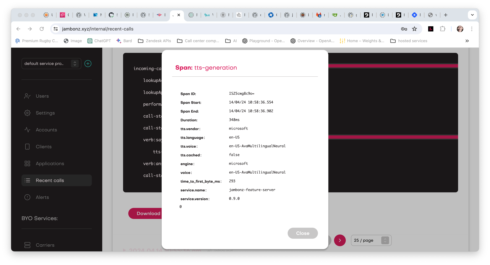
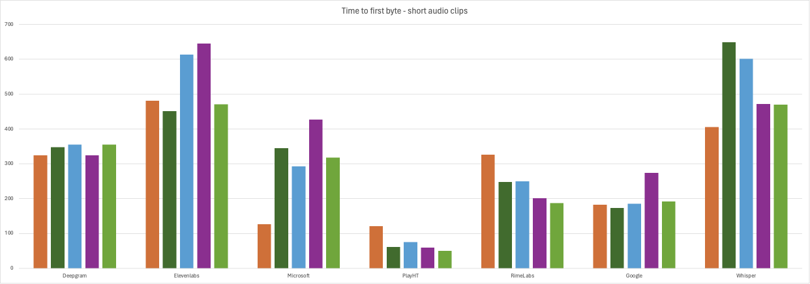
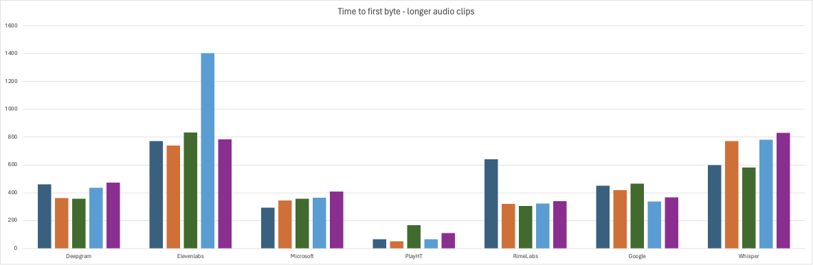

The emergence of AI and Large Language Models (LLMs) onto the tech landscape promises to reshape everything: how we work, how we play, and how we engage with others. Of course - let's be honest: not much of that has happened yet. Someday we'll surely experience the "sonic boom" moment when the actual rate of progress catches up to the hype, but sorry folks, we're not there yet.

Instead, the most notable impact to date has been the refocusing of huge amounts of private and public capital into any and all product categories thought to either benefit from or drive AI technologies. Those of us laboring to make our daily bread in the CX/AI space find ourselves the lucky beneficiaries of this effect. We get to play with new speech technologies developed by startup companies newly flush with VC cash and eager to brag about how many NVIDIA GPUs they bought over the weekend. For those of us working adjacent to them and out of the VC spotlight, it's like eating at the high school table with the rich kids who suddenly and inexplicably want to share their nicely packaged lunches with us.

I'll be honest, the sprouting-up of new text-to-speech (TTS) vendors that we've seen over the past year or so was not something I expected because, quite frankly, I thought your dad's Google TTS and Microsoft TTS were pretty damn fine, not to mention that the investment theme is lost on me when a market already has close to commodity-level pricing. Oh well, that just goes to show what I know.

In our upcoming jambonz 0.9.0 release we've added support for TTS services from a bunch of these sassy newcomers that want to challenge the giants, and we thought it would be a good time to put them to test. What age-old story are we going to see here: the new upstarts disrupting the failing dinosaurs? Or would it be the well-heeled Daddy Warbucks incumbents quashing the neophytes? Let's find out!

## Introducing your contestants!

The [jambonz](https://jambonz.org) open source voice gateway for CX/AI providers has been widely adopted by many CX/AI providers, including the leading vendors in the space. Our "bring your own everything" design enables customers to connect their preferred carriers and speech vendors and so we have always made it our mission to give our customers the broadest selection of speech vendors for both text-to-speech and speech-to-text.

As well, we strive to give customers detailed insights into the behavior of their service through an open telemetry observability framework that reports on data such as time-to-first-byte for TTS requests.

In upcoming release 0.9.0 we added several new vendors for text-to-speech, and we've also made an effort to support streaming APIs where available to reduce the latency experienced by users, so it seemed like a good time to do some benchmark testing and establish a leaderboard. In our testing we compared:

- Deepgram
- Elevenlabs
- Google *
- Microsoft
- PlayHT
- Rime Labs
- Whisper

> *With all other vendors we measured time-to-first-byte; however with Google we were forced to measure time-to-last-byte as we have not implemented a proper streaming API integration for them (yet).

## The testbed

We ran the tests using a jambonz server running in AWS us-east-1 region on a single EC2 t2-medium instance. We ran against the hosted SaaS service for each of the vendors. We tested two different scenarios, both common to conversational AI:

- a very short user prompt (e.g., "Hello and thank you for calling. How can I assist you today?"),
- and a slightly longer prompt that a caller might commonly encounter (e.g., "It seems like you're having trouble logging into your account. For security reasons, please provide the email address associated with your account. Once verified, I will send a password reset link directly to your email. Alternatively, say 'help' for more assistance.")

We tested 5 variations of short and long prompts on each TTS engine, using English language:

*short prompts*

- Hello and thank you for calling. How can I assist you today?
- Please hold while I transfer you to a customer service representative.
- I'm sorry, I didn't catch that. Could you please repeat your request?
- Your current balance is $347.92. Would you like to make a payment now?
- Thank you for your patience. A representative will be with you shortly.'

*longer prompts*

- Thank you for calling our customer support line. To better assist you, please state the reason for your call, such as 'billing', 'technical support', or 'account information'. You can also say 'more options' to hear additional services.
- You have indicated that you are calling about a billing issue. If you would like to proceed with a payment, please say 'Make a payment'. If you need details about your last transaction or have a billing dispute, please say 'Billing details'
- It seems like you're having trouble logging into your account. For security reasons, please provide the email address associated with your account. Once verified, I will send a password reset link directly to your email. Alternatively, say 'help' for more assistance.
- Our records show that your warranty is due to expire in 30 days. To extend your warranty for another year, please say 'Extend warranty'. If you would like to know the benefits of extending your warranty, please say 'Explain benefits'.
- If you are calling to update your personal information, such as address or phone number, please clearly state the new information after the beep. For any changes to sensitive data, such as your password or payment methods, please ensure you have your security pin ready.

In all cases (except Google, as described above) we measured the time from sending the request to the service to receiving the first byte of audio. We give more details on the configuration of each TTS service later in this blog post.

## Results

Before we review the results, there is one additional subtlety to be aware of when measuring latency. Here we are measuring time to first byte, which is an important metric. However, all providers send a small amount of silence at the beginning of generated audio, and that amount we found to differ by provider. The experience of the user will be the time to first byte **plus** the duration of leading silence. In our experience, the vendors fell into two categories:

- those providing very short duration of leading silence; this includes Deepgram (~150 ms), Elevenlabs (~100ms), Microsoft (~150ms), and RimeLabs (~200ms); and
- those providing longer duration of leading silence: Google (~600ms), Whisper (~670ms), and PlayHT (~637ms).

Keep these in mind as we review the results.

Without further ado, here are the results from the tests using the short audio requests.

and here are the results from testing the longer audio segments.

And here are this detailed data from the tests.

##### short audio tests - time to first byte (ms)

| Prompt | Deepgram | Elevenlabs | Google | Microsoft | PlayHT | RimeLabs | Whisper |
| --- | --- | --- | --- | --- | --- | --- | --- |
| 1 | 324 | 481 | 183 | 127 | 121 | 326 | 405 |
| 2 | 348 | 451 | 173 | 345 | 61 | 248 | 649 |
| 3 | 355 | 613 | 185 | 293 | 75 | 250 | 601 |
| 4 | 324 | 645 | 274 | 427 | 59 | 201 | 472 |
| 5 | 355 | 471 | 192 | 318 | 50 | 187 | 470 |
|**avg.**|**341**|**532**|**201**|**302**|**73**|**242**|**519**|

##### long audio tests - time to first byte (ms)

| Prompt | Deepgram | Elevenlabs | Google | Microsoft | PlayHT | RimeLabs | Whisper |
| --- | --- | --- | --- | --- | --- | --- | --- |
| 1 | 460 | 771 | 450 | 293 | 67 | 642 | 600 |
| 2 | 363 | 739 | 420 | 345 | 50 | 320 | 772 |
| 3 | 357 | 833 | 465 | 356 | 168 | 306 | 581 |
| 4 | 435 | 1404 | 338 | 364 | 65 | 322 | 781 |
| 5 | 472 | 783 | 367 | 409 | 111 | 340 | 830 |
|**avg.**|**417**|**906**|**408**|**353**|**92**|**386**|**712**|

## Our findings

Wow! We were not expecting this.

- **PlayHT** (avg 73ms short audio/92ms long audio) was the winner by a mile, with blazingly fast results. Sub-100 ms times (what!!??) to first byte is quite astonishing, given that we are including network round-trip time into that measurement. We truly did not expect this, and count us impressed. PlayHT's voices are regarded as high-quality natural-sounding voices and they offer a voice cloning feature as well. However, we experienced some minor audio defects in our testing: PlayHT incorrectly pronounced "$347.92" as "three hundred forty-seven dollars and ninety-two two". However, all the longer prompts played perfectly. Now, again, this very short time-to-first-byte needs to be factored in with the fact that the audio itself contains a bit more leading silence than some of the other vendors.
- Our next biggest surprise was **Google** (201ms/408ms). We were surprised on two fronts: first, Google had an extra burden in that we were measuring time to last byte instead of first, because we have not yet implemented streaming support for Google in jambonz; and secondly, we are historically used to seeing in the neighborhood of 800ms+ times for Google to synthesize audio. (Keep in mind that Google does return a fair amount of leading silence so head-to-head in overall user experience of latency they would probably fall slightly behind Microsoft, for instance.) Something must have changed recently over at Google to deliver these impressive numbers.
- One of the new entrants, **RimeLabs** (242ms/386ms) turned in some very fast time as well. And if you calculate in the fact that they return much less leading silence than PlayHT, they provide arguably the fastest user experience. RimeLabs also has an optional feature to reduce latency even further by skipping the text normalization phase; when we enabled this feature the numbers got even better (217ms/274ms), edging out everyone except PlayHT. However, they recommend enabling this only on text "where there are no digits, abbreviations, or tricky punctuation" and we found this to be true: when we enabled it our text containing the account balance did not play correctly. Additionally, in our testing, we noted some slight but detectable pauses during longer sentences where they did not belong. And finally, it might be personal preference, but most of the voices seem to lack emotion, as if they are doing a task they are not interested in. If I were calling into a contact center I'd feel like I was talking to a bored gen-X'er who was counting the minutes until they could go off shift.
- Reinforcing that the dinosaurs are not dead, **Microsoft** (302ms/353ms) came in with very fast times as well, competitive with the new entrants and raising the question: why change? I guess it turns out that having buckets of money to throw at GPUs is still an advantage. Both Google and Microsoft deliver those perfectly crafted AI voices that are so good that, counter-intuitively, you immediately know that its AI you're talking to and not a real person.
- **Deepgram**'s (341ms/417ms) new Aura offering was not left behind, turning in some very fast times of its own. There may still be a few issues to work out, as we experienced unnatural pauses once or twice during longer sentences where there was no comma, semi-colon or other indication there should be. Additionally, a spurious soft 'A' was inserted when synthesizing a phase enclosed with single quotes; e.g. "say 'billing' if you have a billing question" is heard as "say ah billing if you have..".
- **Whisper** (519ms/712ms) from openAI impressed as well. The times are slightly longer than the rest of the field, but the quality was outstanding: the voices sounded great, the speech cadence was perfect and the pronunciations were spot on.
- **Elevenlabs** (532ms/906ms) has become well-known for its natural sounding voices and is rapidly becoming the choice of many for that reason. Its times in our test were slightly slower than the rest of the field, but still quite fast overall. We experienced no defects in the generated audio.

## Summary

Our main takeaway is how fast **all** of these vendors are. A year ago, we would have been happy with sub-second results - now we are hungering for, and in some cases getting, ttfb times of less than 100 milliseconds. All of these vendors provide great products that are worth evaluating for those planning their CX/AI rollout. We're looking forward to the vendors polishing things like speech cadence and the minor imperfections that we encountered.

We should note that we are also happy to work directly with any of these vendors to collaborate on testing or on fine-tuning our integrations if necessary to improve performance and overall user experience. We will update our leaderboard from time to time, and we are always adding support for new vendors so reach out to us if you provide a TTS service and would like to be included in future reports.

Also, feel free to create a free account on the [jambonz cloud](https://jambonz.cloud) to try out jambonz!

#### Appendix: Notes on our configuration

A few notes on how we configured each speech service.

| vendor | model | voice |
| --- | --- | --- |
| Deepgram | Aura | Asteria |
| Elevenlabs | turbo-v2 | Serena |
| Google |  | Wavenet-C |
| Microsoft |  | Ava (multi-lingual) |
| PlayHT | PLayHT2.0-Turbo | Jennifer |
| RimeLabs | Mist | Abby |
| Whisper | tts-1 | Alloy |
