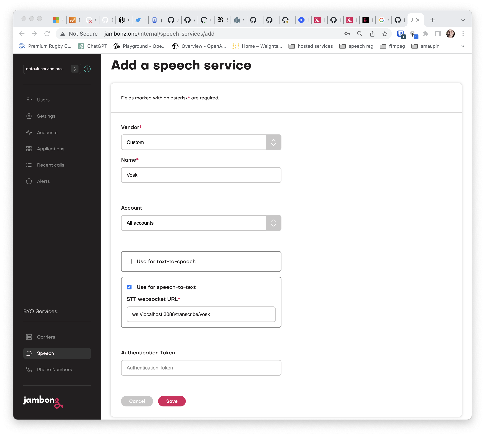
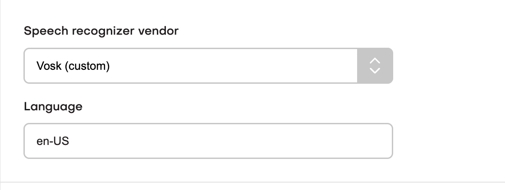

> *Originally published March 2023. This post describes jambonz as it was at the time and some details have since changed.*

jambonz supports many speech providers out of the box, but what if you want to use a speech provider for that is not currently supported? There is where the jambonz [custom speech API](https://docs.jambonz.org/guides/features/custom-stt-providers) comes in.

> The custom speech api requires jambonz 0.8.2 or above

In this article, we will walk through an example of adding support for [Vosk](https://alphacephei.com/vosk/server) which is an open source speech recognition engine that you can run on your own infrastructure. Vosk is not natively supported by jambonz, but we shall see that we can easily add in support for it using the custom speech api.

As described [in the api docs](https://docs.jambonz.org/guides/features/custom-stt-providers), to add support for a speech recognition provider you need to build a websocket server that provides the integration with the speech provider. Your websocket server receives JSON messages and an audio stream from [jambonz](https://jambonz.org) and returns transcripts.

The example code we'll be using to integrate Vosk STT can be found on github in the [custom-speech-example repo](https://github.com/jambonz/custom-speech-example). To run this example you need the following prerequisites:

* a jambonz system running 0.8.2 or above

* a basic jambonz app that exercises speech recognition

* a server on which you can run docker and the custom-speech-example Node.js app (these could also be two different servers).

## Provisioning a custom speech provider

First, let's log into the portal and create a new speech service for Vosk.

To do so, select Speech and then click the + icon to add a new provider. Select "Custom" from the dropdown and give it a name -- we'll call it Vosk.



* Check "Use for speech-to-text" and enter the ws(s) URL that is the endpoint of your websocket server. In my case as you can see, I'll be running that server on the same jambonz instance, and it will be listening on port 3088.

* Also add an authentication token value that your websocket server can use to authenticate the connections from jambonz.

Now you can click on Applications, select the jambonz application you are going to use for testing and specify to use Vosk as the STT provider.



> Hint: A good app to test with is simple echo voicebot that transcribes your voice and repeats it back to you using text-to-speech. You can quickly generate this app using the command "npx create-jambonz-ws-app -s echo my-echo-bot".

## Running Vosk server

Now we need to run the Vosk server. We are going to be using the grpc api that Vosk supports to send audio and commands to the server. The simplest way to run it is in docker. In my case I have Vosk server running on a separate server, as it is fairly demanding of system resources.

```bash
docker run --network host -ti alphacep/kaldi-grpc-en:latest
```

The Vosk server listens for incoming grpc connections on port 5001 by default, so in our next step we will configure the custom-speech-example app accordingly.

## Running the websocket server serving the speech api endpoint

As mentioned above, I have cloned the repo to the same server jambonz is running on, and I will configure it to listen on port 3088 for connections from jambonz.

It will also need to connect to Vosk on the remote server and port 5001, and it will authenticate connections from jambonz using the auth token I specified earlier when configuring the custom Vox speech provider in the jambonz portal.
To handle all of this configuration I've decided to run the Node.js app using [pm2](https://pm2.io/) and included the following configuration file (ecosystem.config.js):

```js
/* eslint-disable max-len */
module.exports = {
  apps : [
    {
      name: 'jambonz-custom-speech-vendors',
      script: 'app.js',
      instance_var: 'INSTANCE_ID',
      exec_mode: 'fork',
      instances: 1,
      autorestart: true,
      watch: false,
      max_memory_restart: '1G',
      env: {
        LOGLEVEL: 'debug',
        HTTP_PORT: 3088,
        API_KEY: 'foobar',
        VOSK_URL: '54.167.7.129:5001'
      }
    }
  ]
};
```

## Test it out!

Now the fun part -- let's route a phone number to our jambonz app and test it out!

When I make the call, Vosk transcribes my speech and it is played back to me. Looking at the logs from custom-speech-example, I can see the transcripts being received from Vosk and sent back to jambonz:

```bash
$ pm2 log jambonz-custom-speech-vendors
{"msg":"Example jambonz speech server listening at http://localhost:3088"} {"url":"/transcribe/vosk","headers":{"pragma":"no-cache","cache-control":"no-cache","host":"localhost","origin":"http://localhost","upgrade":"websocket","connection":"Upgrade","sec-websocket-key":"1CvOEywO14v0DoJGMUjo9Q==","sec-websocket-version":"13","authorization":"Bearer foobar"},"msg":"received upgrade request"}
{"msg":"upgraded to websocket, url: /transcribe/vosk"} {"obj":{"type":"start","language":"en-US","format":"raw","encoding":"LINEAR16","interimResults":true,"sampleRateHz":8000,"options":{}},"msg":"received JSON message from jambonz"}
{"data":{"chunksList":[{"alternativesList":[{"text":"this is a test using a custom speech provider","confidence":1,"wordsList":[]}],"pb_final":true,"endOfUtterance":false}]},"msg":"received data from vosk"}
{"data":{"chunksList":[{"alternativesList":[{"text":"this is a test using a custom speech provider","confidence":1,"wordsList":[]}],"pb_final":true,"endOfUtterance":false}]},"msg":"sending transcription to jambonz"}
{"obj":{"type":"stop"},"msg":"received JSON message from jambonz"}
```

The experience for the caller is no different than using one of the native jambonz speech providers.

## Summary

While jambonz comes packed with native support for a large number of speech providers (Google, Microsoft, AWS, Nuance, Nvidia, IBM Watson, and Wellsaid at the time of writing) it's super easy to add in your own speech providers using the [custom speech API](https://docs.jambonz.org/guides/features/custom-stt-providers). In this tutorial, we walked through adding support for the open source Vosk server. In the example project that we shared, you will find other examples as well, including adding support for [AssemblyAI](https://www.assemblyai.com/) speech recognition as well as an example of how to implement support for custom text-to-speech as well as speech-to-text.

For more information about jambonz visit us at jambonz.org, join our [community forum](https://community.jambonz.org), or email us at support@jambonz.org.
