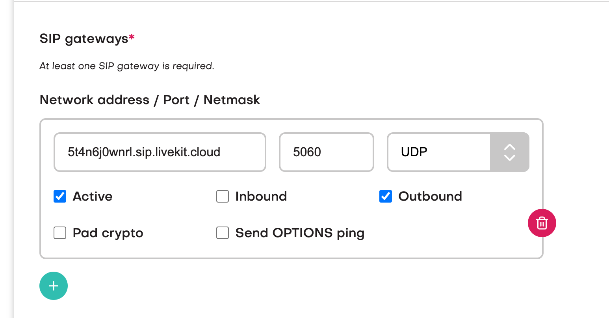
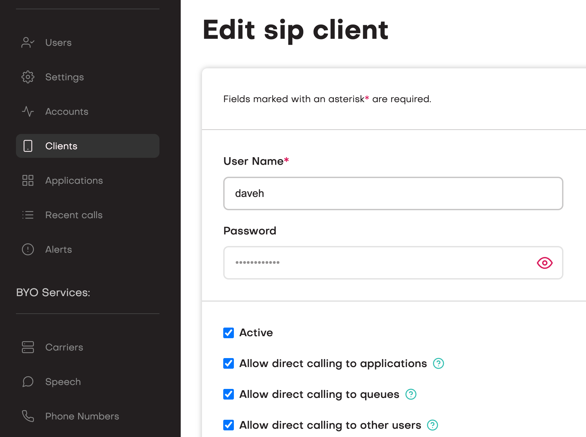
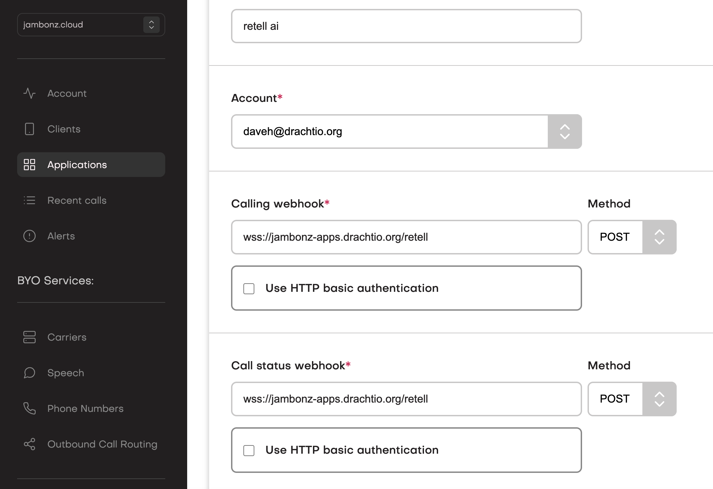
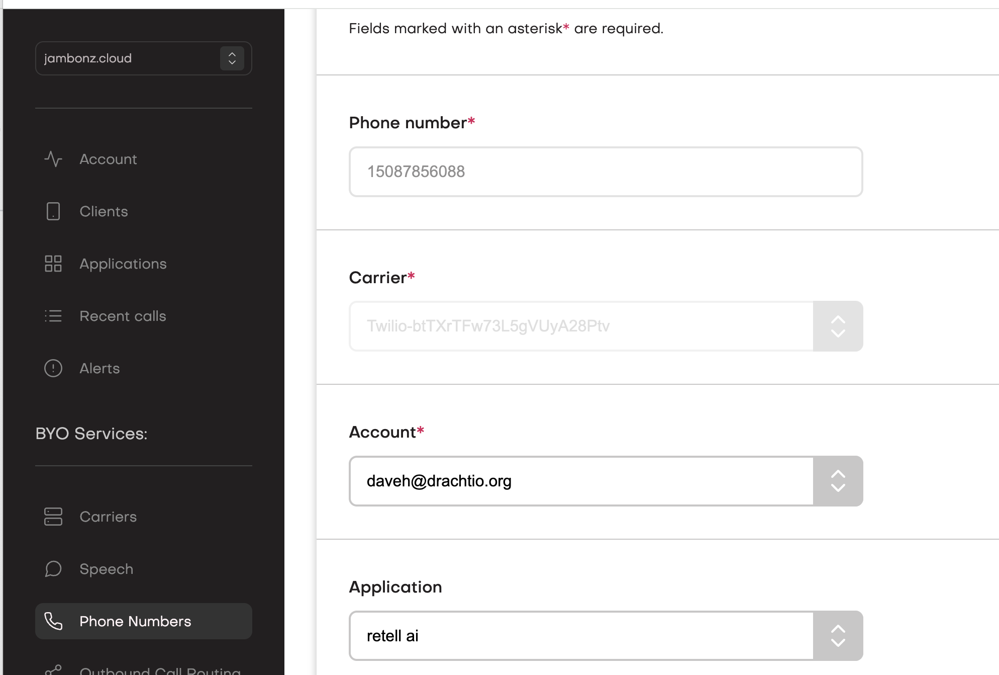
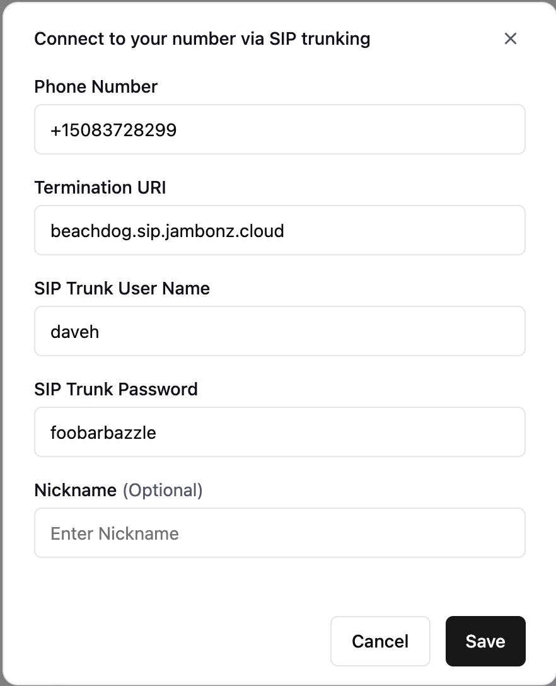
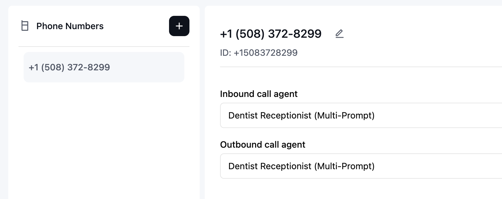
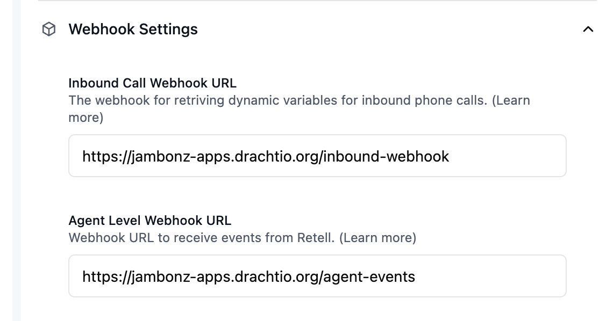

## Overview

[jambonz](https://jambonz.org) is an open source voice gateway platform that can integrate any telephony provider with Retell's VoiceAI platform. It has several advantages over Twilio, including:

* more cost-effective: Twilio's per-minute rounding and surcharges for using features like their voice sdk and bidirectional streaming can be eliminated, and jambonz provides all the same features (and more).

* you can bring your own carrier (jambonz has integrated with hundreds of SIP providers and PBXs).

* run anywhere: jambonz can run in your cloud, on prem, or you can use our hosted service.

In this blog post we will walk you through deploying jambonz as a custom telephony solution for Retell AI. **You will need**:

1. A SIP trunking provider or PBX that you are currently using and want to connect to Retell (presumably, you already have this if you are interested in custom telephony integration).

2. An account on [jambonz.cloud](https://jambonz.cloud/register) (you can sign up for a free 3-week trial) **or**, alternatively, your own hosted jambonz platform (you can deploy in your own AWS account using this [AWS marketplace offering](https://aws.amazon.com/marketplace/pp/prodview-55wp45fowbovo)).

3. A server on which to run a jambonz application (you can use [ngrok](https://ngrok.com/) for early testing from your laptop).

In this example, we will assume you are deploying using jambonz.cloud but the instructions are the same for those running a self-hosted jambonz system.

## High-level overview

### How Retell works

Retell provides two methods of [custom telephony integration](https://docs.retellai.com/deploy/custom-telephony), and jambonz supports both:

* Method 1: Elastic SIP Trunking. This is the method recommended by Retell, and we will focus mostly on this approach.

* Method 2: Dial to SIP Endpoint. This method can alternatively be used, but one of the drawbacks of this method is that the built-in call transfer function that Retell provides will not work with it because Retell will not send a REFER when this method is used.

> Note: you can still implement call transfer when using method 2 by creating your own user function that instructs jambonz to transfer the call.

### How jambonz works

jambonz lets you create sip trunks that can send or receive calls from any number of providers. When calls arrive at a jambonz platform, the first thing jambonz does is to figure out which account is responsible for handling that call (jambonz is a multi-tenant platform). One of the main ways it does that is by looking at the DID/called number and determining which account owns that DID and has a SIP trunk built to the source/sending SIP trunking provider or gateway.

Once the account is identified, jambonz connects to a webhook or websocket application that the account has configured in order to retrieve a set of instructions for the call. It is up to the account holder to provide such an application. In our case, I am going to give you a sample application that will connect the incoming call to your Retell agent, using either method 1 or method 2. You should feel free to modify this sample application to your needs and desires, but it handles quite a few things out of the box:

* inbound and outbound calling

* Retell webhooks for inbound call and agent events

* call transfer via Retell built-in call transfer function.

OK, with that brief overview of how Retell and jambonz work individually, let's put peanut butter and chocolate together now and make something fabulous here!

## Step by step instructions

First, let's integrate using method 1: Elastic SIP Trunking

### Get the jambonz application

You can find the example jambonz application [here](https://github.com/jambonz/retell-sip-integration-example). Clone it to a directory on your laptop and install it:

```bash
git clone https://github.com/jambonz/retell-sip-integration-example.git
cd retell-sip-integration-example
npm ci
```

### On jambonz: create a Carrier/SIP trunk to send calls to Retell

jambonz is a BYOC (Bring your own Carrier) platform. The term "Carrier" is used interchangeably with "SIP trunk" and we first want to build a sip trunk from jambonz to Retell.

To do so, log into your jambonz account and select Carrier from the lefthand menu, then click the plus sign to add a carrier.

Give the carrier a name 'Retell'. Check the box for E.164 syntax, uncheck outbound authentication, and then add one SIP gateway with their network address of `5t4n6j0wnrl.sip.livekit.cloud`.



### On jambonz: create a SIP credential to use for authentication with Retell

Click on "Clients" and add a sip client with a name and password.



### On jambonz: add a Carrier/SIP trunk for your PSTN provider

Create a second Carrier entry, this time you are creating a SIP trunk for your PSTN/DID provider. Add both inbound and outbound gateways for this SIP trunking provider. jambonz provides a lot of options for integrating SIP trunking providers so choose the ones that are relevant to your provider.

You can even use Twilio as a trunking provider if you want, and when you create the Carrier notice there is a dropdown of predefined settings for some carriers, including twilio.

### On jambonz: add an application

You will be running the jambonz application that you cloned in a bit. Before you do that, we need to add an Application in jambonz. Click to add an application, give it a name and set both the call webhook and call status webhook to `wss://<yourdomain>/retell`. (If you are using ngrok to test from your laptop then you will use the ngrok domain).



For speech vendors you can leave the default setting as your application initially will not need to use any TTS and STT services on jambonz. Save the application

### On jambonz: add your phone number(s)

Now that you have added your sip trunking provider and an application, add the phone numbers that you have routed from that SIP trunking provider to jambonz. For each, route the calls arriving on that number to the application that you created. (If you have many phone numbers you can route all calls from that provider to the application on the Carrier settings page).



Things are now set up on jambonz. We have:

* created a sip trunk so we can receive and send calls to your trunking provider,

* created a sip credential (username, password) we can use to authenticate with Retell,

* created another sip trunk for our PSTN provider so we can send calls to Retell,

* added a jambonz application that provides the "glue" to forward these calls to Retell, and

* created routing of calls arriving on phone numbers to this application

Now let's head over to Retell and finish things off.

### On Retell: add phone number(s)

In the Retell Dashboard, select "Phone Numbers" and click the plus sign. In the dropdown select "Connect to your number via SIP trunking".

* Add the phone number in E.164 format (ie leading + followed by country code)

* For termination URI enter a URI with the DNS of your sip realm in jambonz (you can find that under the Account tab in the jambonz portal), e.g. 'mydomain.sip.jambonz.cloud'

* For sip trunk username and password enter the username and password for the SIP credential you created above on jambonz.



### On Retell: associate the number to an agent

Select an agent and then associate the phone number to the agent.



### On Retell: set the inbound call webhook

Select your Agent and then "webhook settings". Add both an "Inbound call webhook URL" and "Agent Level Webhook URL".



For both, the host will be the DNS where your jambonz application is running, and the paths will be "/inbound-webhook" and "/agent-events" respectively.

## Running the application - method 1

Now you are ready to test the application. You must provide your Retell api key and the name of the Retell Carrier that you created on jambonz

```bash
RETELL_API_KEY=xxxxxxxxxx RETELL_TRUNK_NAME=Retell node app.js
```

Place a call to one of your phone numbers and it should be connected to your Retell agent. You will see lots of logging of agent events in your console or log where the jambonz application is running.

## Running the application - method 2

If instead you wish to use method 2 - Dial to SIP Endpoint you do not need to create a Carrier for Retell on jambonz. You still need to create the Carrier entry for your SIP provider, create the application and add the phone numbers as before (you do not need to create a SIP credential).

No setup is needed on the Retell side either; you do not need to add a phone number since we wont be dialing to a phone number, instead we will be calling the [Register Call](https://docs.retellai.com/api-references/register-call) api.

To run using method 2, you need to specify your Retell api key and agent id.

```bash
RETELL_API_KEY=xxxxxxxxxxxxxx RETELL_AGENT_ID=agent_yyyyyyyyy node app.js
```

## Outbound calls

To use this application for outbound calls, use the [jambonz REST API](https://docs.jambonz.org/reference/rest-call-control/calls/create-call) to create a new call. To do this you will need to know:

* your jambonz account\_sid

* your jambonz api key

* the application\_sid of this application (available once you Add Application in jambonz)

* the base URL of the jambonz system you are using (https://api.jambonz.cloud for example on jambonz.cloud)

* the name of the Carrier you created for your PSTN provider

You can then format and send an HTTP POST to jambonz like this:

```bash
curl --location -g 'https:/{{baseUrl}}/v1/Accounts/{{account_sid}}/Calls' \
--header 'Authorization: Bearer {{api_key}}' \
--header 'Content-Type: application/json' \
--data '{
    "application_sid": "{{application_sid}}",
    "from": "15083728299",
    "to": {
        "type": "phone",
        "number": "15082084809",
        "trunk": "{{PSTN carrier name}}"
    }
}'
```

Of course, substitute in your own from and to phone numbers. The example above assumes that you have created a BYOC trunk on jambonz that you will use to outdial the user.

The result of running the above curl command, then, will be to dial the user first and when they answer connect them to your Retell agent.

## Conclusion

This blog post showed how you can easily deploy the jambonz voice gateway to provide custom telephony integration to Retell AI, saving costs and enabling interoperability with any SIP trunking/DID provider.

If you have any questions about jambonz, or would like to inquire about our support plans please email us at support@jambonz.org, or join our [community forum](https://community.jambonz.org).
