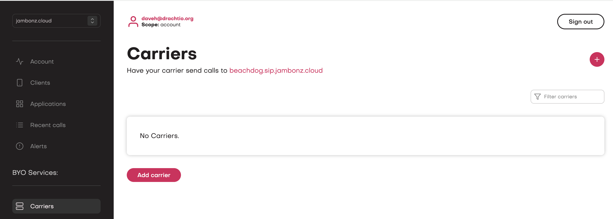
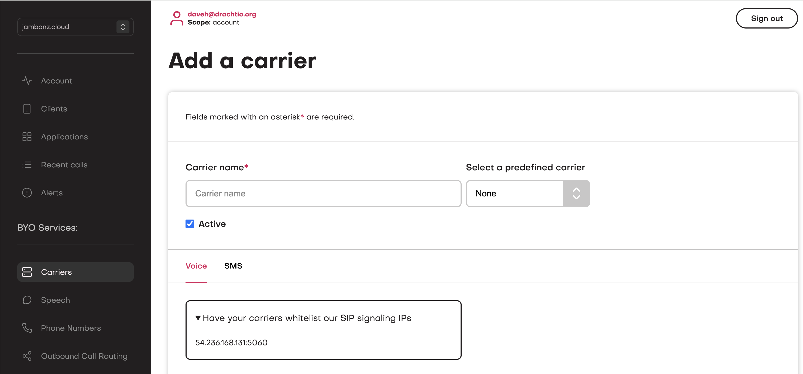
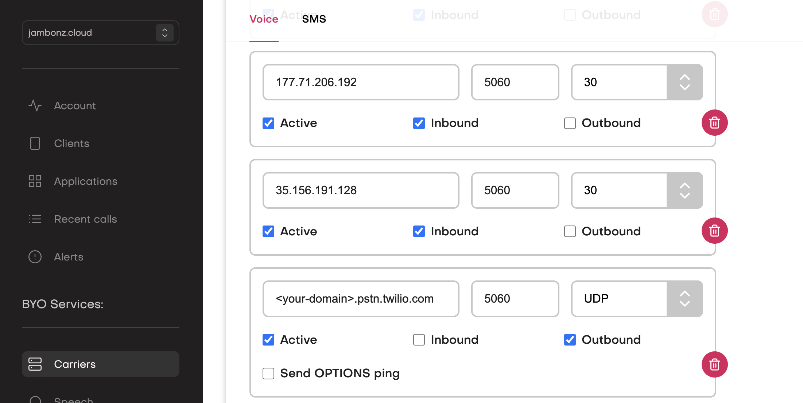
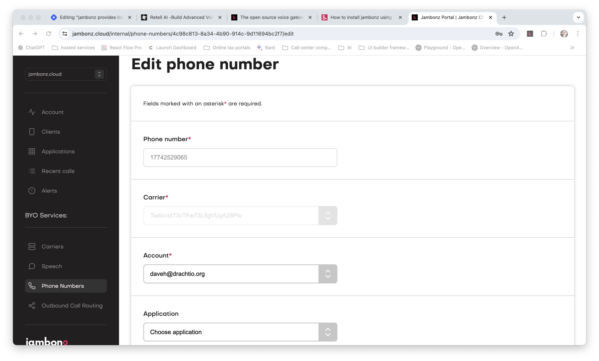
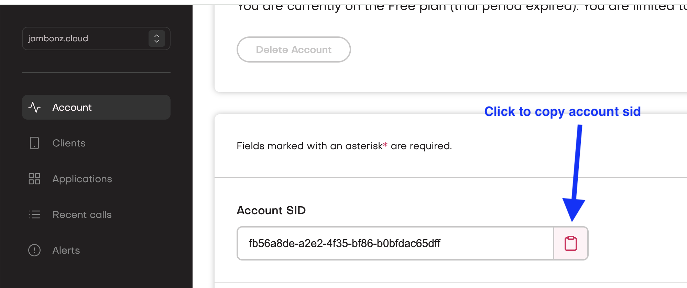
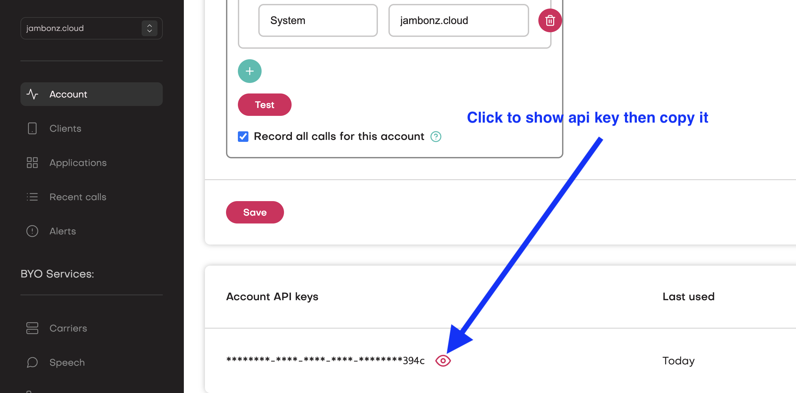
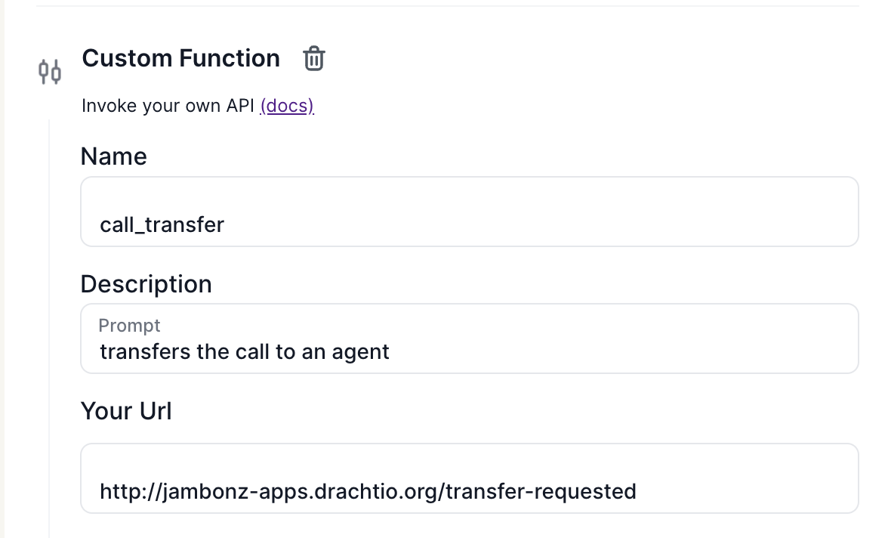

> Note: If you prefer learning visually, watch the [youtube video](https://youtu.be/QQxt6eVUDHU).

Lately, we've noticed a few [Retell AI](https://www.retellai.com/) users have been finding their way to the [jambonz open source voice gateway](https://jambonz.org) project in order to reduce their telephony costs by using our Bring your own carrier (BYOC) feature.

Specifically, these folks were searching for a way to free themselves from Twilio "lock-in". Twilio's price model, which features [costly per-minute rounding of calls](https://help.twilio.com/articles/223132307) **plus** added Voice API costs **plus** added Streaming costs results in a high bundled cost that makes the Voice-AI business proposition simply untenable for much of the served market. Luckily, there is a solution - jambonz to the rescue!

So, to all you Retell AI users, welcome aboard! In this blog post we get you up and running on jambonz for free, and eliminate those nasty costs. Try us out! With jambonz, you can:

* connect any sip trunking provider (or PBX, or SBC) to jambonz, bypassing twilio and those associated added costs

* use jambonz's bi-directional streaming feature to integrate directly with Retell AI

* use phone numbers that you have from your carriers and provision them directly into jambonz

* enjoy features like barge-in and call transfer

* run it all on [our cloud](https://jambonz.cloud/) or [self-host](/blog/installing-jambonz-using-aws-marketplace) your own jambonz instance on AWS for enhanced privacy and control.

Let's get started!

## Sign up for free jambonz account

The easiest way to get started is to create a free jambonz trial account on [jambonz.cloud](https://jambonz.cloud/register). Try it for free for 3 weeks and if you like it you can either continue on a paid plan, or use the AWS marketplace offering to deploy your own jambonz instance in your AWS account. (Contact us for details about deploying a clustered solution if you need to support large call volumes).

## Configure your carrier and phone number

Once you've created a jambonz account, you are able to add one or more Carriers / SIP trunking providers in the jambonz portal. In the example below, I actually use an elastic SIP trunk from Twilio but you can use any SIP provider or PBX - we integrate with anything that can send us VoIP traffic using SIP.

When you first log in to your new account you won't yet have any carriers defined.



Click on "Add carrier" to add a new carrier. This screen will appear:



The main thing you are going to need to configure when adding a Carrier is the IP addresses of their sip gateways that will be sending us calls. In addition, you will add the IP addresses or DNS name of their SIP gateways that we can send outbound calls to. You can also see on the screen above that we show you our sip signaling address, because you will need to configure that in the carrier / SBC / PBX that will be sending us the calls.

You'll also note we have a dropdown of preconfigured carriers. If you are using one of these carriers, just select it from the dropdown and the IP addresses will be pre-populated for you. Otherwise fill them in as show below. In my example, I am actually using a twilio elastic sip trunk as my carrier.



There are quite a few advanced options you can play with when configuring a carrier as well if you need to, but for now we will stick with the basic case.

Once you have configured your carrier, get a phone number / DID from your carrier and then add it under Phone numbers in the jambonz portal



For now, leave the application dropdown at "Choose application" and hit Save. We'll create the application that integrates with Retell AI in the next step, then come back and update the phone number to point to it.

## Run a jambonz application that connects to Retell AI

You control jambonz by either webhooks or websockets. In this case, we are going to run a webhook application that will provide instructions to jambonz, but the app will also accept websocket connections from jambonz with the streaming audio (in jambonz, this is done using the [listen verb](https://docs.jambonz.org/verbs/verbs/listen)).

For this example, I will run the application locally on my laptop and use ngrok to provide a tunnel that allows jambonz to connect.

First, check out and install the application.

```bash
git clone https://github.com/jambonz/retellai-audio-socket.git
cd retellai-audio-socket
npm ci
```

Now edit the ecosystem.config.js file to add information about your jambonz account and your retell agent. Before editing, the file looks like this:

```js
module.exports = {
  apps : [{
    name: 'retellai-shim',
    script: 'app.js',
    instance_var: 'INSTANCE_ID',
    exec_mode: 'fork',
    instances: 1,
    autorestart: true,
    watch: false,
    max_memory_restart: '1G',
    env: {
      NODE_ENV: 'production',
      LOGLEVEL: 'info',
      HTTP_PORT: 3000,
      JAMBONZ_ACCOUNT_SID: 'your_account_sid',
      JAMBONZ_API_KEY: 'your_api_key',
      JAMBONZ_REST_API_BASE_URL: 'https://jambonz.cloud/api/v1',
      RETELL_API_KEY: 'your_retell_api_key',
      RETELL_AGENT_ID: 'your_retell_agent_id',
      WS_URL: 'wss://your_ngrok_or_other_domain_where_this_app_is_running',
    }
  }]
};
```

You can find your jambonz account sid and api key by clicking Account on the lefthandside menu in the portal.



scroll down to find the api keys, then:



Update the ecosystem file with these values. The **JAMBONZ\_REST\_API\_BASE\_URL** variable is already correctly populated with the url for jambonz.cloud, so you can leave it as is.

The **WS\_URL** environment variable should be populated with the URL for the endpoint that will serve this application. Since I am going to be using ngrok and have an ngrok domain of jambonz-apps.drachtio.org I set it as:

```bash
WS_URL: 'wss://jambonz-apps.drachtio.org',
```

You, of course, will replace this with your own domain or other public URL that is reachable from jambonz.cloud.

The remaining environment variables are fairly self-explanatory.

## Your Retell AI agent

I am using a basic retell single-notification agent ("Anna from retell towing"). The prompt is as follows

```text
## Identity
You are Anna, a phone agent who is responsible for informing the other person that their vehicle has been towed by Retell Towing Company.

## Background for Retell Towing Company
Location: 213 2nd Street
Business hour: Monday to Friday, 9am-5pm.
Towing fee: $600.
Vehicle parking fee: $50 per day.

## Style Guardrails
Be conversional. Use everyday language to create a cozy and friendly vibe in the conversation.
Be empathetic. The customer might be frustrated when hearing the news, so use empathetic words when delivering the news. If the customer is frustrated or upset, be sure to speak with a soothing tone and offer comforting words.

## Steps
1. Ask if this is a good time to talk.
  - if not, call function end_call to hang up and say will call back later.
2. Ask if user is the from owner of the white Tesla with plate number 12345 parking on the Main street.
  - if not, call function end_call to hang up and say sorry for the confusion.
3. Inform user that their Tesla has been towed, please come and collect ASAP to avoid any additional parking fee. Tell user about your business hour and location.
4. Ask if user has any questions, and if so, answer them until there are no questions.
  - If user asks something you do not know, let them know you don't have the answer. Ask them if they have any other questions.
  - If user do not have any questions, call function end_call to hang up.

Finally, if the user asks to speak to an agent at any time, or becomes very angry, transfer them to an agent using the call_transfer tool. The agent phone number is 16176354500 and you should use the SIP REFER method to transfer the call.
```

### Call transfer

I've added a simple custom function to do call transfer, instructing Retell AI to send an HTTP POST to the application with the details like the agent phone number when the user requests transfer to an agent. (For those of you familiar with SIP, we support either the SIP REFER method for transferring a call or a SIP INVITE).



Note again that the url is my ngrok domain where I am running the app, with the path "/transfer-requested". The JSON schema for the parameters is as follows:

```json
{
  "type": "object",
  "properties": {
    "agent_number": {
      "type": "string",
      "description": "The phone number of the agent"
    },
    "use_sip_refer": {
      "type": "boolean",
      "description": "if true use a SIP REFER to transfer the call; otherwise use a SIP INVITE"
    },
    "calling_number": {
      "type": "string",
      "description": "The calling party number to use on the call transfer; do no supply unless explicitly directed to"
    }
  },
  "required": [
    "agent_number",
    "use_sip_refer"
  ]
}
```

At this point I can run my application locally and expose a public endpoint using ngrok.

```bash
# in one terminal
ngrok http --domain jambonz-apps.drachtio.org 3000
```

```bash
# in second terminal
pm2 start ecosystem.config.js
```

That's it! Now I can call my phone number and be connected to my Retell AI agent.

Feel free to try it out. If you want to learn more about jambonz or ask questions of the community, join our [community forum](https://community.jambonz.org) or email us at support@jambonz.org.

Enjoy!
